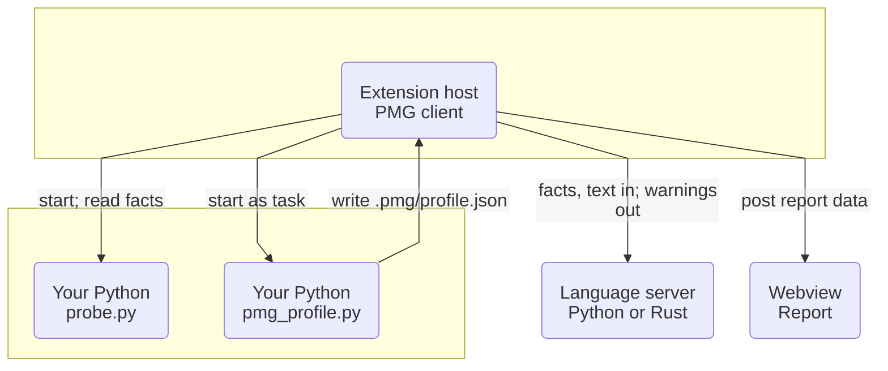
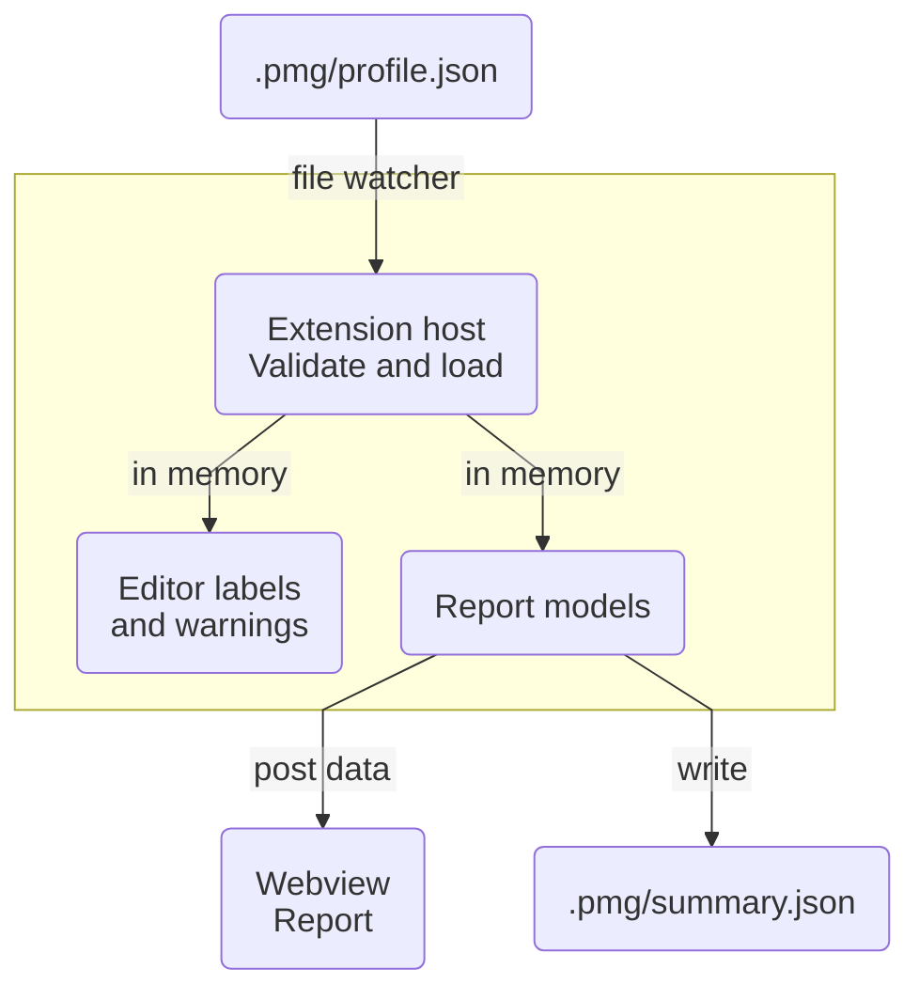

# Python Memory Guardian: technical description

This document tells what Python Memory Guardian (PMG) is, how it works, and how much you can trust its numbers. It is for developers who use PMG, for developers who want to know if its results are correct, and for contributors.

The text uses ASD-STE100 Simplified Technical English where possible. Names of tools, files and Python terms stay as they are. The [glossary](#12-glossary) explains the technical words.

**Contents:** [1. Summary](#1-summary) · [2. Problems that PMG finds](#2-problems-that-pmg-finds) · [3. Parts of PMG](#3-parts-of-pmg) · [4. Static analysis](#4-static-analysis) · [5. Runtime profiler](#5-runtime-profiler) · [6. Files in .pmg](#6-files-in-pmg) · [7. The report](#7-the-report) · [8. How to read the results](#8-how-to-read-the-results) · [9. Cost](#9-cost) · [10. Limits](#10-limits) · [11. Tests](#11-tests) · [12. Glossary](#12-glossary) · [13. Measurement record](#13-measurement-record)

## 1. Summary

PMG is an extension for Visual Studio Code (VS Code). It finds Python code that uses too much memory or too much time. It does this in two ways:

- **Static analysis.** PMG reads your code while you type. It shows a warning on code patterns that waste memory or block a thread. It does not run your code for this.
- **Runtime profiler.** PMG runs your script and measures it. It shows the time and memory of each line in the editor and in a report.

The two parts work together. A static warning on a line that the profiler measured as "hot" gets a higher severity. A warning on a line that did not run gets a lower severity.

## 2. Problems that PMG finds

Python keeps each value as a separate object in memory. Each object has a header and a pointer. Many small objects can use much more memory than the data in them. PMG looks for these problem types:

| Problem | What it is | Example |
|---|---|---|
| Heap inflation | Each value becomes a full Python object | `cursor.fetchall()` on a large table |
| RAM fragmentation | Many small objects stay in memory blocks that the allocator cannot release | `rows.append({...})` in a large loop |
| Text inflation | The program copies text, or keeps it as many separate strings | `f.readlines()` on a large file |
| Memory swell | The program makes a full list when one item at a time is sufficient | `values = list(gen())`, then one loop over `values` |
| Retention and leaks | Memory stays in use after the program does not need it | a cache that only grows |
| Single-thread stalls | One thread blocks other work | a call that blocks, inside `async def` |

The static analysis finds the patterns. The profiler measures if the patterns cost memory or time in your program.

## 3. Parts of PMG

PMG has five parts. They run in different processes.

| Part | File | Process | Function |
|---|---|---|---|
| Extension client | `src/*.ts` | VS Code extension host | Starts the other parts, shows labels and warnings, writes the summary |
| Language server | `server/guardian_server.py` or `rust-server` | Separate process | Analyzes the code and sends warnings |
| Interpreter probe | `server/probe.py` | Your Python, once at start | Measures object sizes and the GIL state of your Python |
| Profiler | `server/pmg_profile.py` | Your Python, as a task | Runs your script and measures time and memory |
| Report | `src/reportWebview.ts` | VS Code webview | Shows charts, tables and call stacks |

All parts run where the extension runs. With Dev Containers, Codespaces, WSL and Remote-SSH, this is the remote environment. One setup is different: Docker or Docker Compose with the editor on the host computer. In this "container mode", the language server stays on the host, and the probe and the profiler run in the container. Section [10](#10-limits) gives more data.

## 4. Static analysis

### 4.1 How it works

1. At start, the client runs `probe.py` with your Python interpreter.
2. The probe measures facts on that interpreter: object sizes, the GIL state, and the memory allocator.
3. The client starts the language server and gives it these facts.
4. When you open or change a Python file, the server reads the file as a syntax tree.
5. The server applies its rules and sends warnings to the editor.

The facts make the messages specific. For example, a message gives the size of a dictionary on your Python version, not a general value. If the probe fails, the messages use general text.

### 4.2 Rules

PMG has 22 rule codes in 8 families. The [rules reference](06-rules.md) lists each code, its trigger, and how to stop one warning.

A rule gives a warning only when its pattern is clear. For example, `memory-swell.list-once` gives no warning if the code uses `len()` on the list. It also gives no warning if the code gets an item by index or uses the list two times. Then the list is necessary.

### 4.3 Two language servers

PMG has two language servers with the same rules:

- **Python server.** It uses the `ast` module. It needs Python 3.9 or later on the computer with the editor.
- **Rust server.** It uses tree-sitter. It does not need Python.

The setting `pythonMemoryGuardian.backend` selects the server. Both servers use the same message file, `server/messages.json`. A parity test sends the same files to both servers. The test fails if one server gives a different code, range, severity or message.

## 5. Runtime profiler

### 5.1 How a profile starts

The command **Profile Current File** starts `server/pmg_profile.py` as a VS Code task, with your interpreter and the arguments that you type. The profiler runs your script in its own process, as `python yourfile.py` does. At the end, it writes `.pmg/profile.json`, and the extension loads it. The [quick start](01-quickstart.md) and [using the extension](02-using-the-extension.md#profile-a-script) give the steps. The profiler can also run from a terminal: see the [command line reference](reference/cli.md).

### 5.2 Memory modes

The memory mode controls what the profiler measures. [Using the extension](02-using-the-extension.md#profile-a-script) compares the modes. All modes measure time ([5.3](#53-how-the-profiler-measures-time)). Fast mode reads the process memory ([5.4](#54-how-fast-mode-measures-memory)). Precise mode traces Python allocations ([5.5](#55-how-precise-mode-measures-memory)), for the full run or for one function ([5.9](#59-precise-mode-for-one-function)). Time-only mode measures no memory per line.

### 5.3 How the profiler measures time

A sampler thread wakes every 10 ms. At each wake, it finds the current line of your code in each thread. It adds the time since the last sample to that line.

The profiler divides the time into three types:

- **System time.** The thread did not use the CPU. For example, it waited for a file, the network or a lock.
- **Native time.** The thread used the CPU in C code, for example in NumPy or in a compression library.
- **Python time.** The thread used the CPU to run Python bytecode.

To find native time, the profiler measures how long its own thread waits for the GIL. A long wait tells that C code held the GIL. A wait near zero, with CPU use, tells that C code released the GIL. Before the script starts, the profiler measures the normal delay of the timer, and it removes this delay from each wait. On a Python build without a GIL, the profiler cannot divide CPU time. It shows "unsplit" time.

The time split also needs a CPU clock for each thread. Linux has this clock. macOS and Windows do not have it. On these systems, the profiler uses the CPU time of the process for the main thread, and other threads get "unsplit" time. The profile field `per_thread_cpu` tells which case applies.

Each sample also records the full call stack of each thread. The Stack Explorer uses these stacks.

### 5.4 How fast mode measures memory

At each sample, the profiler reads the resident set size (RSS) of the process. RSS is the physical memory that the process uses. If RSS increases, the profiler adds the increase to the current line of the busiest thread.

The profiler reads RSS from `/proc/self/statm` on Linux, from `task_info` on macOS, and from `GetProcessMemoryInfo` (the working set) on Windows. On other Unix systems, only the peak RSS (`ru_maxrss`) is available. Then RSS can only increase in the report.

RSS has two limits:

- The operating system adds memory to RSS when a program first writes to it. Thus the increase can show on a line that writes the data, not on the line that made the object.
- RSS seldom decreases. The Python allocator keeps a memory block (an arena of 1 MiB) until the program releases all objects in it. Thus memory that a program releases often stays in RSS, and two equal runs can show different RSS.

A different allocator does not solve this. With `PYTHONMALLOC=malloc`, one million small objects took approximately 33% more time to make. After the program released all of them, RSS did not decrease. With the default allocator, RSS decreased almost to the start value. This test used macOS and CPython 3.13.

### 5.5 How precise mode measures memory

Precise mode starts the `tracemalloc` module. `tracemalloc` records each Python allocation and the call stack that made it. The depth of this stack is 2 frames, or the value of `pythonMemoryGuardian.profile.frames`.

The labels `alloc`, `held` and `spike` ([label table](02-using-the-extension.md#inline-labels)) come from three different measurements. Do not add them:

- `alloc` comes from the samples. At each sample, the profiler adds the increase of traced memory to the current line. Memory that a line allocates and releases between two samples is not included.
- `held` comes from the snapshots. It is the memory from the line in the snapshot with the most memory.
- `spike` comes from the peak that `tracemalloc` records between two samples. The profiler resets this peak after each sample.

**Snapshots.** A snapshot is a full list of the memory in use, with the call stack of each allocation. The profiler takes snapshots at intervals and at the end. It also takes a snapshot when memory stays at a new high level, and when memory doubles. Thus the snapshot with the most memory is near the true peak. On `generators.py`, this snapshot held 98% to 100% of the traced peak.

A snapshot stops your program while the profiler makes it. The profiler does not add this stop to the time of your lines.

Snapshot cost increases with the traced memory. It is approximately 5 to 8 ns for each byte of `tracemalloc` bookkeeping. At 400 MB, one snapshot takes approximately 1.6 s. Thus normal snapshots have a limit of 10% of the traced time. The profiler checks this limit with the measured cost of the last large snapshot. The peak snapshots have a separate limit. A short peak inside one C call that holds the GIL is not visible to the sampler. A snapshot each time the memory doubles captures this peak at half of its size or more.

**Memory without a line of your code.** A library can allocate memory deep in its own code. Then the 2-frame stack often has no frame of your code. An example is `import pandas`. The profile gives this memory as `unattributed_peak_mb`, and the status bar tooltip shows it. A larger traceback depth finds more of it, but it is slower. On a pandas import, 32 frames found 8 MB of 39 MB.

**Leaks.** The profiler marks a line as a "suspected leak" when all these conditions are true:

- The memory of the line did not decrease in the last snapshots.
- It increased in at least 3 of these snapshots.
- At least 1 MB of it was in use at the end.

This needs at least four snapshots. Thus a very short run can show no suspected leak. If your script stops `tracemalloc`, the precise data stops at that time, and the report tells when.

Then the profiler looks for the object that keeps the memory. It examines global variables, the attributes of your objects, and containers that the garbage collector knows. The global variables and the attributes are necessary, because CPython does not track a dictionary that holds only simple values. This search has a time limit. It can find possible holders. It cannot prove that a holder is the cause.

**Largest objects at the end.** In fast and precise mode, the profiler also lists the largest objects at the end of the run. These are objects that global variables or the attributes of your objects keep. It uses the size that each object reports (`sys.getsizeof`), and for containers it adds their items one level deep. NumPy, pandas and PyArrow report their buffers correctly. Polars reports only a small wrapper. Its memory shows as `native ≈`.

### 5.6 Native memory estimate

`tracemalloc` cannot see memory that C extensions get directly from the operating system. PyArrow and Polars are examples. Thus precise mode gives an estimate of native memory:

> native ≈ RSS growth − traced growth − growth of the bookkeeping of `tracemalloc`

The bookkeeping is the memory that `tracemalloc` itself uses to record each allocation. It is large. For 300,000 small dictionaries, it was 72 MB, and the data was 81 MB.

No profiler can give exact native memory per line for libraries that have their own allocators. Memray, which records allocations in C, gave 1 GB for an 8 MB PyArrow array, because the mimalloc allocator reserves address space. It gave 1.5 GB of Polars memory with no call stack.

`tracemalloc` does not report its own cost correctly. Its real RSS cost was 52 MB more than it reported in one test, and 113 MB less in a different test. Thus PMG shows a native estimate only when it is more than two times the bookkeeping. Below this limit, the Overview shows "none detected". Then no line shows `native ≈`.

### 5.7 Allocation by call path

When a sample sees an increase of traced memory, the profiler also adds the increase to the full call stack of the busiest thread. These stacks have up to 128 frames. Thus they show the function that keeps the data, not only the function that made it.

Example from `generators.py`: in `process_eager`, 197 MB of allocation came through `list(iter_raw_records(...))`. The per-line `alloc` label shows this memory inside the generator. The call path shows the line that keeps the list.

### 5.8 Phases

At each point on the memory timeline, the profiler records the call stack of the main thread. The report uses these stacks to divide the run into **phases**. A phase is a continuous period in which the main thread was in the same function, at one depth of its stack.

For each phase, the report shows:

- Its duration.
- Its peak traced memory (precise mode).
- Its peak RSS.
- Its **new RSS**: the RSS that the phase needed above the highest RSS of all earlier phases.

New RSS solves a problem of RSS. When two variants run in one process, the second variant can use memory that the first variant released. Its RSS stays high, but its new RSS is zero. On `generators.py`, the eager phases needed +147 MB and +262 MB of new RSS. All streaming phases needed 0 MB.

### 5.9 Precise mode for one function

With this mode, `tracemalloc` runs only while one function runs. In the editor, put the cursor in the function, then select **precise, only while `f()` runs**. From a terminal, use `--trace-function NAME`. This mode needs Python 3.12 or later.

How it works:

1. The profiler uses `sys.monitoring` to receive an event when each function starts.
2. For all other functions, it turns off this event after their first call. Thus they run at full speed.
3. When the selected function starts, the profiler starts `tracemalloc`.
4. When the function returns or raises an exception, the profiler takes a snapshot. Then it stops `tracemalloc`.

This mode has three limits:

- The selected function is as slow as in full precise mode.
- There is no leak detection. Each call starts `tracemalloc` again, so the profiler cannot follow memory from one call to the next.
- There is no native estimate. Python memory outside the function is not traced, so the profiler cannot separate it from native memory.

### 5.10 Comparison of two runs

The Compare tab compares a run with a saved baseline. [Using the extension](02-using-the-extension.md#compare) gives the steps.

PMG matches functions by file and name. Thus a line number can change. A change is "better" or "worse" only if it is larger than the normal difference between two equal runs. PMG measured this difference on three equal runs per mode:

| Value | A change must be larger than |
|---|---|
| Time | The statistical error of the sample count, and at least 10% |
| Traced memory | 1 MB, and at least 15% |
| RSS and native estimate | 10 MB, and at least 20% |

Some changes come from a different part of the run. For example, the peak can move to a different function. PMG marks these changes as "context", not as "better" or "worse". PMG also gives a warning when the two runs used a different Python version, mode, traceback depth, arguments or traced function.

## 6. Files in .pmg

PMG keeps its data in a folder `.pmg` in your workspace. Add `.pmg/` to your `.gitignore` file.

| File | Written by | Read by | Contents |
|---|---|---|---|
| `profile.json` | The profiler, at the end of a run | The extension | All measurements of the last run |
| `summary.json` | The extension, after it reads a profile | Scripts and AI agents. PMG does not read it. | A short form of the results, with the method and the limits of each value |
| `baselines/<name>.json` | **Save Profile as Baseline** | The Compare tab | A copy of a profile, with its name and git commit |
| `pmg_profile.py`, `probe.py` | The extension, in container mode only | The container | Copies of the tools, so that the container can run them |

The report does not use a stored file. Each time the report changes, the extension calculates the report from the profile in memory. The profile has the measurements. The editor adds the current state: if each source file is the same as when PMG profiled it, and which baseline you selected.

The format of `summary.json` is `pmg-summary/1`. The file [pmg-summary.schema.json](pmg-summary.schema.json) defines it.

## 7. The report

[Using the extension](02-using-the-extension.md#the-report) describes each tab of the report and each label in the editor.

The labels show only when the source file is the same as when PMG profiled it. To find this, PMG compares a SHA-1 hash of the current text with the hash in the profile. A change to the file hides its labels. An undo of the change shows them again.

## 8. How to read the results

These rules prevent incorrect conclusions:

1. **Do not compare times from precise mode.** `tracemalloc` makes allocation-heavy code much slower. Measure time in fast mode.
2. **Do not use RSS to find what keeps memory.** RSS stays high after the program releases memory. Use `held` memory and Memory diagnosis.
3. **Look at the caller, not only the line.** In a generator pipeline, `alloc` shows on the generator line. Use **Allocated (sampled, full call paths)** to find the line that keeps the data.
4. **"Held at peak" is one moment.** If you fix the code that made the peak, the peak moves. Then a different function shows more held memory, but its code did not change.
5. **A suspected leak is not proof.** Run the same workload for a longer time. A leak continues to grow. A cache stops at a limit.
6. **One run is not sufficient for small changes.** Two equal runs can differ by 10% or more. Use the Compare tab: it shows when a change is within this normal difference.
7. **Read the method and the limits.** Each card in the report tells how PMG measured the value. Each section of `summary.json` also tells this.

## 9. Cost

The cost of the profiler depends on the mode and on the number of allocations in your program. These values come from `examples/profiling-workloads/generators.py` with 200,000 records. This workload makes millions of small dictionaries. Thus it is a high-cost case for precise mode. Section [13](#13-measurement-record) gives the machine and the commands.

| Run | Time | Slowdown |
|---|---|---|
| Without PMG | 11.4 s | 1.0× |
| Fast mode | 11.9 s to 15.5 s | 1.04× to 1.36× |
| Precise mode | 122.0 s to 142.8 s | 10.7× to 12.5× |
| Precise mode, only `process_eager` | 48.6 s to 49.8 s | 4.3× to 4.4× |

The ranges come from two runs on a computer that also did other work. `tracemalloc` alone made `process_eager` 7.7 to 9.4 times slower. In precise mode, snapshots used 15 s to 34 s of the run. On code with fewer allocations, precise mode was approximately 3 times slower.

To decrease the cost:

- Use a smaller input. The memory pattern is usually the same.
- Use precise mode for one function.
- Keep the traceback depth at 2 frames. A depth of 6 frames made the run approximately two times slower.

## 10. Limits

PMG does not measure these items:

- **Child processes.** The profiler measures one process. It does not follow `multiprocessing` or other subprocesses. Some examples have an `--in-process` option for this reason.
- **C and C++ call stacks.** The profiler sees native time at the Python line that called the C code. It does not see the C functions.
- **Each allocation.** The profiler samples. It does not count allocations that start and stop between two samples.
- **GPU time and data copies.**

Display limits:

- A call stack keeps at most 128 frames. The profiler keeps at most 50,000 different stacks per run.
- The Stack Explorer shows at most 25,000 boxes. Time in deeper calls stays in the boxes above them, in a striped box "beyond display limit".
- Memory diagnosis shows the first 200 findings.

Other limits:

- The tests use only CPython. PMG has no tests on other Python interpreters.
- Before Python 3.11, code objects do not have qualified names. Then the profiler gets names such as `Service.handle` from the source file.
- The profiler runs a script file. It does not run `python -m module` directly. Use a small script that starts your module.
- `docker stop` sends the signal SIGTERM. The profiler does not catch this signal. Thus a profile is lost when a container stops this way. Stop the program with Ctrl+C (SIGINT) to keep the profile.
- A C call that holds the GIL, for example `[0] * 20_000_000`, can show on the next line. The sampler can run only after the call returns. The function totals are correct.
- In a server that runs many short request threads, time and memory growth can show on the main thread, not on the request handler. `held` memory shows the correct line.
- Your project code is the code under the workspace folder. PMG treats code in a different repository as library code.
- Container mode is necessary only for Docker or Docker Compose when the editor runs on the host computer. Dev Containers, Codespaces, WSL and Remote-SSH run the extension inside the environment. They do not need container mode. See [Container setup](03-container-setup.md).

## 11. Tests

| Test | What it checks |
|---|---|
| Parity test | The Python and Rust servers give the same warnings on all test files |
| Rule fixtures | Each rule gives a warning where it must, and no warning where it must not |
| Profiler tests with known answers | Time types, leak detection, holders, memory per line |
| Scripted sampler tests | Exact values from a sampler that gets prepared clock and memory values, not real clock time |
| Model tests | The report, the comparison and the summary calculate the correct values from known profiles |
| Schema test | `summary.json` agrees with its schema, and each value is the same as in the profile |
| Editor tests | With a simulated VS Code: keystrokes, summary writes, profile deletion |
| Container test | A simulated container with path mappings |

Run all tests with `npm test`. The tests of the language server's bundled packages ran on Python 3.9, 3.10, 3.12, 3.13 and 3.14. The profiler tests ran on Python 3.9, 3.12 and 3.13. There is no automatic test in a real VS Code window. For container tests, see [container setup](03-container-setup.md#troubleshooting).

**Comparison with Scalene 2.3.0.** One computer, the same workloads with known results (`test-fixtures/profiler/`):

| | PMG | Scalene |
|---|---|---|
| Cost, time only | 1.6% | 15% (`--cpu-only`) |
| Cost, time and memory | 1.2% (fast) / 3.1× (precise) | 37% |
| Python / native / system time | correct on all test lines | correct on all test lines |
| 48 MB leak in `workload.py` | found, holder `global LEAK` named | not reported |
| 2 MB-per-call leak in `leak_workload.py` | found | not reported |
| 160 MB short-lived list | correct for the function; the line value shows on the next line | correct line |

These results come from one computer and a few workloads. They are not a general benchmark. Scalene is more mature. It measures GPU time, data copies and multiprocessing, and its memory hooks attribute short native allocations more precisely.

## 12. Glossary

| Term | Definition |
|---|---|
| Allocation | A request for memory to keep a new object |
| Allocator | The part of Python or of the operating system that gives memory to a program |
| Baseline | A saved profile that you compare with a later profile |
| Bookkeeping | The memory that `tracemalloc` uses to record allocations |
| Call stack | The list of functions that are active at one time, from the first caller to the current function |
| Extension host | The VS Code process that runs extensions |
| GIL | Global Interpreter Lock. Only the thread with the GIL can run Python bytecode. |
| Hot line | A line that used more time or memory than the settings `hotShare` and `hotMB` |
| Language server | A program that analyzes code and sends warnings to the editor by the Language Server Protocol (LSP) |
| Native code | Code in C, C++ or Rust that a Python library calls |
| Phase | A continuous period of the run in one function of the main thread |
| Profile | The measurements of one run, in `profile.json` |
| RSS | Resident set size: the physical memory that a process uses |
| Sample | One measurement by the sampler thread, every 10 ms |
| Snapshot | A full record of the traced memory in use at one time |
| Static analysis | Analysis that reads the code and does not run it |
| `tracemalloc` | A Python standard module that records Python allocations |
| Webview | A panel in VS Code that shows HTML |

## 13. Measurement record

All numbers in this document come from these runs. The numbers depend on the computer and on its load. Compare only numbers from the same run.

- Date: 2026-10-04.
- Computer: macOS on arm64, 8 CPUs, with other programs open (load average 2.5 to 3.7).
- Python: CPython 3.13.0. Profiler tests also passed on CPython 3.9.6.
- Workload: `examples/profiling-workloads/generators.py --records 200000 --mode both`.

| Number | Command or method |
|---|---|
| Run times and slowdown | The workload without PMG; with `pmg_profile.py --memory fast`; `--memory precise`; `--memory precise --trace-function process_eager`. Two runs. |
| Snapshot cost and peak capture | `snapshot_cost_s`, `peak_snapshot_cost_s`, `peak_traced_mb` and the peak memory-stack table in the precise profiles |
| `tracemalloc` cost on one function | `ingest_eager` without `tracemalloc`, then `process_eager` without `tracemalloc`, with `tracemalloc` from the start, and with `tracemalloc` started just before the call. Two runs. |
| Bookkeeping and RSS | Make 300,000 and 1,000,000 dictionaries `{"id": str(i), "n": i}`. Compare RSS growth, `tracemalloc.get_traced_memory()` and `tracemalloc.get_tracemalloc_memory()` with 0, 2 and 6 frames. Two runs. |
| Phases and new RSS | The Phases table of the fast and precise profiles |
| Allocation by call path | Stack Explorer, measure "Allocated (sampled, full call paths)", focus `process_eager` |
| Normal difference between equal runs | Three equal runs per mode, compared function by function |

The RSS values had a large variation. The same 1,000,000-dictionary test gave an RSS growth of 353 MB in one run and 597 MB in the next run. For this reason, this document gives ranges.
