# Python Memory Guardian: implemented feature map

Use this map to trace a feature from its trigger to its result, implementation and tests. Static analysis examines source text; runtime profiling executes the saved script. Source code is the authority for implemented behavior. See the [README](../README.md) for product context and the [user guides](00-guides.md) for usage instructions.

## Start here

| What do you want to understand? | Start with |
|---|---|
| How the main pieces fit together | [System overview](#system-overview) |
| Where a static warning comes from, or where to add a rule | [Static diagnostics](#static-diagnostics) |
| What happens when you profile a script | [Runtime profiling](#runtime-profiling) |
| Why a profile fails to load or becomes stale | [Profile loading and freshness](#profile-loading-and-freshness) |
| How line labels, runtime warnings and severity changes work | [Editor annotations and warnings](#editor-annotations-and-warnings) |
| How report charts and source navigation work | [Reports and source navigation](#reports-and-source-navigation) |
| What `.pmg/summary.json` contains and when it is written | [Run summary](#run-summary) |
| Which Python or language server runs | [Interpreter and backend setup](#interpreter-and-backend-setup) |
| How host and container paths connect | [Container execution](#container-execution) |
| How resources reach the installed extension | [Build and packaging](#build-and-packaging) |
| Which components must change together | [Shared contracts and coordinated changes](#shared-contracts-and-coordinated-changes) |

**Contents:** [Overview](#system-overview) · [Implemented features](#implemented-features) · [Developer reference](#developer-reference) · [Planned capabilities](#planned-incomplete-or-unused-capabilities) · [Verification and limits](#verification-and-limits)

Each feature below follows the same order: **behavior → trigger/result → flow → code → branches → tests**. Filenames link to source; named functions identify the relevant entry points. Tables are the feature-to-code map, placed beside the behavior they explain.

## System overview

**Where static and runtime analysis meet**

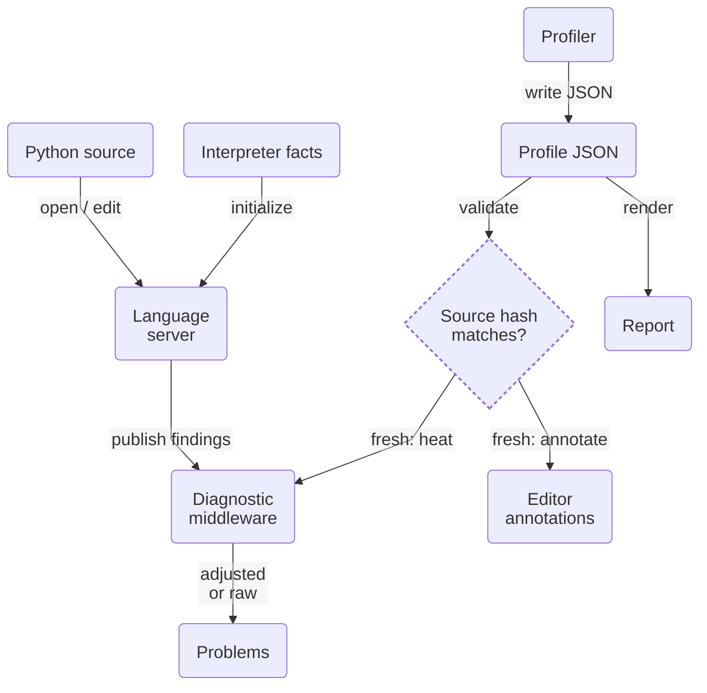
```mermaid
%%{init: {"fontFamily":"Arial, sans-serif","themeVariables":{"fontSize":"18px","fontFamily":"Arial, sans-serif"},"flowchart":{"curve":"linear","nodeSpacing":32,"rankSpacing":40,"diagramPadding":8,"padding":18,"subGraphTitleMargin":{"top":10,"bottom":24},"htmlLabels":false},"layout":"dagre","htmlLabels":false,"themeCSS":".node rect, .cluster rect { rx: 10px; ry: 10px; } .label, .nodeLabel, .edgeLabel, .cluster-label { letter-spacing: normal; word-spacing: normal; } .edgeLabel rect { stroke: currentColor !important; stroke-width: 1px !important; stroke-dasharray: none; opacity: 1 !important; fill-opacity: 1; rx: 4px; ry: 4px; }"}}%%
flowchart TD
    Src("Python source") -->|open / edit| LSP("Language<br/>server")
    Facts("Interpreter facts") -->|initialize| LSP
    LSP -->|publish findings| MW("Diagnostic<br/>middleware")
    Prof("Profiler") -->|write JSON| JSON("Profile JSON")
    JSON -->|validate| Gate{"Source hash<br/>matches?"}
    Gate -->|fresh: heat| MW
    Gate -->|fresh: annotate| Ed("Editor<br/>annotations")
    MW -->|adjusted<br/>or raw| Probs("Problems")
    JSON -->|render| Rep("Report")
    classDef decision stroke-width:2px,stroke-dasharray:4 3;
    class Gate decision;
```

Static findings come from the selected language server; runtime evidence comes from a validated profile. They meet in the diagnostic middleware, and only when the current source text matches the profiled hash. A stale or absent profile leaves static findings unchanged, while the report can still show historical measurements.

**Diagram key:** rounded rectangles show actions, components or data; dashed diamonds show decisions. Bordered arrow labels describe calls and transfers. Solid arrows show runtime calls or data flow; dotted arrows show build-time dependencies. Diagrams that cross a process boundary group nodes in borderless-titled boxes and name the owning process inside the first node of each box, keeping process names clear of arrow labels. When a flow returns to a process it left, that process appears as a second box below, so arrows run top-down instead of crossing back. Single-process diagrams name the owner in the caption; overview and build diagrams are unboxed. Each diagram shows one complete mechanism, including its main failure branches; repeated nodes refer to the same component. Labels use SVG text with a consistent Arial/sans-serif font at 18 px, explicit line breaks and room around words and process titles. Nodes and process boxes have rounded corners; arrows remain straight and colors follow the viewer.

## Implemented features

### Static diagnostics

The selected Python or Rust language server recognizes source patterns and publishes findings with advice. These are suggestions in diagnostic text; no code actions or automatic edits are registered.

**Trigger:** open, edit, save or close a Python `file` or `untitled` document. **Result:** editor squiggles and Problems entries, optionally adjusted using a fresh runtime profile.

**Analyze and publish — both servers**

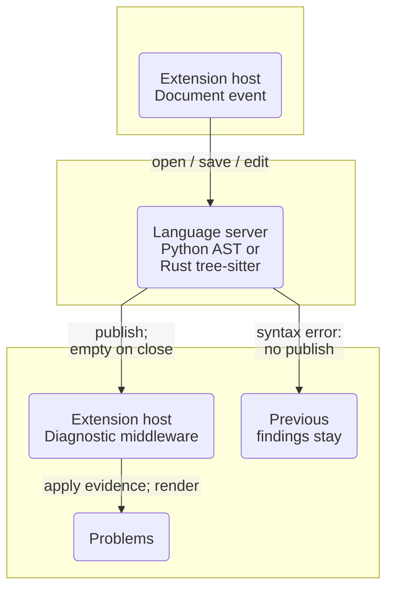
```mermaid
%%{init: {"fontFamily":"Arial, sans-serif","themeVariables":{"fontSize":"18px","fontFamily":"Arial, sans-serif"},"flowchart":{"curve":"linear","nodeSpacing":32,"rankSpacing":40,"diagramPadding":8,"padding":18,"subGraphTitleMargin":{"top":10,"bottom":24},"htmlLabels":false},"layout":"dagre","htmlLabels":false,"themeCSS":".node rect, .cluster rect { rx: 10px; ry: 10px; } .label, .nodeLabel, .edgeLabel, .cluster-label { letter-spacing: normal; word-spacing: normal; } .edgeLabel rect { stroke: currentColor !important; stroke-width: 1px !important; stroke-dasharray: none; opacity: 1 !important; fill-opacity: 1; rx: 4px; ry: 4px; }"}}%%
flowchart TD
    subgraph IN[" "]
      Event("Extension host<br/>Document event")
    end
    subgraph LSP[" "]
      Server("Language server<br/>Python AST or<br/>Rust tree-sitter")
    end
    subgraph OUT[" "]
      MW("Extension host<br/>Diagnostic middleware")
      Keep("Previous<br/>findings stay")
      UI("Problems")
    end
    Event -->|open / save / edit| Server
    Server -->|publish;<br/>empty on close| MW
    Server -->|syntax error:<br/>no publish| Keep
    MW -->|apply evidence; render| UI
```

**Implementation**

| Responsibility | Files and symbols |
|---|---|
| Receive events, debounce edits and publish findings | [guardian_server.py](../server/guardian_server.py#L60): `did_open`, `did_change`, `did_save`, `did_close`, `_publish`; [main.rs](../rust-server/src/main.rs#L1206): `Backend::did_*`, `publish` |
| Parse source, build scope indexes and visit patterns | [rules.py](../server/rules.py#L705): `analyze`, `index_file`, `classify`, `Visitor`; [main.rs](../rust-server/src/main.rs#L1111): `analyze`, `index_with_imports`, `classify`, `Visitor::visit` |
| Render advice and sized or neutral messages | [messages.json](../server/messages.json); `render` and `prefix` in both analyzers |
| Convert ranges and suppress marked findings | [rules.py](../server/rules.py#L661): `_utf16`, `_range`, `SUPPRESS`; [main.rs](../rust-server/src/main.rs#L1096): `to_utf16`, `lsp_range`, `SUPPRESS` |
| Apply runtime evidence before display | [extension.ts](../src/extension.ts#L148): `startClient` middleware; [profileView.ts](../src/profileView.ts#L193): `adjust` |

**Important branches and limits**

- Open/save analyze immediately; edits debounce for 350 ms. Invalid syntax retains the last good diagnostics; closing publishes an empty list.
- Python uses CPython `ast`, `pygls` and `lsprotocol`. Rust uses `tree-sitter-python` and `tower-lsp`. Parsers, scope indexes, visitors, message rendering, range conversion and suppression are separate implementations.
- Both use the same [diagnostic message contract](#shared-contracts-and-coordinated-changes). Python reads the JSON at module import; Rust embeds it with `include_str!` at build time and parses it through `OnceLock` on first render. Message changes require a Rust rebuild.
- Rule context includes import aliases, lexical bindings, loops and known thread targets. No project-wide dataflow analysis is implemented.
- For runtime severity changes, see [Editor annotations and warnings](#editor-annotations-and-warnings).

**Tests:** [parity_test.py](../test-fixtures/parity_test.py) and its rule fixtures compare backend diagnostics; [server_lifecycle_test.py](../test-fixtures/server_lifecycle_test.py) checks server events and lifecycle. Parity is tested, not guaranteed by shared implementation.

#### Static rule families

Both servers emit the following codes through their visitor/analyzer, with text and advice from `server/messages.json`. These are source-pattern suggestions in diagnostic messages; the extension registers no code actions or automatic edits.

| Family | Implemented diagnostic codes | Examples of recognized patterns |
|---|---|---|
| Heap inflation | `heap-inflation` | `fetchall`, looped `fetchone`, cursor iteration |
| Pointer chasing | `pointer-chasing` | pandas import and recognized loader calls |
| Cycles and GC | `cyclic-reference`, `gc-cycle-risk` | looped construction of back-linked classes; back links with finalizers |
| RAM fragmentation | `ram-fragmentation.append`, `ram-fragmentation.no-slots` | per-row containers; looped instances without slots |
| Text inflation | `text-inflation.concat`, `text-inflation.whole-file` | string `+=` in loops; whole-file line/token reads |
| Memory swell | `memory-swell.list-arg`, `memory-swell.list-copy`, `memory-swell.list-once`, `memory-swell.method-cache`, `memory-swell.unbounded-cache`, `memory-swell.deepcopy-loop`, `memory-swell.recompile-loop`, `memory-swell.setdefault-loop`, `memory-swell.list-extend-loop` | eager lists, unbounded caches, repeated copies/compilation/default creation |
| Resource and task retention | `resource-leak.file-handle`, `task-retention.asyncio-task` | open handles without visible cleanup; discarded task handles |
| Single-thread stalls | `single-thread-stall.async-blocking`, `single-thread-stall.list-membership`, `single-thread-stall.cpu-thread` | blocking async calls, repeated list search, known pure-Python thread targets |

There are **22 codes in 8 grouped rows** above. The source has ten naming prefixes if `cyclic-reference` and `gc-cycle-risk`, and `resource-leak` and `task-retention`, are counted separately. Diagnostics carry severity, code, source, UTF-16 range and sometimes related locations. A `memory-guardian: ignore` marker on the finding's starting line suppresses that static finding. It does not suppress runtime leak diagnostics.

`memory-swell.list-once` is a separate pass in both servers ([rules.py](../server/rules.py#L771) `_list_once`, [main.rs](../rust-server/src/main.rs#L1232) `list_once`) rather than part of the visitor. For the module and every function, it takes `name = list(x)` (one positional argument, no keywords) or `name = [comprehension]` with a plain name target and no annotation or chained target, and reports it when, in that scope's body (nested scopes included), `name` is bound exactly once and loaded exactly once, after the assignment, outside any nested function, and that load only iterates it: a `for` or comprehension iterable, an argument to `sum`/`any`/`all`/`min`/`max`/`iter`/`enumerate`/`zip`, or a positional argument to a module-level function of the file whose matching parameter is itself loaded once, never rebound, and only iterated. Bindings counted are assignment, for and comprehension targets, walrus, `with`/`except`/`match` `as`, `del`, `global`/`nonlocal`, parameters, def/class names, and any name in an import (both servers treat import names alike so parity holds). [list_once_cases.py](../test-fixtures/list_once_cases.py) has the positive and quiet cases with `# expect:` markers.

[Back to navigation](#start-here)

### Runtime profiling

The editor command and standalone CLI run the same profiler. It executes the target script, samples thread timing and records memory evidence according to the chosen mode.

**Trigger:** `pythonMemoryGuardian.profileFile` (Profile Current File), or direct `pmg_profile.py` invocation. **Result:** task/terminal output and schema-3 `.pmg/profile.json`.

**Launch the profiler**

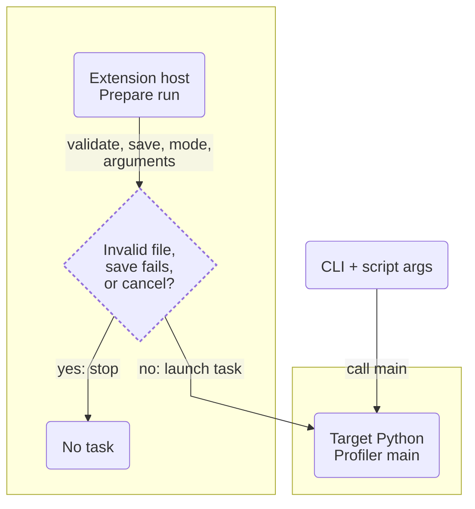
```mermaid
%%{init: {"fontFamily":"Arial, sans-serif","themeVariables":{"fontSize":"18px","fontFamily":"Arial, sans-serif"},"flowchart":{"curve":"linear","nodeSpacing":32,"rankSpacing":40,"diagramPadding":8,"padding":18,"subGraphTitleMargin":{"top":10,"bottom":24},"htmlLabels":false},"layout":"dagre","htmlLabels":false,"themeCSS":".node rect, .cluster rect { rx: 10px; ry: 10px; } .label, .nodeLabel, .edgeLabel, .cluster-label { letter-spacing: normal; word-spacing: normal; } .edgeLabel rect { stroke: currentColor !important; stroke-width: 1px !important; stroke-dasharray: none; opacity: 1 !important; fill-opacity: 1; rx: 4px; ry: 4px; }"}}%%
flowchart TD
    subgraph EXT[" "]
      Editor("Extension host<br/>Prepare run")
      Stop{"Invalid file,<br/>save fails,<br/>or cancel?"}
      Cancel("No task")
    end
    subgraph PROC[" "]
      Main("Target Python<br/>Profiler main")
    end
    Editor -->|validate, save, mode, arguments| Stop
    Stop -->|yes: stop| Cancel
    Stop -->|no: launch task| Main
    CLI("CLI + script args") -->|call main| Main
    classDef decision stroke-width:2px,stroke-dasharray:4 3;
    class Stop decision;
```

**Capture and write**

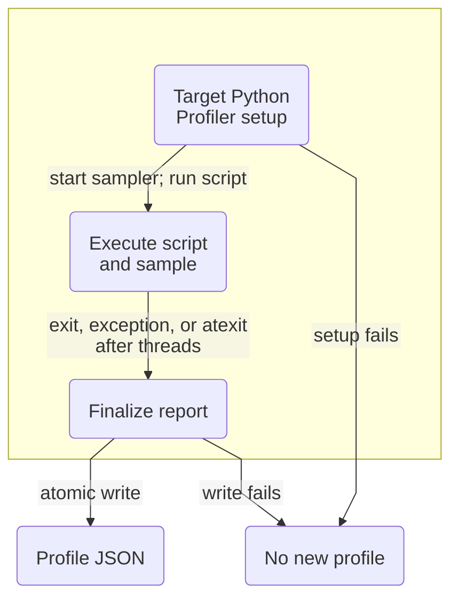
```mermaid
%%{init: {"fontFamily":"Arial, sans-serif","themeVariables":{"fontSize":"18px","fontFamily":"Arial, sans-serif"},"flowchart":{"curve":"linear","nodeSpacing":32,"rankSpacing":40,"diagramPadding":8,"padding":18,"subGraphTitleMargin":{"top":10,"bottom":24},"htmlLabels":false},"layout":"dagre","htmlLabels":false,"themeCSS":".node rect, .cluster rect { rx: 10px; ry: 10px; } .label, .nodeLabel, .edgeLabel, .cluster-label { letter-spacing: normal; word-spacing: normal; } .edgeLabel rect { stroke: currentColor !important; stroke-width: 1px !important; stroke-dasharray: none; opacity: 1 !important; fill-opacity: 1; rx: 4px; ry: 4px; }"}}%%
flowchart TD
subgraph PROC[" "]
      Start("Target Python<br/>Profiler setup")
      Run("Execute script<br/>and sample")
      Finish("Finalize report")
    end
    Start -->|start sampler; run script| Run
    Run -->|exit, exception, or atexit after threads| Finish
    Finish -->|atomic write| JSON("Profile JSON")
    Start -->|setup fails| Missing("No new profile")
    Finish -->|write fails| Missing
```

**Implementation**

| Responsibility | Files and symbols |
|---|---|
| Validate/save editor, choose mode (or a function to trace), ask for script arguments, build argv and launch task | [profileView.ts](../src/profileView.ts#L101): `runProfiler`; [runOptions.ts](../src/runOptions.ts): `splitArgs`, `enclosingFunction`; [package.json](../package.json): profile settings |
| Parse CLI arguments and execute target | [pmg_profile.py](../server/pmg_profile.py#L1427): `main`, `runpy.run_path`, `finish` |
| Sample stacks, time and RSS | [pmg_profile.py](../server/pmg_profile.py#L809): `Profiler.start`, `_run`/`_sample_loop`, `_walk`, `_code`, `_record_stack` |
| Precise sample: traced and bookkeeping growth per line and per stack, timeline point with the main thread's stack, snapshot budgets | [pmg_profile.py](../server/pmg_profile.py#L611): `_precise_sample`, `_record_timeline`, `_native_estimate` |
| Precise mode for one function | [pmg_profile.py](../server/pmg_profile.py#L824): `_enable_trace_function`, `_tf_on_start`, `_tf_exit`, `_disable_trace_function` |
| Collect precise retention and possible holders | [pmg_profile.py](../server/pmg_profile.py#L740): `_snapshot`, `_leaks`, `_find_holders` |
| Snapshot memory per traceback; name frames; capture the peak | [pmg_profile.py](../server/pmg_profile.py#L740): `_snapshot` (one append per trace, C-level `sum()` per traceback), `_memory_stacks`, `_function_at`, `_sample_loop` (plateau and doubling triggers) |
| Count optional line execution events | [pmg_profile.py](../server/pmg_profile.py#L297): `_enable_monitoring`, `_on_line_event` |
| Finalize, bound timeline, verify source hashes and write JSON | [pmg_profile.py](../server/pmg_profile.py#L898): `stop`, `report`, `_remember_sources`, `_unchanged_source`, `_text_hash`; `main.finish` uses `os.replace` |

**Important branches and limits**

| Mode | Collected memory evidence |
|---|---|
| `fast` | Sampled process RSS growth attributed to Python lines: charged where memory is first written; RSS rarely falls after frees (pymalloc keeps arenas until every block in them is free) |
| `precise` | `tracemalloc` (every Python object allocation, not memory C extensions take from `malloc` directly): net traced growth per line (`alloc`), held memory, retention trends, bounded holder search, and peak/exit allocation stacks (`memory_stacks`) |
| `off` / time only | Memory omitted from line labels and heat; process RSS fields still recorded |

- The editor requires a saved Python file and saves dirty text before prompting. Invalid editors warn; save failure or Quick Pick cancellation launches no task. The `memoryMode` setting supplies placeholder text; the actual selected item supplies the CLI mode.
- Timing is sampled per thread and classified as Python, native, waiting or unsplit where clocks/GIL signals permit. Native timing is estimated at Python call sites; native stacks are not captured. Each sample walks a thread's frames once (`_walk`): the innermost user frame gives line attribution, and the frames from the outermost user call to the active frame (at most 128) become the stack, keyed by interned code ids so the sampler hashes small ints; `report` decodes them into frame records, merged by content.
- `profile.frames` / `--frames` controls precise traceback depth (1–64). `profile.monitoring=lines` / `--monitoring lines` uses Python 3.12+ `sys.monitoring` for line-event counts and records why activation failed when unavailable. Timing remains sampled. `_on_line_event` returns `sys.monitoring.DISABLE` for library and stdlib lines, turning LINE events off at that location for this tool after one event, and resolves user paths once per file name; user lines keep exact counts.
- The editor asks for the script's arguments after the mode (an input box remembered per file in workspace state; Escape cancels). `splitArgs` splits them like a shell does for plain words (quotes and backslash escapes, no variables or globs; unterminated quotes are rejected in the input box), and they follow the script path in argv. When the cursor is inside a function (`enclosingFunction`: the nearest `def` above with smaller indentation, skipping blank and comment lines), the Quick Pick adds **precise, only while `f()` runs**, which passes `--trace-function f`.
- The CLI also accepts `--root`, `--out`, `--interval` and target-script arguments. `report` records how the run started as `run`: the script's own arguments, the UTC start time and `sys.platform`; [compareModel.ts](../src/compareModel.ts) uses it to warn when compared runs differ.
- **Precise mode for one function** (`--trace-function NAME`, needs `--memory precise` and Python 3.12+; argparse rejects otherwise): `tracemalloc` is not started at launch. A `sys.monitoring` tool (ID 4 or 3, whichever is free) receives PY_START for every function once; non-matching code returns `DISABLE`, so it runs untouched after its first call (toggling the global event set does not re-enable it, measured). Matching code (`co_name` or `co_qualname` without `.<locals>` equal to the name, in user files) gets a local PY_RETURN; the first outermost call starts `tracemalloc` and enables PY_UNWIND, and when the depth returns to 0 (return or exception) `_tf_exit` snapshots and then stops tracing, because `stop()` clears every trace. Recursion and several threads share one depth counter; a generator's window lasts until it finishes or is closed. A lock keeps the sampler from snapshotting while a window opens or closes. `_precise` treats tracing that is off between calls as expected, not lost. Leak detection and holder search are off, because each call starts tracing afresh (the Overview shows "Leak detection: off" instead of a count). There is no native estimate (`native_untraced_mb` is null, `nativeMb` reads 0 for every line, and the Overview says "not measured"): Python memory allocated outside the traced calls is untraced, so RSS minus traced memory would count it as native (measured: 219 MB of plain strings). `report` writes `trace_function` (`name`, `calls`, `traced_s`; a call still running at exit, in a background thread, is counted up to exit), and the exit memory-stack table is the last call's end. Measured on `generators.py` (200,000 records): 48.6 s tracing only `process_eager` against 122.0 s for the whole run and 11.4 s untraced; the function itself costs the same either way (`tracemalloc` alone took it from 3.95 s to 30.6 s, and to 32.5 s when started just around the call).
- **Bookkeeping and the native estimate:** each precise sample reads `tracemalloc.get_tracemalloc_memory()` and charges its growth to the busiest line (`profiler_mb`), next to traced growth (`alloc_mb`); `book_max` becomes `tracemalloc_peak_mb`. `_native_estimate` is RSS peak minus RSS at start, the traced peak and the largest bookkeeping, and reports 0 unless it exceeds twice that bookkeeping: the reported value misstates tracing's real RSS cost in both directions (measured with 2 frames: 52 MB more than reported on 300,000 small dicts, 125 MB less on 1 million, and 102 MB left over in a profiled 300,000-dict run). Before this, `generators.py` (pure Python) showed 492 MB of native memory.
- **Allocation by call path:** when a precise sample sees traced growth, it is also added to `alloc_stacks` under the busiest thread's stack key, the same key as its time stack, and written as `alloc_bytes` on that `stacks.samples` entry. Time stacks reach the outermost user frame (up to 128 frames), so this attributes allocation to callers independently of `--frames`.
- **Timeline stacks:** each kept timeline point also records the main thread's stack key in a parallel list, thinned together with the timeline; `report` writes `timeline_stacks` (an index into `stacks.samples`, or -1 when the main thread had no user frame; -1 for the exit point).
- A snapshot holds the GIL, so user threads only wait while it runs. `_sample_loop` restarts its wall and process clocks after each snapshot, so that pause is not charged to the next sampled line (it remains in `wall_s` and `snapshot_cost_s`). Before this, 2.1 s of snapshots in a `generators.py` run put 0.5 s of waiting time on a generator that takes 0.04 s.
- Precise leak detection requires at least four snapshots in the run (including the exit snapshot), at least three trailing snapshot increases without an intervening decrease, and at least 1 MiB retained at exit (`_leaks`). A run too short for four snapshots reports no suspected leaks; its retention cards can still appear in the report. Holder search is bounded; it provides possible references, not a complete ownership graph.
- Each snapshot sums bytes per allocation traceback. The loop runs while `tracemalloc` traces it, so each trace only appends a reference to its existing size object and `sum()` totals each traceback in C (about 9x faster than adding in Python, which created one traced integer per trace); per-line `held` totals and the memory-stack tables derive from those sums. The bytes-per-traceback tables of the snapshot where user lines held the most and of the latest snapshot are kept; `_memory_stacks` writes them as `memory_stacks.peak` and `.exit`, at most 20,000 stacks each (the rest summed as `other_bytes`), outermost frame first, trimmed to start at the outermost user frame like time stacks, and flagged when `tracemalloc` cut the traceback. `_function_at` names frames from source (`co_qualname`-style names and decorator-adjusted first lines, inline-scope callers resolved from the traceback, comprehension scopes before 3.12, a 2 s parse budget) so time and memory frames share an identity.
- Peak capture: routine snapshots stay within 10% of the traced time (the run, or with `--trace-function` only the traced calls), predicted with the larger of the clamped rate and the last large snapshot's measured rate, so the cap holds against actual cost (with only the clamped rate, routine snapshots reached 11.3% at 6 frames). Peak-capture budgets (`PLATEAU_BUDGET`, `DOUBLING_BUDGET`) are shares of the same traced time; halving them on `generators.py` changed neither their cost (16 s, each snapshot about 1.6 s at 400 MB) nor the peak captured (98%), so they were kept. A plateau snapshot is taken when the running maximum of traced memory has not risen 1% for five samples, is still within 10% of it, and is 25% and 5 MB above any captured high (budget: the elapsed time, at least 2 s); a doubling snapshot whenever traced memory is twice the captured high (budget: half the elapsed time, at least 1 s). `peak_snapshots` and `peak_snapshot_cost_s` report them. Cost is predicted from `tracemalloc` bookkeeping at 8 ns/byte (measured 5–8), refined only from snapshots with at least 8 MB of bookkeeping and clamped to 4–20 ns. `tracemalloc.reset_peak()` runs after each snapshot so its own objects do not inflate the traced peak.
- At exit, in fast and precise modes, `_largest_objects` lists up to 20 objects of at least 1 MB still referenced by `__main__` or user-module globals or by attributes of user-class instances, within a 1 s budget (`complete` says whether it finished). Sizes come from `sys.getsizeof`, so each library's `__sizeof__` decides; builtin containers add their items one level deep, extrapolated past 10,000 items (`estimated`). Measured: NumPy, pandas and PyArrow report their buffers exactly; Polars reports only its wrapper.
- `stop` adds a post-script RSS/traced-memory sample; `report` retains the endpoint while bounding the timeline to 300 points. During the run, `_record_timeline` keeps at most `TIMELINE_CAP` (600) evenly spaced samples, halving the keep rate each time it fills, so the profiler's own memory stays constant instead of growing with run length and being charged to user lines. RSS is read once per sample; `rss_max` tracks every sample, so `rss_peak_mb` and `native_untraced_mb` include spikes that thinning drops from the timeline. It also emits line/function data, stack samples, source metadata and verified hashes.
- Normal exit, `SystemExit`, `KeyboardInterrupt` and script exceptions all attempt finalization. Non-daemon threads can defer it through `atexit`. Failure during setup or report writing can prevent output.
- If the script stops `tracemalloc` (for example an interpreter probe or a memory test), `_precise` records `memory_tracing_lost_s` and precise collection ends: no further snapshots, traced-memory samples or exit leak/holder search, and `report` emits no `leak_runs`. Time sampling and RSS continue and the profile is still written. A `stop()` followed by `start()` between two samples is not detected.
- `_run` wraps the sampling loop: an unexpected sampler exception is recorded as `sampler_error` and ends sampling instead of killing the thread silently; finalization still writes the profile.
- Container task staging and path arguments are described under [Container execution](#container-execution).

**Tests:** [profiler_test.py](../test-fixtures/profiler_test.py) and [profiler_regression_test.py](../test-fixtures/profiler_regression_test.py) cover measurements, retention, monitoring and output; [test_model.js](../test-fixtures/test_model.js) checks consumed line-event data; [test_report.js](../test-fixtures/test_report.js) checks diagnosis from precise evidence. `test_script_stopping_tracemalloc_keeps_profile` and `test_sampler_failure_is_reported` cover lost tracing and sampler failure; `test_timeline_memory_is_bounded_and_evenly_spaced` and `test_rss_peak_survives_timeline_thinning` cover the timeline bound; `test_monitoring_disables_library_lines_and_counts_user_lines` covers the line-event callback; `test_single_walk_attributes_line_and_stack` covers the single stack walk; `test_memory_stacks_attribute_bytes_to_call_paths` and `test_memory_frame_names_match_code_objects` cover memory stacks and frame naming (run on Python 3.9 and 3.13), `test_peak_capture_snapshots_on_doubling_and_plateau` and `test_peak_capture_respects_its_budget` cover peak capture, `test_largest_objects_at_exit_by_holder` and `test_container_sizes_are_extrapolated_past_the_sample` cover largest objects, `test_snapshot_pause_is_not_charged_to_user_lines` checks with a scripted clock that a 0.5 s snapshot adds nothing to line time, `test_tracemalloc_bookkeeping_is_not_counted_as_native_memory` (scripted) and `test_native_estimate_excludes_tracemalloc_bookkeeping_in_a_real_run` cover the bookkeeping and allocation-by-stack attribution, `test_timeline_points_carry_the_main_thread_stack` covers timeline stacks, `test_trace_function_traces_only_that_function` (Python 3.12+) covers repeated calls, an exception exit, recursion and a name never called, `test_trace_function_reports_no_native_estimate_and_counts_open_calls` covers the missing native estimate and a call still open at exit, `test_trace_function_needs_precise_mode` the CLI check, `test_routine_snapshots_stay_within_budget_by_measured_cost` the routine cap against measured cost, and `test_gil_holding_call_result_is_credited_once_to_its_line` checks, without real scheduling, that a GIL-holding C call's live result is credited once to its line and that small in-call buffers stay below the spike threshold; [test_model.js](../test-fixtures/test_model.js) checks the new fields' validation and notes.

[Back to navigation](#start-here)

### Profile loading and freshness

A profile must pass schema validation before it replaces the loaded profile. Its measurements can inform current source only when the mapped path and source hash match.

**Trigger:** startup discovery; `.pmg/profile.json` create/change; saved-report selection; JSON editor graph action; Python source edit. **Result:** an indexed profile, a warning on invalid data, or a freshness decision for each source file.

**Load, validate and check freshness — extension host**

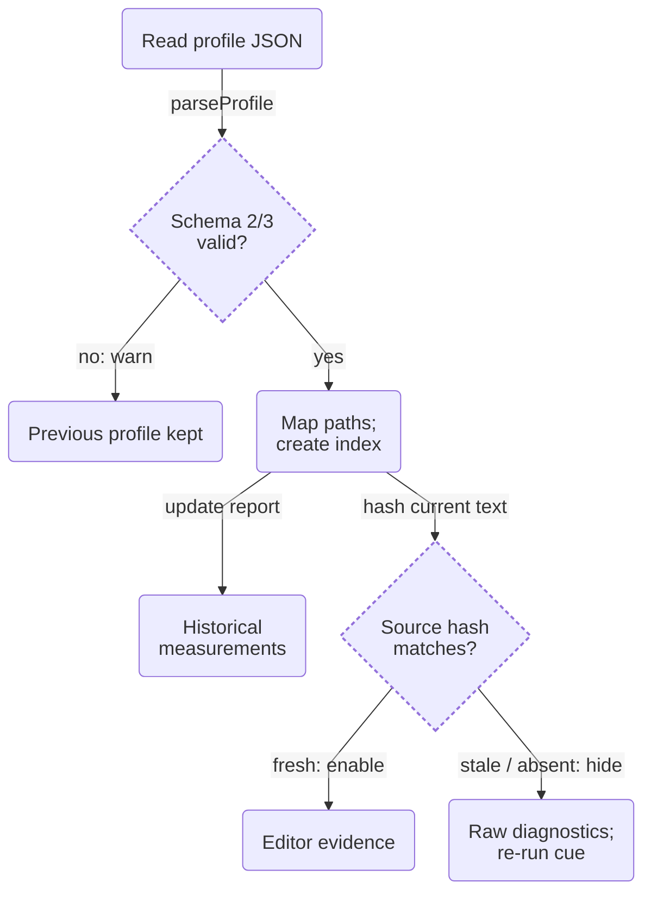
```mermaid
%%{init: {"fontFamily":"Arial, sans-serif","themeVariables":{"fontSize":"18px","fontFamily":"Arial, sans-serif"},"flowchart":{"curve":"linear","nodeSpacing":32,"rankSpacing":40,"diagramPadding":8,"padding":18,"subGraphTitleMargin":{"top":10,"bottom":24},"htmlLabels":false},"layout":"dagre","htmlLabels":false,"themeCSS":".node rect, .cluster rect { rx: 10px; ry: 10px; } .label, .nodeLabel, .edgeLabel, .cluster-label { letter-spacing: normal; word-spacing: normal; } .edgeLabel rect { stroke: currentColor !important; stroke-width: 1px !important; stroke-dasharray: none; opacity: 1 !important; fill-opacity: 1; rx: 4px; ry: 4px; }"}}%%
flowchart TD
    Load("Read profile JSON") -->|parseProfile| Valid{"Schema 2/3<br/>valid?"}
    Valid -->|no: warn| Old("Previous profile kept")
    Valid -->|yes| Index("Map paths;<br/>create index")
    Index -->|update report| Report("Historical<br/>measurements")
    Index -->|hash current text| Check{"Source hash<br/>matches?"}
    Check -->|fresh: enable| Editor("Editor evidence")
    Check -->|stale / absent: hide| Stale("Raw diagnostics;<br/>re-run cue")
    classDef decision stroke-width:2px,stroke-dasharray:4 3;
    class Valid,Check decision;
```

**Implementation**

| Responsibility | Files and symbols |
|---|---|
| Discover/watch profiles and refresh on Python edits | [profileView.ts](../src/profileView.ts#L43): constructor, `PROFILE_GLOB` |
| Select a saved JSON file or receive an editor URI | [profileView.ts](../src/profileView.ts#L139): `openSavedReport`, `visualizeReport`; [package.json](../package.json): `visualizeReport` command and editor/title menu |
| Read, validate, replace index and update consumers | [profileView.ts](../src/profileView.ts#L155): `load`; [profileModel.ts](../src/profileModel.ts#L79): `parseProfile`, `ProfileIndex` |
| Normalize paths and compare current text with recorded hashes | [profileModel.ts](../src/profileModel.ts#L69): `normPath`, `textHash`, `ProfileIndex.state` |
| Rewrite container paths before indexing | [containerPaths.ts](../src/containerPaths.ts#L72): `remapProfileKeys`, `toLocal` |
| Clear loaded evidence and report state | [profileView.ts](../src/profileView.ts#L182): `clear` |

**Important branches and limits**

- Startup loads the first discovered profile. The watcher reads disk; saved-report selection and the JSON graph action use `load` with reveal, which reads an open document's current text, including unsaved edits.
- The graph action is contributed for any local JSON file. It passes its URI to `visualizeReport`; validation decides whether it is a supported profile.
- Unreadable selected files or malformed/unsupported profiles warn and retain the previous index/report. No partially validated profile is installed. Every numeric field a consumer computes with is type-checked, including optional ones such as a function's `alloc_mb`, `rss_growth_mb` and `profiler_mb` (a string there was accepted before and reached label arithmetic and the run summary).
- `ProfileIndex.state` returns `fresh`, `stale` or `absent`. Freshness requires a matching normalized file path and SHA-1 of decoded source text with CRLF normalized to LF. The producer records hashes only for verified unchanged source; the consumer hashes current editor text. See the [source identity contract](#shared-contracts-and-coordinated-changes).
- Editing a profiled file does work only when its freshness changes (`onEdit`): the first edit after profiling makes it stale, and an undo back to the profiled text makes it fresh again. That transition re-adjusts that file's diagnostics, refreshes the report once and re-renders decorations. Stale files lose current editor evidence and regain unadjusted static diagnostics; historical measurements can still appear in the report. Typing in an unprofiled or already-stale file, or with no profile loaded, does no profile work.
- `docState` hashes an open document at most once per `TextDocument.version`; the decorations, middleware and report freshness checks share that hash. Closing a document, or a server publishing an empty list for it, drops its stored findings and cached hash.
- `pythonMemoryGuardian.clearProfile`, or deletion of the loaded profile file (`profileDeleted`), clears the index, runtime diagnostics and report, restores raw static findings and removes decorations/status. Deleting another `.pmg/profile.json` (another folder of a multi-root workspace) leaves the loaded profile in place. Deleting the run's `profile.json` also deletes its `summary.json`.

**Tests:** [test_model.js](../test-fixtures/test_model.js), [test_report.js](../test-fixtures/test_report.js), [test_report_entry.js](../test-fixtures/test_report_entry.js) and [profiler_regression_test.py](../test-fixtures/profiler_regression_test.py) cover validation, report entry, hashing and freshness; [test_editor_events.js](../test-fixtures/test_editor_events.js) counts per-keystroke diagnostics publishes, report refreshes and hashes across unprofiled, fresh, stale and closed files.

[Back to navigation](#start-here)

### Editor annotations and warnings

A fresh profile supplies line/function labels, suspected runtime leak warnings and prioritization of static findings. The extension stores raw static diagnostics so it can restore them when the profile becomes stale or is cleared.

**Trigger:** valid profile load, editor visibility/source change, static diagnostic publication or overlay toggle. **Result:** end-of-line annotations, runtime Problems entries, adjusted static severity and profile status.

**Runtime evidence in the editor — extension host**

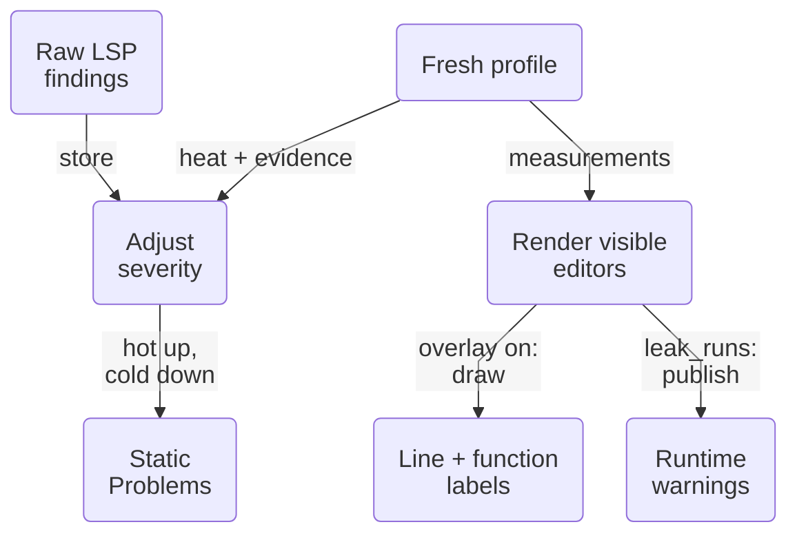
```mermaid
%%{init: {"fontFamily":"Arial, sans-serif","themeVariables":{"fontSize":"18px","fontFamily":"Arial, sans-serif"},"flowchart":{"curve":"linear","nodeSpacing":32,"rankSpacing":40,"diagramPadding":8,"padding":18,"subGraphTitleMargin":{"top":10,"bottom":24},"htmlLabels":false},"layout":"dagre","htmlLabels":false,"themeCSS":".node rect, .cluster rect { rx: 10px; ry: 10px; } .label, .nodeLabel, .edgeLabel, .cluster-label { letter-spacing: normal; word-spacing: normal; } .edgeLabel rect { stroke: currentColor !important; stroke-width: 1px !important; stroke-dasharray: none; opacity: 1 !important; fill-opacity: 1; rx: 4px; ry: 4px; }"}}%%
flowchart TD
    Raw("Raw LSP<br/>findings") -->|store| Adjust("Adjust<br/>severity")
    Fresh("Fresh profile") -->|heat + evidence| Adjust
    Fresh -->|measurements| Render("Render visible<br/>editors")
    Adjust -->|hot up,<br/>cold down| UI("Static<br/>Problems")
    Render -->|overlay on:<br/>draw| Labels("Line + function<br/>labels")
    Render -->|leak_runs:<br/>publish| Warnings("Runtime<br/>warnings")
```

**Implementation**

| Responsibility | Files and symbols |
|---|---|
| Store raw findings, check freshness and adjust severity | [profileView.ts](../src/profileView.ts#L193): `adjust`, `refreshDiagnostics` (all files, or only the edited one), `onEdit`, `docState`, `forget` |
| Classify heat and format diagnostic evidence | [profileModel.ts](../src/profileModel.ts#L229): `heat`, `memoryMb`, `adjustSeverity`, `evidence`, `ProfileIndex.insideSampledFunction` |
| Render decorations, runtime diagnostics and status | [profileView.ts](../src/profileView.ts#L270): `render`, `thresholds` |
| Format line/function totals and leak advice | [profileModel.ts](../src/profileModel.ts#L256): `lineLabel`, `funcLabel`, `leakMessage`, `unattributedNote` |
| Register overlay and clear controls | [profileView.ts](../src/profileView.ts#L43): constructor; `pythonMemoryGuardian.toggleProfileOverlay` and `pythonMemoryGuardian.clearProfile` |

**Important branches and limits**

| Evidence state | Editor behavior |
|---|---|
| Fresh, hot line | Static severity rises one level; measured evidence is prefixed |
| Fresh, cold line | Non-error findings become hints |
| Sampled-function gap or line-event-only evidence | Heat stays unknown; severity stays unchanged |
| Stale/absent profile evidence | Raw static diagnostics; no current runtime annotations/warnings |

- `profile.hotShare` and `profile.hotMB` set hot thresholds; `leak_runs` also makes a line hot. This is **inferred runtime prioritization**, not a new language-server finding.
- Labels show time split and mode-specific memory; precise mode distinguishes allocated, held and transient-peak quantities. Function annotations aggregate measurements.
- Overlay toggling skips decorations only. Runtime leak warnings still publish, and the static adjustment path is unchanged.
- `render` publishes runtime leak warnings per **visible** editor whose source is fresh. A profiled file that is not open in a visible editor has no runtime warnings in Problems until it becomes visible; static severity adjustment does not depend on visibility.
- `memory-guardian: ignore` suppresses a static finding, not runtime leak warnings.
- Status shows run duration, memory mode/peak or a stale re-run cue. Its click opens the report; the tooltip explains substantial unattributed precise memory and traceback-depth tuning, plus `runNotes` for lost tracing or a sampler error. The report summary repeats those notes, and the Overview stops the traced-memory line at `memory_tracing_lost_s`.

**Tests:** [test_model.js](../test-fixtures/test_model.js) and [test_report.js](../test-fixtures/test_report.js) cover model and consumed evidence behavior. These checks do not constitute an automated VS Code editor integration run.

[Back to navigation](#start-here)

### Reports and source navigation

The webview presents an Overview, precise-memory diagnosis and a time-weighted Stack Explorer. It can display historical measurements when source is stale, but source navigation requires verified current text.

**Trigger:** `pythonMemoryGuardian.showReport`, `pythonMemoryGuardian.openSavedReport`, `pythonMemoryGuardian.visualizeReport`, status click, or automatic opening after a profiling task's next valid load; `pythonMemoryGuardian.saveBaseline` for baselines. **Result:** interactive charts, evidence cards, stack filters, run comparisons and verified source navigation.

**Render and filter**

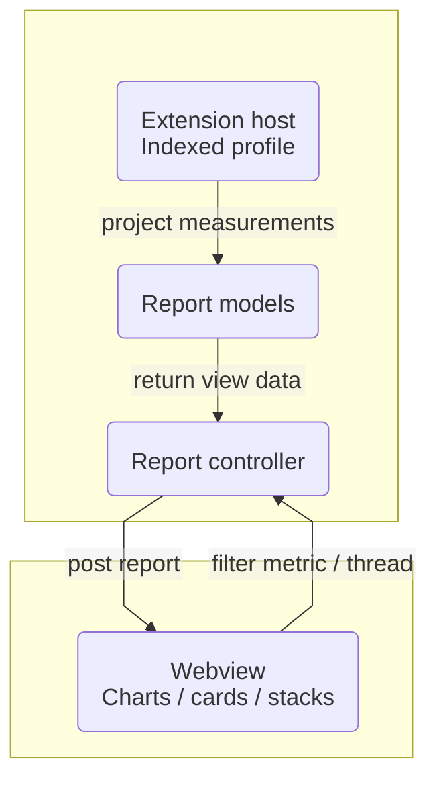
```mermaid
%%{init: {"fontFamily":"Arial, sans-serif","themeVariables":{"fontSize":"18px","fontFamily":"Arial, sans-serif"},"flowchart":{"curve":"linear","nodeSpacing":32,"rankSpacing":40,"diagramPadding":8,"padding":18,"subGraphTitleMargin":{"top":10,"bottom":24},"htmlLabels":false},"layout":"dagre","htmlLabels":false,"themeCSS":".node rect, .cluster rect { rx: 10px; ry: 10px; } .label, .nodeLabel, .edgeLabel, .cluster-label { letter-spacing: normal; word-spacing: normal; } .edgeLabel rect { stroke: currentColor !important; stroke-width: 1px !important; stroke-dasharray: none; opacity: 1 !important; fill-opacity: 1; rx: 4px; ry: 4px; }"}}%%
flowchart TD
subgraph EXT[" "]
      Profile("Extension host<br/>Indexed profile")
      Models("Report models")
      Bridge("Report controller")
    end
    subgraph WEB[" "]
      Panel("Webview<br/>Charts / cards / stacks")
    end
    Profile -->|project measurements| Models
    Models -->|return view data| Bridge
    Bridge -->|post report| Panel
    Panel -->|filter metric / thread| Bridge
```

**Save a baseline and compare**

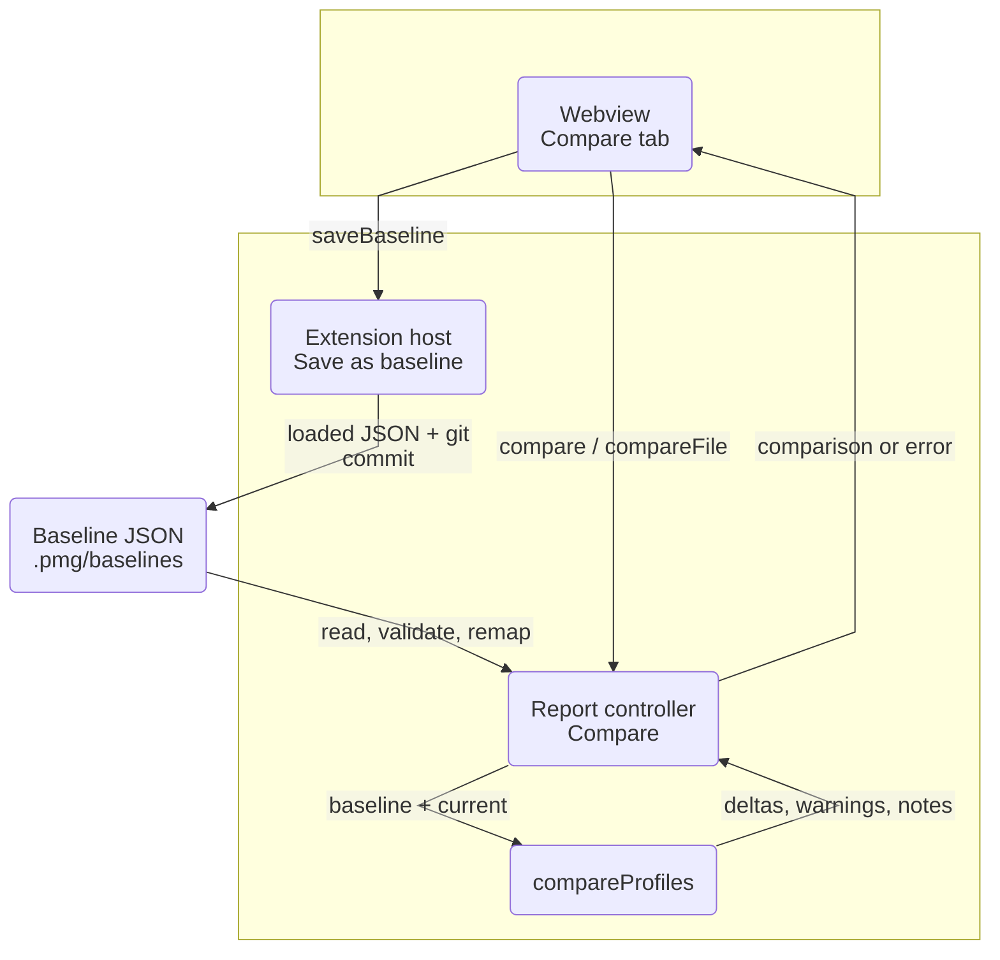
```mermaid
%%{init: {"fontFamily":"Arial, sans-serif","themeVariables":{"fontSize":"18px","fontFamily":"Arial, sans-serif"},"flowchart":{"curve":"linear","nodeSpacing":32,"rankSpacing":40,"diagramPadding":8,"padding":18,"subGraphTitleMargin":{"top":10,"bottom":24},"htmlLabels":false},"layout":"dagre","htmlLabels":false,"themeCSS":".node rect, .cluster rect { rx: 10px; ry: 10px; } .label, .nodeLabel, .edgeLabel, .cluster-label { letter-spacing: normal; word-spacing: normal; } .edgeLabel rect { stroke: currentColor !important; stroke-width: 1px !important; stroke-dasharray: none; opacity: 1 !important; fill-opacity: 1; rx: 4px; ry: 4px; }"}}%%
flowchart TD
subgraph WEB[" "]
      Tab("Webview<br/>Compare tab")
    end
    subgraph EXT[" "]
      Save("Extension host<br/>Save as baseline")
      Report("Report controller<br/>Compare")
      Model("compareProfiles")
    end
    Tab -->|saveBaseline| Save
    Save -->|loaded JSON + git commit| File("Baseline JSON<br/>.pmg/baselines")
    File -->|read, validate, remap| Report
    Tab -->|compare / compareFile| Report
    Report -->|baseline + current| Model
    Model -->|deltas, warnings, notes| Report
    Report -->|comparison or error| Tab
```

**Navigate to source**

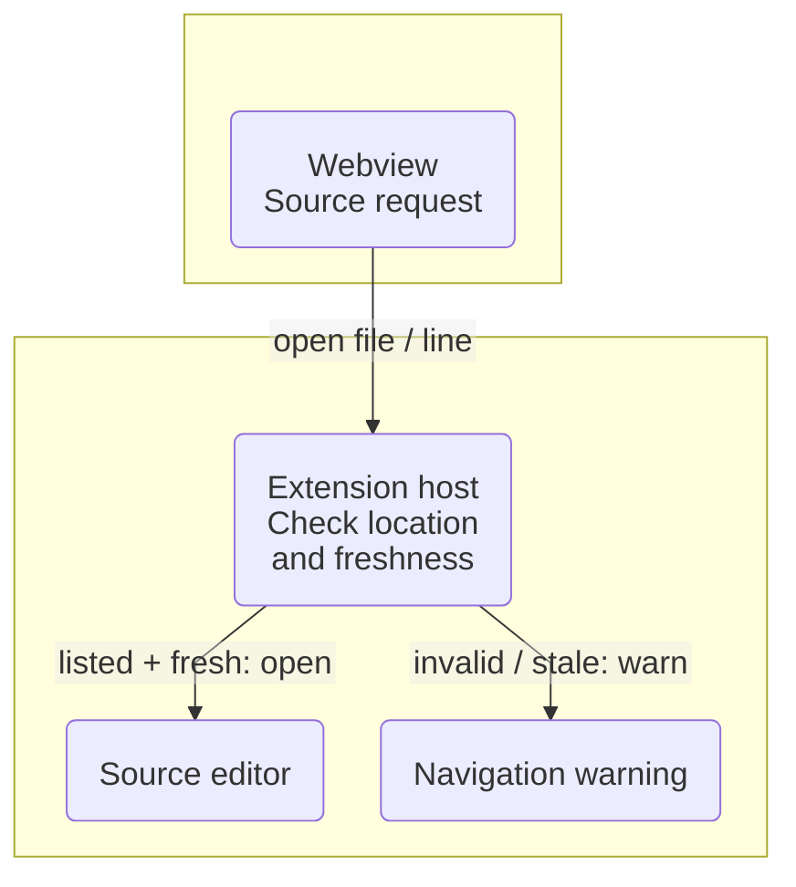
```mermaid
%%{init: {"fontFamily":"Arial, sans-serif","themeVariables":{"fontSize":"18px","fontFamily":"Arial, sans-serif"},"flowchart":{"curve":"linear","nodeSpacing":32,"rankSpacing":40,"diagramPadding":8,"padding":18,"subGraphTitleMargin":{"top":10,"bottom":24},"htmlLabels":false},"layout":"dagre","htmlLabels":false,"themeCSS":".node rect, .cluster rect { rx: 10px; ry: 10px; } .label, .nodeLabel, .edgeLabel, .cluster-label { letter-spacing: normal; word-spacing: normal; } .edgeLabel rect { stroke: currentColor !important; stroke-width: 1px !important; stroke-dasharray: none; opacity: 1 !important; fill-opacity: 1; rx: 4px; ry: 4px; }"}}%%
flowchart TD
subgraph WEB[" "]
      Request("Webview<br/>Source request")
    end
    subgraph EXT[" "]
      Check("Extension host<br/>Check location<br/>and freshness")
      Source("Source editor")
      Warning("Navigation warning")
    end
    Request -->|open file / line| Check
    Check -->|listed + fresh: open| Source
    Check -->|invalid / stale: warn| Warning
```

**Pending report flag — extension host**

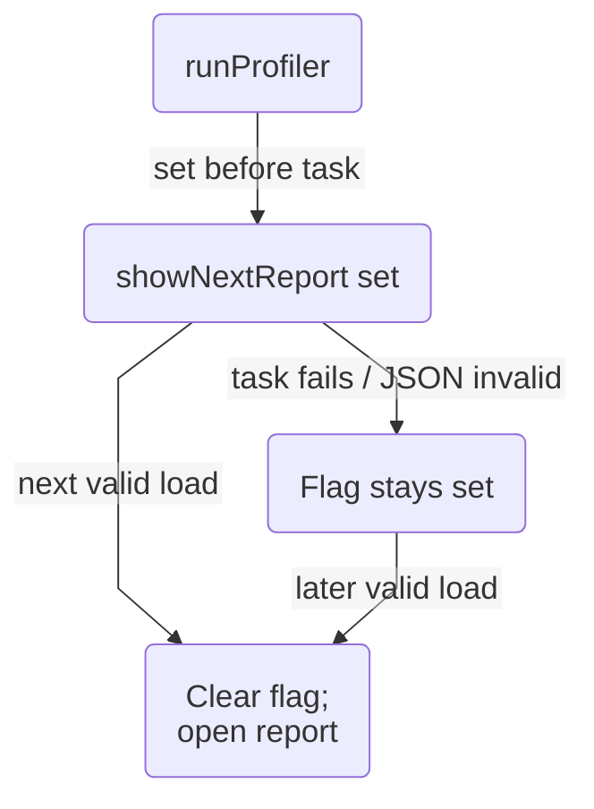
```mermaid
%%{init: {"fontFamily":"Arial, sans-serif","themeVariables":{"fontSize":"18px","fontFamily":"Arial, sans-serif"},"flowchart":{"curve":"linear","nodeSpacing":32,"rankSpacing":40,"diagramPadding":8,"padding":18,"subGraphTitleMargin":{"top":10,"bottom":24},"htmlLabels":false},"layout":"dagre","htmlLabels":false,"themeCSS":".node rect, .cluster rect { rx: 10px; ry: 10px; } .label, .nodeLabel, .edgeLabel, .cluster-label { letter-spacing: normal; word-spacing: normal; } .edgeLabel rect { stroke: currentColor !important; stroke-width: 1px !important; stroke-dasharray: none; opacity: 1 !important; fill-opacity: 1; rx: 4px; ry: 4px; }"}}%%
flowchart TD
    Run("runProfiler") -->|set before task| Flag("showNextReport set")
    Flag -->|next valid load| Open("Clear flag;<br/>open report")
    Flag -->|task fails / JSON invalid| Wait("Flag stays set")
    Wait -->|later valid load| Open
```

**Implementation**

| Responsibility | Files and symbols |
|---|---|
| Register report commands and update after valid loads | [profileView.ts](../src/profileView.ts#L43): constructor, `openSavedReport`, `visualizeReport`, `load`, `showNextReport` |
| Create/reveal panel and exchange messages | [reportView.ts](../src/reportView.ts#L37): `GuardianReport.show`, `update`, `refresh` |
| Project bounded timeline and top sampled lines | [reportModel.ts](../src/reportModel.ts#L17): `overview` |
| Classify retention and suggest checks, for the whole run or a time window | [reportModel.ts](../src/reportModel.ts#L59): `diagnose`, `diagnoseWindow`, `recommendations` |
| Aggregate sampled stacks by time metric and thread; label frame origins | [reportModel.ts](../src/reportModel.ts#L210): `callTree` (views `all`/`grouped`/`mine`, `inverted`; node limit keeps the stack prefix and counts the rest as `omitted`), `frameOrigin` |
| Split the run into phases; gate and weigh memory measures; focus | [reportModel.ts](../src/reportModel.ts#L439): `phases`, `hasMetric`, `stackSource` (focus filter, `mem_alloc` weights) |
| Rank functions across call paths; callers and callees of one function | [reportModel.ts](../src/reportModel.ts#L371): `topFunctions`, `neighbors`, `functionKey` |
| Render charts, cards, filters and source controls | [reportWebview.ts](../src/reportWebview.ts#L2): `reportHtml`, `memoryChart`, `overview` |
| Save the loaded profile as a baseline | [profileView.ts](../src/profileView.ts#L208): `saveBaseline`, `baselineDir`, `parse`; [compareModel.ts](../src/compareModel.ts#L356): `baselineFileName` |
| List baselines, load the selected one, compare and cache | [reportView.ts](../src/reportView.ts#L54): `baselinesChanged`, `listBaselines`, `compare`, `bounded` |
| Match runs, compute deltas, variation, context and warnings | [compareModel.ts](../src/compareModel.ts#L187): `compareProfiles`, `timeNoise`, `memoryNoise`, `enclosingName`, `baselineMeta` |
| Render the Compare tab | [reportWebview.ts](../src/reportWebview.ts#L200): `compareView`, `deltaTable` |
| Validate requested location and current source before opening | [reportView.ts](../src/reportView.ts#L37): `GuardianReport.show` message handler, `fresh` |

**Important branches and limits**

- Overview shows run metrics, bounded RSS/traced-memory timeline and top sampled-line bars. Time-only mode hides the memory chart. `timeline` and `rss_kind` come from the profiler through schema validation.
- Only precise profiles produce memory cards (`growing`, `retained`, `released`) and recommendations. Editor leak text and report recommendations are separate consumers of the same evidence.
- Stack Explorer aggregates Python call stacks, including library frames, by elapsed/Python/native/system/unsplit time and thread. Missing stacks leave it empty. Sampled time across threads may exceed run duration; widths are aggregated time, not chronological order or allocation weights. `callTree` sends only the stack frames its nodes reference, renumbered in node order, and the webview skips drawing the explorer while its tab is hidden. `frameOrigin` classifies each sent frame from its path alone (so older reports work too) as your code, an installed package (`site-packages`/`dist-packages`), the standard library, or Python internals (frozen import machinery, `<string>`, generated code), with a plain label such as `Python import system` or `pandas (installed package)`. The webview colors boxes by that kind (one hue per package) with a legend, shows durations in ms below one second, and its details line gives origin, total, share of sampled time and whether the time was spent in the function or its callees; the raw `file:line` stays in the tooltip, and search also matches origin labels. A **Frames** control picks the `callTree` view: `grouped` (the report's default) merges each run of consecutive non-user frames with the same origin into one box such as `Python import system · 8 frames`, showing a run that holds one distinct function as that function; `all` keeps every frame (the function's default); `mine` keeps only user frames, so library and internal time becomes self time of the nearest calling user frame. Total and self time are the same in every view. The controller validates the view in `filter` messages.
- Stack Explorer stays legible at scale: the webview draws boxes in pixels and merges children narrower than 40 px into one striped `+N smaller calls` box per caller (its details list them, each zoomable); a box shows text only when at least 56 px wide; it draws 12 levels below the zoom point, marking deeper boxes with ▸; a breadcrumb shows the zoom path; **Hottest path** follows the biggest callee while it carries at least 5% of the starting time and the caller does not spend more in itself, then highlights the chain. At the 25,000-node limit `callTree` keeps the part of a stack already in the tree and counts the rest as `omitted` on the deepest node shown, drawn as a striped "beyond display limit" box, so upper levels keep their full time.
- In precise mode the Measure list adds **Memory at peak snapshot** and **Memory held at exit** (`mem_peak`, `mem_exit`): `callTree`, `topFunctions` and `neighbors` read the memory-stack table instead of time samples (one internal stack source), values show in bytes, frames without a recoverable name show as `line N`, and the thread filter is disabled because memory stacks are not per thread. The notice states the traceback depth and truncation, the snapshot's time and total, and warns when the traced peak exceeds the snapshot total by 50%.
- **Direction** sets `callTree`'s `inverted` option. Bottom-up first maps every frame to one representative per function (`functionKey`), so a function reached from several lines is one box pointing at its first line, then reverses each display path: the top level is where time was spent or memory allocated (it equals each function's self value in Top functions, for time and memory measures) and the boxes below are callers. Frames views apply before the reversal. The details line says how much of the top function's value was reached through each caller chain.
- **Time windows:** in precise mode, dragging across the Overview memory chart posts `window` (`{from, to}` in elapsed seconds, or `{clear: true}`); the controller validates it, resets it when a new profile loads, and recomputes `diagnose(profile, window)`. A windowed diagnosis uses only each line's retention points inside the window: its highest point there, the value at its last point in the window, rises and releases within it (growing needs three trailing rises), and cites exit holders only when the window reaches the last snapshot. Lines without points in the window get no card. The Memory tab shows the window with a **Show whole run** button. Retention points are per line (at most 60 per line); memory stacks are not windowed.
- **Native estimate (precise mode):** `nativeMb` is a line's or function's RSS growth beyond its traced growth and its `tracemalloc` bookkeeping growth (`profiler_mb`), for any C extension; it reads 0 when within twice that bookkeeping, and for every line when the run-level estimate is 0 in a profile that records `tracemalloc_peak_mb` (RSS is charged where pages are first touched and bookkeeping where tables grow, so per-line differences do not line up: one pure-Python function showed 372 MB with 0.08 MB of bookkeeping growth). Older profiles keep the plain difference. The Overview card then reads "none detected" with the bookkeeping size. It appears as `native ≈` in line and function labels, counts toward heat, fills the Top functions **Native ≈** column (user functions) and the Overview's top-line memory, and the run-level `native_untraced_mb` shows as an Overview card. It inherits RSS's limits: charged where memory is first written, rarely falling.
- The Memory diagnosis tab lists `largest_objects` (holder, type, size, items) in both memory modes and explains that libraries which do not report their memory appear under `native ≈` instead.
- **Top functions** (`topFunctions`) ranks up to 200 functions, identified by file, first line and name, summed across call paths: self time (innermost frame), total time (counted once per stack, so recursion is not doubled), distinct calling functions, and function-level memory from `functions` for user functions only (precise: largest of held, spike and allocated; fast: RSS growth). It follows the measure, thread and `mine` view. Selecting a row highlights the function in the chart and posts `neighbors`; the controller answers with `neighbors` (callers and callees merged across call paths, each counted once per stack). Source opening also accepts a profiled user frame's first line.
- **Baselines:** `saveBaseline` asks for a name (letters, digits, `.`, `-`, `_`; confirms before replacing), reads `git rev-parse HEAD` and `git status --porcelain --untracked-files=no` in the workspace folder (either may be null), adds a `baseline` block (`name`, `saved_at`, `git_commit`, `git_dirty`) to the loaded profile's JSON as written (container paths unmapped) and writes `<workspace folder>/.pmg/baselines/<name>.json` atomically. A baseline is still a valid profile, so it can also be opened as a report. The profile watcher (`**/.pmg/profile.json`) ignores the folder.
- **Compare tab:** the controller lists `.pmg/baselines/*.json` (newest first) on each refresh, accepts `compare` only for a listed name (or `''` to stop) and `compareFile` through an open dialog, reads and validates the file once per modification time through the same `parseProfile` and container remapping as `load`, and recomputes `compareProfiles` once per loaded profile, so a new run compares against the selected baseline automatically. The payload keeps the 300 largest function and line changes and 100 sites, with totals. Unreadable files show `compareError`.
- **Matching:** files are keyed relative to each profile's script folder (so another checkout matches); functions by file and qualified name, with generator expressions, lambdas and comprehensions merged into their enclosing function (`enclosingName`), because samples and allocations move between them from run to run (measured: 1.2 vs 25.4 MB on one of a pair of identical runs, the same 27.1 MB in total). A line belongs to the function its `func_line` names, or its source `scope` when never sampled. Lines match by number when both runs recorded the same file hash; otherwise by function plus assignments and calls when that signature is unique in the function in both runs, else by offset from the function's first line (from `functions`, time stacks or memory stacks). Module-level lines in a changed file stay unmatched and are counted. Memory-stack sites are the innermost user frame of each stack; a site missing from a table held 0 bytes there.
- **Variation and verdicts:** each value gets `better`, `worse`, `same` (within variation), `new`, `gone` or `context`. Thresholds come from three identical runs each of `generators.py` in fast and precise mode: time uses the counting error of each value's samples, 2·√(t₁²/n₁ + t₂²/n₂), at least 10% (precise mode slows the sampler, so one line had 0.54 s from 6 samples and 0.61 s from 2); traced memory 1 MB or 15% (held at the peak snapshot moved 47.3–52.0 MB); RSS growth and the native estimate 10 MB or 20% (8.8 MB swings on small functions); run duration 10%. A line's change counts only when its function's total changed in the same measure (`shifted` otherwise; 24 MB moved between two lines of identical runs). On those runs no function, line, site or run value was marked better or worse; the thresholds were set on the same runs. A row is `significant` when a measure got better or worse, a leak appeared or went, or a new or removed row has a value beyond its variation.
- **Different tracing scopes:** when both runs are precise but only one, or each a different function, was traced with `--trace-function`, a warning says so and every better/worse verdict becomes `context`: code traced in one run and not the other has memory in one only, and untraced code runs faster.
- **Context:** when the largest peak site differs between runs, held-at-peak changes become `context` with a note: the peak moved, so functions there rise without changing (measured: 0 → 27 MB on an unchanged function after the code that peaked was fixed). When peak RSS fell beyond variation, RSS and native increases become `context` (and decreases when it rose): memory freed earlier stays resident for reuse, so later code can show growth it did not show before (measured: 0 → 73 MB). Warnings cover different scripts, arguments, Python versions, platforms, memory modes (only common measures are compared), traceback depths and sampling intervals, and a GIL difference.
- **Phases** ([reportModel.ts](../src/reportModel.ts#L439) `phases`): from `timeline_stacks`, each timeline point's main-thread user frames give a path; at depth *d*, contiguous points with the same function path (functionKeys from depth 0 to *d*) form a phase, bridging up to two points with a shallower stack. Phases are stretches of time, so a function that runs again later is a new phase. Each has from/to, duration, peak traced and peak RSS over its points, and new RSS: its peak RSS above the highest RSS before it (starting from `rss_start_mb`). Automatic depth: the shallowest level with 3 to 12 phases of at least 1% of the run covering at least 90% of it and none over half; otherwise the deepest level still covering 90%. On `generators.py` that is the ingest/process/verify level (largest phase 26-30%); the level above is one `measure` phase, the levels below are helper calls covering 80% or less. With `--trace-function`, the traced function dominates the run and the level inside it is chosen. The Overview's Phases card lists phases of at least 1% with **Shallower**/**Deeper**/**Automatic** (`phaseDepth` message, validated 0-128 or null, reset on load), draws them as bands on the memory chart, and offers **Memory diagnosis** (posts the phase as a `window`) and **Focus stacks** (posts `focus`).
- **Allocated (sampled, full call paths)** (`mem_alloc`, offered when stack samples carry `alloc_bytes`): `callTree`, `topFunctions` and `neighbors` weigh time stacks by `alloc_bytes`, so the thread filter works; `hasMetric` gates each memory measure on what the profile recorded, and the controller resets an unavailable measure on load.
- **Focus** (`focus` message with a functionKey, or `''`): the controller accepts only a key present in the profile's time or memory-stack frames, and `stackSource` keeps only stacks through that function for the call tree, Top functions and callers/callees. The Stack Explorer shows a focus bar with **Show all stacks**; the callers/callees panel and phases set focus. Focus resets when a profile loads. On `generators.py`, `normalize` allocated 146.6 MB under `process_eager` and 0 under `process_streaming`.
- `ready` requests a refresh; `filter` selects metric/thread; `open` requests navigation; `compare`, `compareFile` and `saveBaseline` drive the Compare tab; `phaseDepth` and `focus` drive phases and focus. The controller validates message shape, metric and report-listed locations. Producer/consumer payload changes must stay coordinated.
- Navigation accepts a profiled line or user stack-frame location only if its source hash is fresh; freshness is checked again after opening the document. Stale, unavailable or unverified source warns. Historical measurements remain visible with freshness warnings.
- Opening a report with no loaded profile shows an information message.
- `runProfiler` sets `showNextReport` before task execution; a valid `load` clears it and opens the report. If the task fails or its JSON is invalid, a later valid watcher load can still auto-open the report. This is a specific lifecycle coupling.

**Tests:** [test_report.js](../test-fixtures/test_report.js) covers report projection, diagnosis, call trees (including frame origins, the three frame views, and the node limit, with conserved totals), top functions and callers/callees, the memory measures (table totals, nameless frames, thread filter, validation), the bottom-up view (top level equals self values; callers below; one box per function), windowed diagnosis (window peak and end, holders only when the window reaches exit), phases (automatic depth, a function that runs again is a new phase, new RSS, a one-point gap bridged, older profiles without timeline stacks), the sampled-allocation measure and focus (a shared helper allocates under one caller and not the other), the native estimate gated by the run, path remapping and webview script syntax; [test_run_options.js](../test-fixtures/test_run_options.js) covers argument splitting and the function around the cursor; [test_compare.js](../test-fixtures/test_compare.js) covers matching across a 5-line shift, a line inserted inside a function and a different checkout folder, exact deltas and thresholds, generator-expression merging, identical files matched by line, attribution moving between lines, comparability warnings, different tracing scopes (warning and context), peak-moved context and baseline names; [test_report_entry.js](../test-fixtures/test_report_entry.js) checks the JSON editor URI and validation path; [profiler_test.py](../test-fixtures/profiler_test.py) checks produced report data. Navigation guards are supported by source inspection.

[Back to navigation](#start-here)

### Run summary

After each profiling run, the extension writes a machine-readable summary, `.pmg/summary.json`, beside the run's `.pmg/profile.json`, so scripts and agents can use the results without reading the report. Format `pmg-summary/1`, described by [pmg-summary.schema.json](pmg-summary.schema.json).

**Trigger:** a valid load of any `.pmg/profile.json` (the profiling task's output in fast, precise or time-only mode, or that file found at startup); rewritten when its inputs change. Opening another saved JSON or a baseline does not replace it. **Result:** `.pmg/summary.json`, written atomically; deleting the profile deletes it.

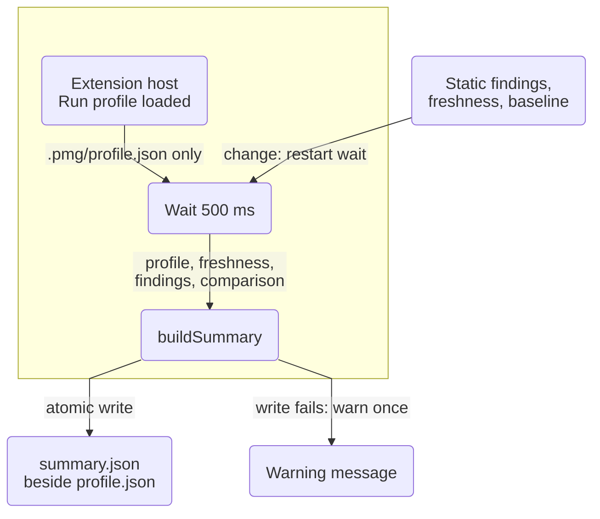
```mermaid
%%{init: {"fontFamily":"Arial, sans-serif","themeVariables":{"fontSize":"18px","fontFamily":"Arial, sans-serif"},"flowchart":{"curve":"linear","nodeSpacing":32,"rankSpacing":40,"diagramPadding":8,"padding":18,"subGraphTitleMargin":{"top":10,"bottom":24},"htmlLabels":false},"layout":"dagre","htmlLabels":false,"themeCSS":".node rect, .cluster rect { rx: 10px; ry: 10px; } .label, .nodeLabel, .edgeLabel, .cluster-label { letter-spacing: normal; word-spacing: normal; } .edgeLabel rect { stroke: currentColor !important; stroke-width: 1px !important; stroke-dasharray: none; opacity: 1 !important; fill-opacity: 1; rx: 4px; ry: 4px; }"}}%%
flowchart TD
subgraph EXT[" "]
      Load("Extension host<br/>Run profile loaded")
      Wait("Wait 500 ms")
      Build("buildSummary")
    end
    Load -->|.pmg/profile.json only| Wait
    Inputs("Static findings,<br/>freshness, baseline") -->|change: restart wait| Wait
    Wait -->|profile, freshness,<br/>findings, comparison| Build
    Build -->|atomic write| Out("summary.json<br/>beside profile.json")
    Build -->|write fails: warn once| Warn("Warning message")
```

**Implementation**

| Responsibility | Files and symbols |
|---|---|
| Recognize a run profile, schedule and write the summary, delete it with the profile | [profileView.ts](../src/profileView.ts#L257): `load`, `scheduleSummary`, `writeSummary`, `profileDeleted`; rescheduled from `adjust`, `onEdit` and the report's `BaselineSource.changed` |
| Build the summary from the profile and the report models | [summaryModel.ts](../src/summaryModel.ts): `buildSummary`, `methods`, `memoryStacks`, `nextSteps`; uses `diagnose` ([reportModel.ts](../src/reportModel.ts)) and `Comparison` ([compareModel.ts](../src/compareModel.ts)) |
| Comparison for the summarized profile | [reportView.ts](../src/reportView.ts): `GuardianReport.comparisonFor` |
| Contract | [pmg-summary.schema.json](pmg-summary.schema.json) |

**Important branches and limits**

- Sections: `run` (script, Python, platform, arguments, start time, mode, interval, samples, traceback depth, incomplete-evidence notes from `runNotes`, and `traced_function` with `--trace-function`), `phases` (the automatic-depth phases of at least 1% with peak traced, peak RSS and new RSS, or null without timeline stacks), `totals.tracemalloc_peak_mb`, `methods` (time and, per mode, traced/process/native measurement method and limits), `totals` (each a value with unit, method and limits; values the mode does not measure are omitted), `functions` and `lines` (your code: the top 20 by sampled time plus the top 20 by memory, with samples and per-mode memory fields), `memory_stacks` (precise: the peak and exit tables by innermost user function and the 10 largest stacks), `retention` (precise: `diagnose` findings with evidence, holders and recommendations), `largest_objects`, `static_diagnostics`, `source` (hash and current freshness per file), `comparison` (when a baseline is selected in the Compare tab: run rows and significant functions with baseline, current, change, variation and verdict) and `next_steps`.
- Traceability: profile values are copied unchanged (only values derived from bytes, shares and the native estimate are rounded to 0.001); `functions` and `lines` keep the profile's own names, so a generator expression is its own row (the comparison merges them). Paths are relative to the workspace folder (or the folder containing `.pmg`) when inside it.
- Static findings come from the language client's diagnostic collection, so they carry the profile's severity adjustment and evidence prefix. Both language servers analyze only open documents, so only open profiled files have findings; the others are listed in `static_diagnostics.limits`. Each finding states whether its line was `hot`, `cold` or `unknown` in this run (`heat` with the configured thresholds), or `source changed` when the file is no longer fresh.
- Freshness uses the per-version document hash for open files and reads closed files from disk (`unverified` when unreadable). `next_steps` puts a re-run first when any file is stale; it also covers a time-only or fast run (re-run in a memory mode), growing retention, static findings on hot lines, at least 1 MB never reaching user code within the traceback depth (not mere truncation, which nearly every stack has at the default depth), functions with fewer than 10 samples, and saving a baseline or checking comparison warnings.
- Rewrites are debounced (500 ms) and triggered by static findings for profiled files, freshness transitions and a changed baseline selection. A write failure warns once until a write succeeds.
- Not implemented: a summary from the standalone profiler (`pmg_profile.py --summary`); the interpretation (diagnosis, native estimate, comparison) exists only in TypeScript.

**Tests:** [test_summary.js](../test-fixtures/test_summary.js) validates summaries built from the profiles the profiler tests write (precise, fast, and a leak with holders) against the schema with a small validator that rejects unknown keywords, checks that function, line and total values equal the profile's, that every section has a method and limits, static findings' measured heat and the stale case, the comparison section, and that the schema rejects extra sections and another format; [test_editor_events.js](../test-fixtures/test_editor_events.js) checks that loading a `.pmg/profile.json` writes the summary after the delay with the open file's static finding, that deleting another folder's profile leaves the report and summary, and that deleting the loaded profile removes the summary and clears the report.

[Back to navigation](#start-here)

### Interpreter and backend setup

Activation probes the target interpreter, then starts the selected language server over stdio. Probe facts let either backend render messages for the target Python.

**Trigger:** Python document activation, `pythonMemoryGuardian.restart`, or a change to `backend`, `interpreter` or `container.*` settings. **Result:** a running language client, logs/trace, or a startup error.

**Probe interpreter facts**

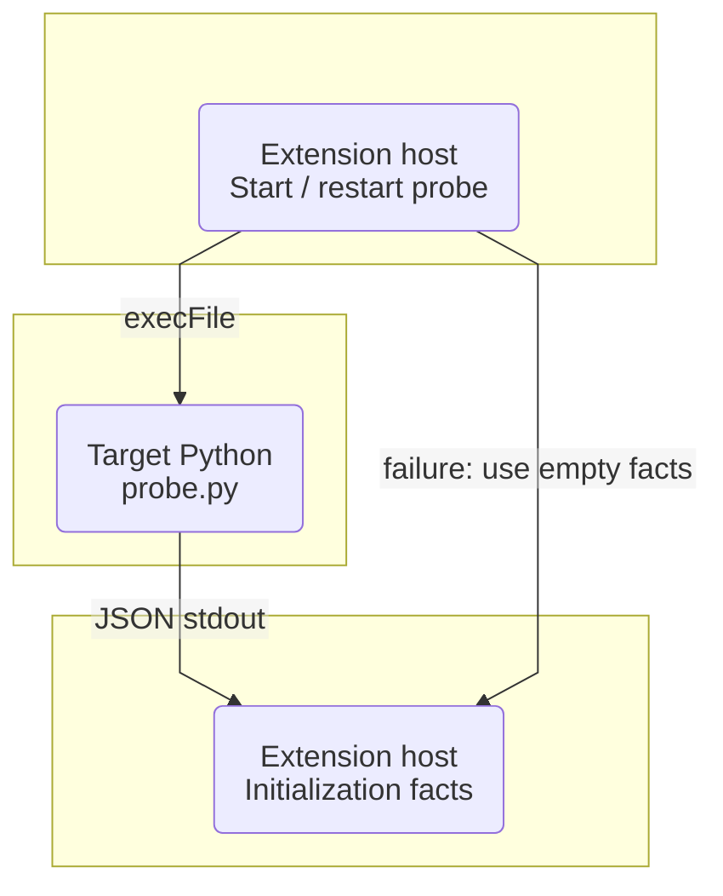
```mermaid
%%{init: {"fontFamily":"Arial, sans-serif","themeVariables":{"fontSize":"18px","fontFamily":"Arial, sans-serif"},"flowchart":{"curve":"linear","nodeSpacing":32,"rankSpacing":40,"diagramPadding":8,"padding":18,"subGraphTitleMargin":{"top":10,"bottom":24},"htmlLabels":false},"layout":"dagre","htmlLabels":false,"themeCSS":".node rect, .cluster rect { rx: 10px; ry: 10px; } .label, .nodeLabel, .edgeLabel, .cluster-label { letter-spacing: normal; word-spacing: normal; } .edgeLabel rect { stroke: currentColor !important; stroke-width: 1px !important; stroke-dasharray: none; opacity: 1 !important; fill-opacity: 1; rx: 4px; ry: 4px; }"}}%%
flowchart TD
    subgraph IN[" "]
      Probe("Extension host<br/>Start / restart probe")
    end
    subgraph TARGET[" "]
      Facts("Target Python<br/>probe.py")
    end
    subgraph OUT[" "]
      Init("Extension host<br/>Initialization facts")
    end
    Probe -->|execFile| Facts
    Facts -->|JSON stdout| Init
    Probe -->|failure: use empty facts| Init
```

**Python and Rust backends**

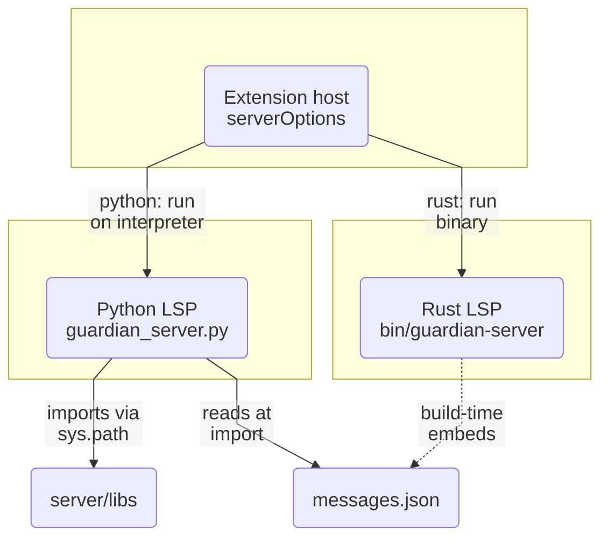
```mermaid
%%{init: {"fontFamily":"Arial, sans-serif","themeVariables":{"fontSize":"18px","fontFamily":"Arial, sans-serif"},"flowchart":{"curve":"linear","nodeSpacing":32,"rankSpacing":40,"diagramPadding":8,"padding":18,"subGraphTitleMargin":{"top":10,"bottom":24},"htmlLabels":false},"layout":"dagre","htmlLabels":false,"themeCSS":".node rect, .cluster rect { rx: 10px; ry: 10px; } .label, .nodeLabel, .edgeLabel, .cluster-label { letter-spacing: normal; word-spacing: normal; } .edgeLabel rect { stroke: currentColor !important; stroke-width: 1px !important; stroke-dasharray: none; opacity: 1 !important; fill-opacity: 1; rx: 4px; ry: 4px; }"}}%%
flowchart TD
    subgraph EXT[" "]
      Client("Extension host<br/>serverOptions")
    end
    subgraph PY[" "]
      Python("Python LSP<br/>guardian_server.py")
    end
    subgraph RS[" "]
      Rust("Rust LSP<br/>bin/guardian-server")
    end
    Client -->|python: run<br/>on interpreter| Python
    Client -->|rust: run<br/>binary| Rust
    Python -->|imports via<br/>sys.path| Libs("server/libs")
    Python -->|reads at<br/>import| Msg("messages.json")
    Rust -. build-time<br/>embeds .-> Msg
```

**Implementation**

| Responsibility | Files and symbols |
|---|---|
| Declare activation, commands and settings | [package.json](../package.json): `activationEvents`, `contributes` |
| Construct profile view before starting server | [extension.ts](../src/extension.ts#L189): `activate` |
| Select interpreter and launch probe with fallback | [extension.ts](../src/extension.ts#L37): `interpreter`, `probeInterpreter`; [probe.py](../server/probe.py#L51): `probe` |
| Select server command and initialize stdio client | [extension.ts](../src/extension.ts#L114): `serverOptions`, `startClient`, `LanguageClient` |
| Serialize stop/start and stop on deactivation | [extension.ts](../src/extension.ts#L179): `restartClient`, `deactivate` |
| Consume initialization facts and serve LSP | [guardian_server.py](../server/guardian_server.py#L30): `on_initialize`, `start_io`; [main.rs](../rust-server/src/main.rs#L1176): `Backend::initialize`, `main` |

**Important branches and limits**

- `pythonMemoryGuardian.backend` selects Python or Rust. `pythonMemoryGuardian.interpreter` chooses Python; an empty setting falls back to `python3` (`python` on Windows). No automatic environment discovery is implemented.
- The Python server runs on that interpreter. Rust runs the packaged `bin/guardian-server[.exe]`; missing binaries report a startup error. The server command is launched from the extension host in both cases.
- **Container mode changes the probe and profiler, not the language-server launch.** Both backends receive target-interpreter facts via `initializationOptions.profile`.
- Probe failure supplies `{}` and neutral wording where sized facts are unavailable. Python probes itself only if initialization supplies no facts object; an explicit empty object does not trigger a host probe.
- Failed server start leaves static analysis unavailable. Profile tasks/report commands remain registered because `ProfileView` was constructed first.
- Changing `backend`, `interpreter` or any `container.*` setting re-probes and restarts the client (`RESTART_SETTINGS`); deactivation waits for the serialized lifecycle and stops it. `profile.*` settings are client-only: they call `ProfileView.settingsChanged` to re-apply thresholds without a restart. `trace.server` controls LSP traffic in the output channel; `vscode-languageclient` applies changes to it without a restart.

**Tests:** [test_extension_lifecycle.js](../test-fixtures/test_extension_lifecycle.js), [server_lifecycle_test.py](../test-fixtures/server_lifecycle_test.py) and [parity_test.py](../test-fixtures/parity_test.py) cover lifecycle, settings that do and do not restart the server, facts and backend behavior.

[Back to navigation](#start-here)

### Container execution

With the editor on the host, a configured exec prefix launches the probe/profiler in a container. Path translation connects staged helpers and generated profile data to host-side source.

**Trigger:** nonempty `pythonMemoryGuardian.container.execPrefix`. **Result:** target measurements from container Python, remapped editor/report paths, or a mapping/execution error.

**Map outbound paths and execute**

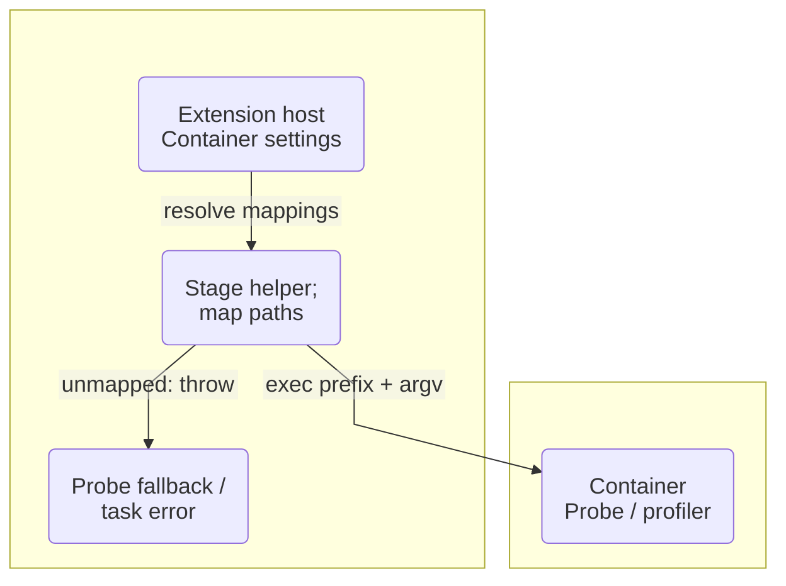
```mermaid
%%{init: {"fontFamily":"Arial, sans-serif","themeVariables":{"fontSize":"18px","fontFamily":"Arial, sans-serif"},"flowchart":{"curve":"linear","nodeSpacing":32,"rankSpacing":40,"diagramPadding":8,"padding":18,"subGraphTitleMargin":{"top":10,"bottom":24},"htmlLabels":false},"layout":"dagre","htmlLabels":false,"themeCSS":".node rect, .cluster rect { rx: 10px; ry: 10px; } .label, .nodeLabel, .edgeLabel, .cluster-label { letter-spacing: normal; word-spacing: normal; } .edgeLabel rect { stroke: currentColor !important; stroke-width: 1px !important; stroke-dasharray: none; opacity: 1 !important; fill-opacity: 1; rx: 4px; ry: 4px; }"}}%%
flowchart TD
subgraph HOST[" "]
      Config("Extension host<br/>Container settings")
      Stage("Stage helper;<br/>map paths")
      Error("Probe fallback /<br/>task error")
    end
    subgraph CONT[" "]
      Target("Container<br/>Probe / profiler")
    end
    Config -->|resolve mappings| Stage
    Stage -->|exec prefix + argv| Target
    Stage -->|unmapped: throw| Error
```

**Remap incoming profile paths**

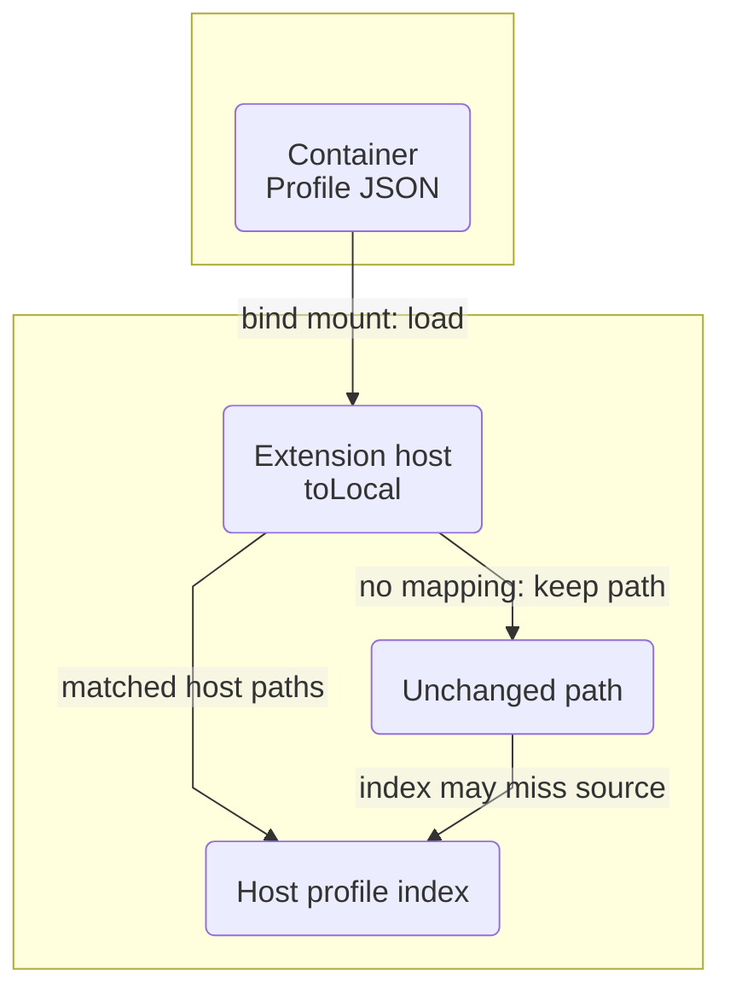
```mermaid
%%{init: {"fontFamily":"Arial, sans-serif","themeVariables":{"fontSize":"18px","fontFamily":"Arial, sans-serif"},"flowchart":{"curve":"linear","nodeSpacing":32,"rankSpacing":40,"diagramPadding":8,"padding":18,"subGraphTitleMargin":{"top":10,"bottom":24},"htmlLabels":false},"layout":"dagre","htmlLabels":false,"themeCSS":".node rect, .cluster rect { rx: 10px; ry: 10px; } .label, .nodeLabel, .edgeLabel, .cluster-label { letter-spacing: normal; word-spacing: normal; } .edgeLabel rect { stroke: currentColor !important; stroke-width: 1px !important; stroke-dasharray: none; opacity: 1 !important; fill-opacity: 1; rx: 4px; ry: 4px; }"}}%%
flowchart TD
subgraph CONT[" "]
      JSON("Container<br/>Profile JSON")
    end
    subgraph HOST[" "]
      Remap("Extension host<br/>toLocal")
      Index("Host profile index")
      Unmapped("Unchanged path")
    end
    JSON -->|bind mount: load| Remap
    Remap -->|matched host paths| Index
    Remap -->|no mapping: keep path| Unmapped
    Unmapped -->|index may miss source| Index
```

**Implementation**

| Responsibility | Files and symbols |
|---|---|
| Read container configuration and stage probe | [extension.ts](../src/extension.ts#L52): `containerConfig`, `stageHelper`, `probeInterpreter` |
| Resolve mapping settings and compose container argv | [containerPaths.ts](../src/containerPaths.ts#L24): `resolveMappings`, `toContainer`, `containerCommand` |
| Copy profiler under workspace `.pmg` and map task paths | [profileView.ts](../src/profileView.ts#L85): `runProfiler` |
| Rewrite profile paths on load | [profileView.ts](../src/profileView.ts#L155): `load`; [containerPaths.ts](../src/containerPaths.ts#L53): `toLocal`, `remapProfileKeys` |

**Important branches and limits**

- Empty `execPrefix` keeps local or remote-extension-host execution. Dev Containers, Codespaces, WSL and Remote-SSH normally run the extension beside Python and do not need this branch.
- Plain Docker/Compose requires a bind-mounted workspace and configured path mappings. Helpers are staged under workspace `.pmg` so container Python can read them.
- Probe and profiler intentionally share mapping/prefix helpers. The language server remains launched from the extension host.
- `toContainer` throws on an unmapped outbound path: the probe falls back to neutral facts, while profiler setup reports an error.
- `toLocal` leaves unmapped inbound paths unchanged. If they differ from host paths, source lookup/freshness can miss.
- `remapProfileKeys` rewrites script, file/function keys, source hashes, time stack-frame paths and memory-stack frame paths ([test_container.js](../test-fixtures/test_container.js) checks both); baselines and compared files go through the same remapping. Changes to profile path fields must update this contract.

**Tests:** [test_container.js](../test-fixtures/test_container.js) simulates an exec prefix with a path alias and mapped paths; it does not launch Docker.

[Back to navigation](#start-here)

### Build and packaging

Packaging creates the JavaScript bundle and vendors Python dependencies. Rust compilation is separate; its output must be placed at the path the extension expects.

**Trigger:** npm build/package scripts, `build:rust`, or `node scripts/install-local.js`. **Result:** bundled resources, an optional Rust executable, a VSIX and optionally local VS Code installation.

#### Extension and Python resources

**Prepublish build**

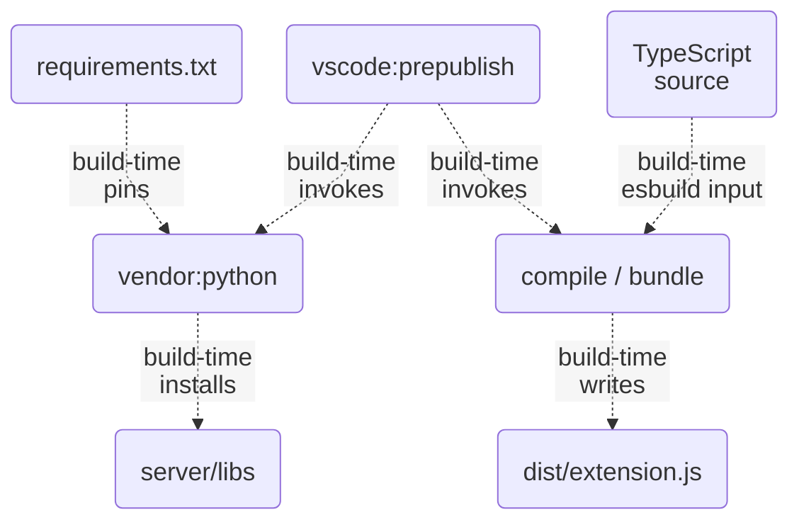
```mermaid
%%{init: {"fontFamily":"Arial, sans-serif","themeVariables":{"fontSize":"18px","fontFamily":"Arial, sans-serif"},"flowchart":{"curve":"linear","nodeSpacing":32,"rankSpacing":40,"diagramPadding":8,"padding":18,"subGraphTitleMargin":{"top":10,"bottom":24},"htmlLabels":false},"layout":"dagre","htmlLabels":false,"themeCSS":".node rect, .cluster rect { rx: 10px; ry: 10px; } .label, .nodeLabel, .edgeLabel, .cluster-label { letter-spacing: normal; word-spacing: normal; } .edgeLabel rect { stroke: currentColor !important; stroke-width: 1px !important; stroke-dasharray: none; opacity: 1 !important; fill-opacity: 1; rx: 4px; ry: 4px; }"}}%%
flowchart TD
    Pins("requirements.txt") -. build-time<br/>pins .-> Vendor("vendor:python")
    Prepub("vscode:prepublish") -. build-time<br/>invokes .-> Vendor
    Prepub -. build-time<br/>invokes .-> Compile("compile / bundle")
    Sources("TypeScript<br/>source") -. build-time<br/>esbuild input .-> Compile
    Vendor -. build-time<br/>installs .-> Libs("server/libs")
    Compile -. build-time<br/>writes .-> Bundle("dist/extension.js")
```

#### Rust executable

**Compile and place the Rust binary**

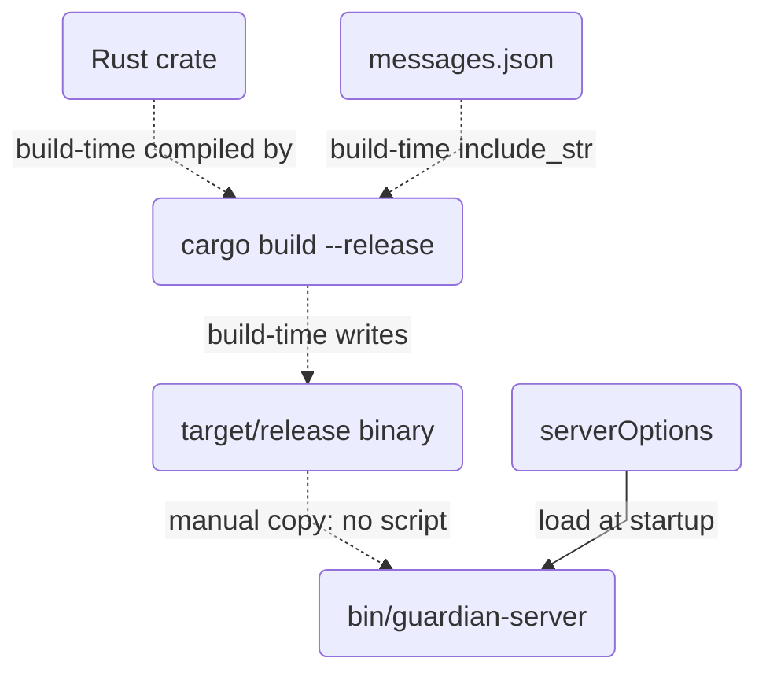
```mermaid
%%{init: {"fontFamily":"Arial, sans-serif","themeVariables":{"fontSize":"18px","fontFamily":"Arial, sans-serif"},"flowchart":{"curve":"linear","nodeSpacing":32,"rankSpacing":40,"diagramPadding":8,"padding":18,"subGraphTitleMargin":{"top":10,"bottom":24},"htmlLabels":false},"layout":"dagre","htmlLabels":false,"themeCSS":".node rect, .cluster rect { rx: 10px; ry: 10px; } .label, .nodeLabel, .edgeLabel, .cluster-label { letter-spacing: normal; word-spacing: normal; } .edgeLabel rect { stroke: currentColor !important; stroke-width: 1px !important; stroke-dasharray: none; opacity: 1 !important; fill-opacity: 1; rx: 4px; ry: 4px; }"}}%%
flowchart TD
    Source("Rust crate") -. build-time compiled by .-> Cargo("cargo build --release")
    Messages("messages.json") -. build-time include_str .-> Cargo
    Cargo -. build-time writes .-> Target("target/release binary")
    Target -. manual copy: no script .-> Bin("bin/guardian-server")
    Client("serverOptions") -->|load at startup| Bin
```

The manual-copy edge has no repository script. See [optional Rust packaging](05-build-and-release.md#optional-a-package-with-the-rust-backend-for-your-machine) for placing the binary; a missing binary produces a startup error.

#### Local installer

**Install locally**

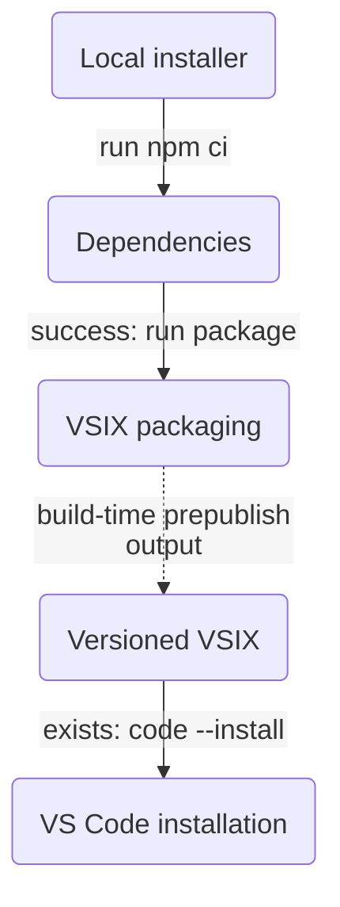
```mermaid
%%{init: {"fontFamily":"Arial, sans-serif","themeVariables":{"fontSize":"18px","fontFamily":"Arial, sans-serif"},"flowchart":{"curve":"linear","nodeSpacing":32,"rankSpacing":40,"diagramPadding":8,"padding":18,"subGraphTitleMargin":{"top":10,"bottom":24},"htmlLabels":false},"layout":"dagre","htmlLabels":false,"themeCSS":".node rect, .cluster rect { rx: 10px; ry: 10px; } .label, .nodeLabel, .edgeLabel, .cluster-label { letter-spacing: normal; word-spacing: normal; } .edgeLabel rect { stroke: currentColor !important; stroke-width: 1px !important; stroke-dasharray: none; opacity: 1 !important; fill-opacity: 1; rx: 4px; ry: 4px; }"}}%%
flowchart TD
Installer("Local installer") -->|run npm ci| Ci("Dependencies")
    Ci -->|success: run package| Pack("VSIX packaging")
    Pack -. build-time prepublish output .-> VSIX("Versioned VSIX")
    VSIX -->|exists: code --install| Code("VS Code installation")
```

**Implementation**

| Responsibility | Files and symbols |
|---|---|
| Define compile, bundle, vendor, package and Rust build commands | [package.json](../package.json): `scripts`, `main` |
| Pin Python packages and load vendored dependencies | [requirements.txt](../requirements.txt); [_vendor.py](../server/_vendor.py): `sys.path` setup; [guardian_server.py](../server/guardian_server.py) and [rules.py](../server/rules.py): early `_vendor` imports |
| Compile Rust and embed diagnostic messages | [Cargo.toml](../rust-server/Cargo.toml); [main.rs](../rust-server/src/main.rs#L24): `MESSAGES_JSON` |
| Check/load installed Rust binary | [extension.ts](../src/extension.ts#L114): `serverOptions` |
| Derive VSIX filename, run ordered commands and stop on failure | [install-local.js](../scripts/install-local.js#L8): `manifest`, `vsix`, `run` |

**Important branches and limits**

- `vscode:prepublish` runs Python vendoring through `uv` and TypeScript compilation/bundling through `tsc`/`esbuild`. `_vendor` prepends `server/libs` before third-party imports; `package.json` points the extension entry to `dist/extension.js`.
- `build:rust` writes into `rust-server/target/release`; `serverOptions` expects `bin/guardian-server[.exe]`. Repository scripts do not copy the binary. Missing it breaks Rust startup; that gap does not mean the Rust implementation is unused.
- The local installer supports macOS/Linux, runs `npm ci` then packaging then `code --install-extension --force`, and stops when a command fails or the VSIX is missing.
- `PMG_CODE_CLI` overrides the VS Code executable; `--dry-run` prints commands without running them. The filename comes from manifest name/version.
- The installer does not build/copy Rust or reload an open VS Code window. See [build, install and release](05-build-and-release.md) and [developer setup](04-developer-setup.md) for those steps.

**Checks:** `node scripts/install-local.js --dry-run` previews installer commands; [package_test.py](../test-fixtures/package_test.py) checks the VSIX.

[Back to navigation](#start-here)

## Developer reference

### Shared contracts and coordinated changes

Feature sections own their detailed code/test mappings. This table identifies the data and configuration shared across features; repeated references describe the same contract, not additional services.

| Contract | Producer / definition | Consumers |
|---|---|---|
| Commands and settings | [package.json](../package.json) | [extension.ts](../src/extension.ts), [profileView.ts](../src/profileView.ts), build/install scripts |
| Interpreter facts: `initializationOptions.profile` | [probe.py](../server/probe.py) via `probeInterpreter` | Python/Rust initialization and message renderers |
| Diagnostic codes and text | [messages.json](../server/messages.json), Python/Rust analyzers | LSP handlers, `ProfileView.adjust` and editor diagnostics |
| Profile schema 2/3, modes, timeline, `timeline_stacks`, measurements (including `profiler_mb`), stack `alloc_bytes`, `memory_stacks`, `largest_objects`, `tracemalloc_peak_mb`, `trace_function` and `run` | [pmg_profile.py](../server/pmg_profile.py#L1249): `Profiler.report` | [profileModel.ts](../src/profileModel.ts#L32): `Profile`/`parseProfile`; editor, report and comparison models |
| Run summary `pmg-summary/1`: `.pmg/summary.json` beside a run's `.pmg/profile.json` | [summaryModel.ts](../src/summaryModel.ts): `buildSummary`, written by `ProfileView.writeSummary`; [pmg-summary.schema.json](pmg-summary.schema.json) | Scripts and agents outside the extension; [test_summary.js](../test-fixtures/test_summary.js) validates it against the schema |
| Baseline files: a profile plus a `baseline` block, in `.pmg/baselines/<name>.json` | [profileView.ts](../src/profileView.ts#L208): `saveBaseline` | [reportView.ts](../src/reportView.ts#L73): `compare`; [compareModel.ts](../src/compareModel.ts#L347): `baselineMeta` |
| Source identity: `file_hashes` and normalized text | [pmg_profile.py](../server/pmg_profile.py#L365): `_text_hash`, verified source | [profileModel.ts](../src/profileModel.ts#L75): `textHash`/`ProfileIndex.state`; report navigation |
| Host/container paths | [containerPaths.ts](../src/containerPaths.ts), container settings | Probe/task argv, profile loader, source identity |
| Runtime retention: `leak_runs`, `held_by`, trends | [pmg_profile.py](../server/pmg_profile.py#L926): `_leaks`/`_find_holders`/`report` | `leakMessage` in [profileModel.ts](../src/profileModel.ts); `diagnose`/`recommendations` in [reportModel.ts](../src/reportModel.ts) |
| Webview `report` (including `baselines`, `compareWith`, `comparison`, `compareError`)/`clear`/`neighbors` and `ready`/`filter` (metric, thread, frames, inverted)/`open`/`neighbors`/`window`/`compare`/`compareFile`/`saveBaseline`/`phaseDepth`/`focus` messages; `report` also carries `phases`, `focus`, `allocAvailable`, `traceFunction` and `tracemallocPeakMb` | [reportView.ts](../src/reportView.ts) ↔ [reportWebview.ts](../src/reportWebview.ts) | Report rendering, filters and validated navigation |

**When changing a contract**

- **Static rule or diagnostic wording:** coordinate Python/Rust rules, message keys/placeholders and parity fixtures. Python loads messages at import; Rust needs a rebuild.
- **Interpreter facts:** coordinate the probe, initialization bridge, both server renderers and message placeholders. Missing sized facts select neutral wording; GIL facts also affect CPU-thread findings.
- **Profile fields or mode/schema names:** coordinate Python production, TypeScript types/validation, editor and report consumers. Schema 2 compatibility is explicit; validator rejection preserves the old profile. Timeline changes involve sampler/exit production, report bounds, validation and Overview rendering.
- **Retention criteria/advice:** coordinate produced evidence with both editor leak messages and report diagnosis/recommendations. These consumers have separate formatters.
- **Source identity:** coordinate Python and TypeScript hash algorithms. A normalization mismatch suppresses editor evidence and report navigation.
- **Paths:** update outbound mapping and every inbound profile path field. Missing outbound mappings error; unmatched inbound paths can prevent freshness matches.
- **Webview payloads:** update both message producers/consumers and extension validation together.
- **Run summary:** a field added to or renamed in the summary needs the same change in [pmg-summary.schema.json](pmg-summary.schema.json) (its top level rejects unknown sections). A profile field the summary copies keeps its value; consumers rely on that to trace numbers back to `profile.json`.
- **Commands/settings or packaging:** keep manifest IDs, registrations, argv and resource lookup paths consistent. The local installer derives version/output path from the manifest. The language servers report their own version at initialization: Rust uses `CARGO_PKG_VERSION` from [Cargo.toml](../rust-server/Cargo.toml) and Python uses the `LanguageServer` constructor in [guardian_server.py](../server/guardian_server.py); neither reads `package.json`, so a release bumps all three.
- **Task/report lifecycle:** review `showNextReport` set/clear paths; failed tasks or invalid loads can leave automatic opening pending for a later valid profile.

Shared messages, facts, path helpers and the profile model are intentional reuse. Separate Python/Rust analyzers and Python/TypeScript hash algorithms create coordination risks; parity and freshness checks exercise them. The pending-report flag is the specific lifecycle coupling identified in [Reports](#reports-and-source-navigation).

### Imports and process boundaries

Local imports are acyclic in this checkout. Runtime refresh/message loops are distinct from import cycles; some TypeScript imports are type-only and can be elided during compilation.

| Module | Local imports |
|---|---|
| [extension.ts](../src/extension.ts) | `profileView`, `containerPaths` |
| [profileView.ts](../src/profileView.ts) | `profileModel`, `containerPaths`, `compareModel`, `summaryModel`, `runOptions`, `reportView` |
| [reportView.ts](../src/reportView.ts) | `profileModel`, `reportModel`, `compareModel`, `reportWebview` |
| [reportModel.ts](../src/reportModel.ts) | `profileModel` |
| [compareModel.ts](../src/compareModel.ts) | `profileModel` |
| [summaryModel.ts](../src/summaryModel.ts) | `profileModel`, `reportModel`, `compareModel` (type only) |
| [runOptions.ts](../src/runOptions.ts) | No local imports |
| [guardian_server.py](../server/guardian_server.py) | `_vendor`, `probe`, `rules` |
| [rules.py](../server/rules.py) | `_vendor` |
| [pmg_profile.py](../server/pmg_profile.py) | No local server-module imports |

The extension uses `vscode-languageclient` to communicate with the selected language server over stdio LSP (`textDocument/publishDiagnostics` carries findings), launches the probe/profiler as separate processes, reads persisted profile JSON and exchanges `postMessage` messages with the report webview. A configured container changes the probe/profiler process location. Runtime and build-time relationships are separated in the feature diagrams.

[Back to navigation](#start-here)

## Planned, incomplete or unused capabilities

| Item | Source-grounded status |
|---|---|
| Automatic quick fixes or code actions | Diagnostic text recommends changes, but no code-action provider, `WorkspaceEdit`, or fix command is registered in `src`, `server`, or `rust-server/src/main.rs`. |
| Automatic environment/interpreter discovery | `src/extension.ts` `interpreter` uses the explicit setting or `python3`/`python` fallback. It does not query the VS Code Python extension or scan virtual environments. `server/probe.py` measures whichever executable was selected. |
| Allocation-stack graph and native stack/heap attribution | `server/pmg_profile.py` records line-level traced memory and Python call-stack **time** samples; `src/reportModel.ts` `callTree` weights time metrics only. The [planned completion criteria](#planned-completion-criteria) list memory-weighted allocation stacks and native visibility as planned. |
| Memory budgets; summary from the standalone CLI | Runs can be compared in the report's Compare tab and each profiling run writes `.pmg/summary.json` (see [Run summary](#run-summary)), but no CLI budget option or `pmg_profile.py --summary` exists. These are roadmap items. |
| General task provider | `package.json` declares the `pmg-profile` task type and `runProfiler` creates a task, but no `registerTaskProvider` implementation exists. |

### Planned completion criteria

These criteria describe proposed work, not current app behavior. The current Stack Explorer weights sampled Python call stacks by time. Precise memory evidence is attributed to lines, and native timing is estimated at a Python call site; the app does not unwind C/C++ stacks or attribute native heap allocations.

| Planned capability | Completion criterion | Reference |
|---|---|---|
| Memory-weighted stack graph | **Implemented:** Memory at peak snapshot and Memory held at exit measures, with peak capture. Remaining: a Memory diagnosis card opens its allocation stacks in the Stack Explorer. | Memray's default flame graph shows memory alive at peak; `--leaks` shows memory never freed. |
| Inverted (callers-first) view | **Implemented** as the Stack Explorer's Direction control (bottom-up), for time and memory measures; tests check that its top level equals Top functions' self values. | Memray `--inverted`. |
| Time-window memory analysis | **Implemented** for line-level retention: dragging on the Overview memory chart narrows Memory diagnosis to the window, and the Phases card does the same for one phase, which it finds from the main thread's stack over time. Remaining: windowed memory stacks, which would need allocation stacks from more than the peak and exit snapshots. | Memray `--temporal` flame graphs with time sliders. |
| Allocator-aware RSS guidance | Where fast-mode RSS evidence is shown, explain that RSS grows where memory is first written and stays high while pymalloc arenas still hold any live object, and point to precise mode, which tracks Python objects directly. Do not offer `PYTHONMALLOC=malloc`: measured on macOS/CPython 3.13 it was about 33% slower on small objects and returned none of their memory after a full free, while pymalloc returned almost all of it. | Memray's notes on pymalloc and resident vs heap memory. Memray's `PYTHONMALLOC=malloc` advice is about what Memray's allocator hooks can observe, which does not apply to `tracemalloc`. |
| Memory budgets for tests and CI | A test or CLI option fails a run whose peak or retained memory exceeds a stated budget, reporting the measurement method and the top allocation sites. It builds on the machine-readable report below. | `pytest-memray` with `@pytest.mark.limit_memory(...)`. |
| Native C-extension visibility | **Implemented, library-agnostic:** a per-line native estimate (RSS growth beyond traced growth and `tracemalloc`'s own bookkeeping, shown only when the run's estimate clears twice the bookkeeping) and largest live objects sized by `sys.getsizeof`. **Not adopting Memray as a backend:** on `examples/profiling-workloads` it reported 1,073.8 MB for an 8 MB PyArrow array (mimalloc reserves a 1 GiB region and Memray counts the reservation), attributed 1,555.8 MB of Polars memory to no stack (native worker threads), peaked at 1.42 GB and 1.60 GB against 360 MB and 406 MB of RSS, and runs only on Linux and macOS. Per-library counters (such as `pyarrow.total_allocated_bytes()`) are exact but do not scale across libraries and were not added. Remaining: native call stacks. | Memray `run --native`. |
| Cross-run diffing | **Implemented:** Save Profile as Baseline and the Compare tab: functions matched by file and name, lines by hash, signature or offset, per-function and per-line time and memory deltas, memory stacks by allocating function, run-to-run variation thresholds, context for a moved peak, and environment and argument warnings. Remaining: compare time stacks (call paths), and compare runs whose script moved to another file. | |
| Agent-ready telemetry | **Implemented in the editor:** each profiling run writes `.pmg/summary.json` (`pmg-summary/1`, [schema](pmg-summary.schema.json)) with evidence, static findings for open files, source identity, measurement method and limits, a comparison when a baseline is selected, and next steps. Remaining: a summary from the standalone profiler for CI and terminals, which first needs a way to run the profiler outside VS Code. | |
| End-to-end verification | Move from a finding to a candidate fix and a repeat run in VS Code, with a comparison showing whether retention improved under the same workload. The comparison exists (Compare tab); the step from a finding to a fix does not. | |

[Memray](https://github.com/bloomberg/memray) is a reference for several of these items. It traces every allocation and measures memory only, on Linux and macOS; this extension samples time and memory, works in the editor alongside static analysis, and runs on Windows too. Ideas are adopted only where they fit that design, and their implementation here is independent.

The intended priority is memory-stack attribution and leak diagnosis (memory-weighted stacks, allocator-aware guidance), then interactive exploration (inverted view, time windows), native visibility, cross-run diffing with memory budgets, and telemetry. New measurements should expose their source and limits so sampled or inferred data is not presented as proof of ownership or causality.

## Verification and limits

This map describes the current `package.json`, `src`, `server`, `rust-server/src/main.rs`, shared messages and test entry points. Feature tables identify relevant checks; their presence does not establish full UI coverage.

- Rust startup requires `bin/guardian-server[.exe]`. The build output is under `rust-server/target/release` and requires placement at the installed lookup path. Parity tests can exercise the release binary directly.
- Container tests simulate an exec prefix and mapped paths; they do not start Docker.
- UI flows are supported by source inspection and model/entry/lifecycle tests, rather than an automated VS Code-host integration run.
- Local file/heading links, Mermaid block structure, edge labels and styling JSON were checked. The 16 earlier diagrams were rendered with Mermaid 11.17.2 and headless Chrome at 720 px and 480 px column widths; the "Save a baseline and compare" and "Run summary" diagrams were rendered the same way at 720 px only (both fit, with no overlapping labels). All fit a 720 px column at 18 px type except the system overview (727 px wide, about 17.8 px). In the 480 px check the smallest scaled type was about 12 px in the overview and at least 13.7 px elsewhere. Edge-label bounds were checked against each other and against nodes, with no overlaps detected; rounded corners, bordered arrow labels and the decision diamonds were inspected in rendered screenshots. The unspecified Markdown viewer may use a different Mermaid version or override styling.

[Back to navigation](#start-here)
