# Python Memory Guardian: implemented feature map

This map follows the source in this checkout. Solid Mermaid arrows represent runtime calls or data flow; dotted arrows marked **build-time** represent packaged dependencies. A process boundary is drawn where execution crosses the VS Code extension host, a language server, the profiler process, or a configured container. Static analysis examines source text; runtime profiling executes the saved script. Each diagram keeps the viewer's Mermaid colors while requesting a sans-serif font, straight lines, and consistent spacing; the Markdown viewer ultimately controls how Mermaid renders them. The [README](../README.md) provides product context; source code is the authority for implemented behavior.

## 1. Core feature overview

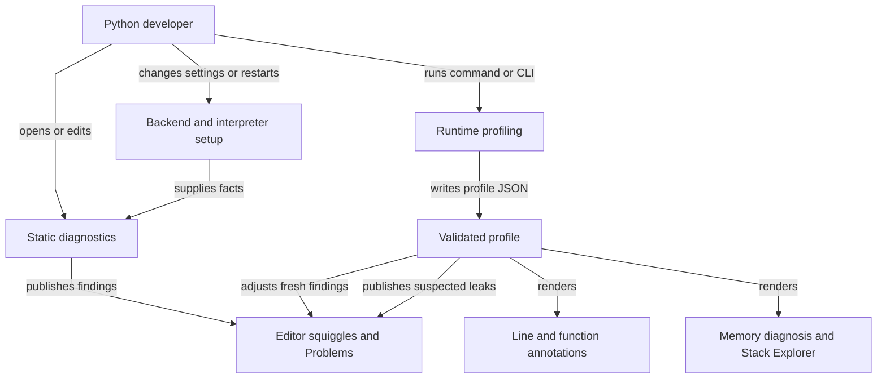

### Static rule families

Both servers emit the following codes through their visitor/analyzer, with text and advice from `server/messages.json`. These are source-pattern suggestions in diagnostic messages; the extension registers no code actions or automatic edits.

| Family | Implemented diagnostic codes | Examples of recognized patterns |
|---|---|---|
| Heap inflation | `heap-inflation` | `fetchall`, looped `fetchone`, cursor iteration |
| Pointer chasing | `pointer-chasing` | pandas import and recognized loader calls |
| Cycles and GC | `cyclic-reference`, `gc-cycle-risk` | looped construction of back-linked classes; back links with finalizers |
| RAM fragmentation | `ram-fragmentation.append`, `ram-fragmentation.no-slots` | per-row containers; looped instances without slots |
| Text inflation | `text-inflation.concat`, `text-inflation.whole-file` | string `+=` in loops; whole-file line/token reads |
| Memory swell | `memory-swell.list-arg`, `memory-swell.list-copy`, `memory-swell.method-cache`, `memory-swell.unbounded-cache`, `memory-swell.deepcopy-loop`, `memory-swell.recompile-loop`, `memory-swell.setdefault-loop`, `memory-swell.list-extend-loop` | eager lists, unbounded caches, repeated copies/compilation/default creation |
| Resource and task retention | `resource-leak.file-handle`, `task-retention.asyncio-task` | open handles without visible cleanup; discarded task handles |
| Single-thread stalls | `single-thread-stall.async-blocking`, `single-thread-stall.list-membership`, `single-thread-stall.cpu-thread` | blocking async calls, repeated list search, known pure-Python thread targets |

There are **21 codes in 8 grouped rows** above. The source has ten naming prefixes if `cyclic-reference` and `gc-cycle-risk`, and `resource-leak` and `task-retention`, are counted separately. Diagnostics carry severity, code, source, UTF-16 range and sometimes related locations. A `memory-guardian: ignore` marker on the finding's starting line suppresses that static finding. It does not suppress runtime leak diagnostics.

## 2. Feature execution flows

### 2.1 Activation, interpreter facts and backend selection

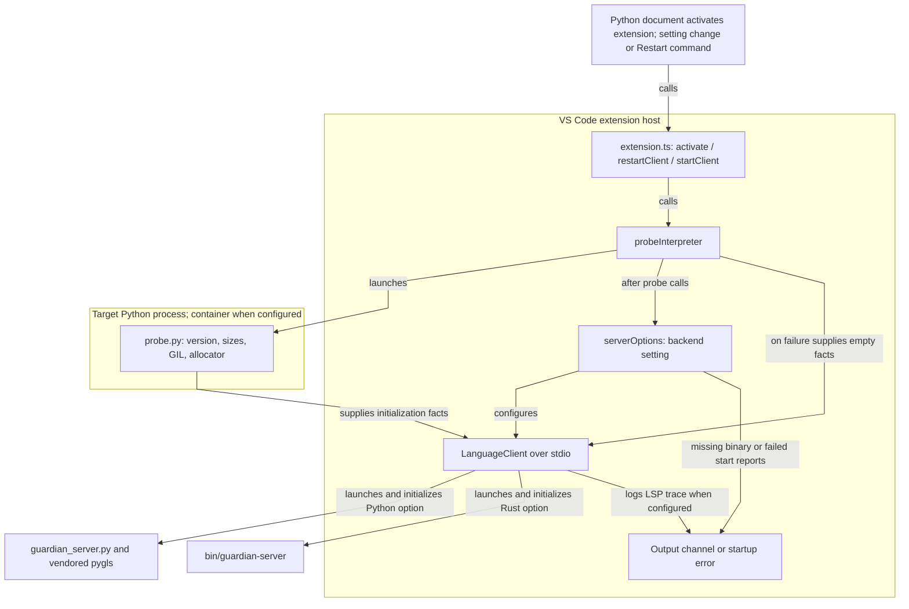

The Python server runs on `pythonMemoryGuardian.interpreter` (default `python3`, or `python` on Windows). The Rust server is a local packaged executable. **Container mode affects the probe and profiler, not the language server**: the selected server still runs in the extension host, using target-interpreter facts. The Python server probes itself only when initialization supplied no profile object; the extension normally sends an object, including `{}` after probe failure. Both servers then use neutral wording when sized facts are unavailable. Any setting under `pythonMemoryGuardian` restarts the client, and deactivation stops it. `trace.server` configures LSP traffic logging.

### 2.2 Static diagnostics and advice

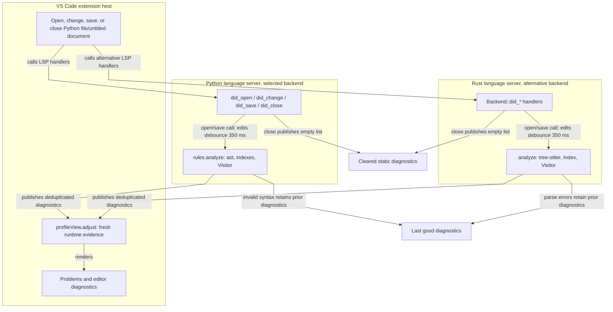

The two backends share diagnostic message templates and interpreter facts. Python reads `server/messages.json` at runtime; Rust embeds it with `include_str!` at **build time**. Python uses CPython `ast`, `pygls` and `lsprotocol`; Rust uses `tree-sitter-python` and `tower-lsp`. Their separate parsers and visitors are checked by `test-fixtures/parity_test.py`; parity is tested, not structurally guaranteed. Source-level rule context includes import aliases, lexical bindings, loops and known thread targets. No project-wide dataflow analysis is implemented.

### 2.3 Runtime profiling: command or CLI to profile

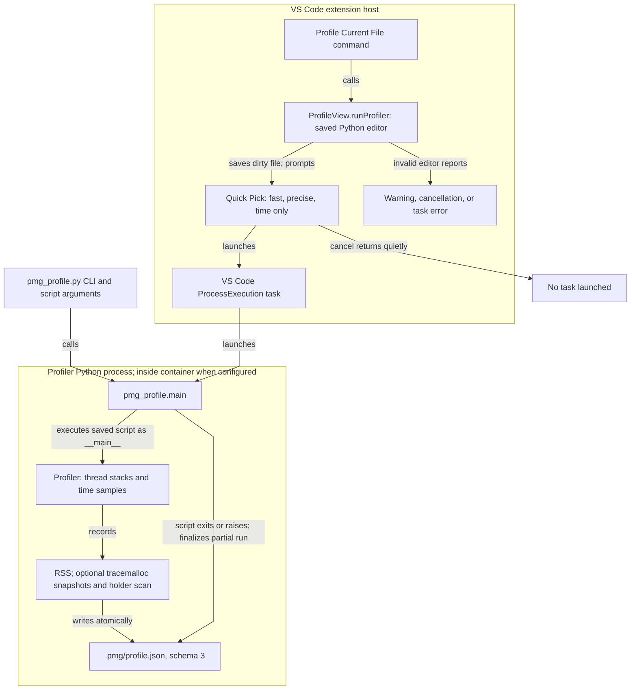

`--memory fast` attributes sampled RSS growth; `precise` adds `tracemalloc` allocation, held-memory and retention evidence plus a bounded holder search; `off` records time without memory attribution. Timing is sampled per thread and classified as Python, native, waiting or unsplit where clocks/GIL signals permit; these are estimates at Python lines, not native stack captures. Optional `--monitoring lines` uses Python 3.12+ `sys.monitoring` for execution counts and reports why it could not activate. The CLI also accepts `--root`, `--out`, `--interval`, `--frames` and target-script arguments. The profiler writes JSON after normal exit, `SystemExit`, `KeyboardInterrupt` or an exception; a failure before/during profiler setup or report writing can prevent output.

### 2.4 Profile loading, freshness, annotations, prioritization and report

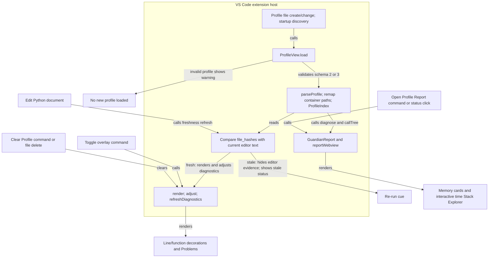

Freshness requires a verified SHA-1 of normalized source text and a matching mapped file path. Edits clear current runtime warnings and decorations for stale files and restore unadjusted static diagnostics. The overlay toggle controls decorations; `render` still publishes runtime leak warnings. Hot static findings rise one severity level; cold non-errors become hints; sampled-function gaps and lines with execution events stay unknown. This is an **inferred runtime prioritization**, not a new server finding. Only precise profiles produce memory diagnosis cards (`growing`, `retained`, `released`) and recommendations. The Stack Explorer aggregates sampled Python call stacks by metric and thread, including library frames; missing stacks leave it empty. Source navigation from the webview requires a report-listed location and a fresh file hash. Opening a report without a loaded profile shows an information message. The report may display stale historical measurements with a warning, while editor evidence is gated on freshness.

### 2.5 Container path and execution branch

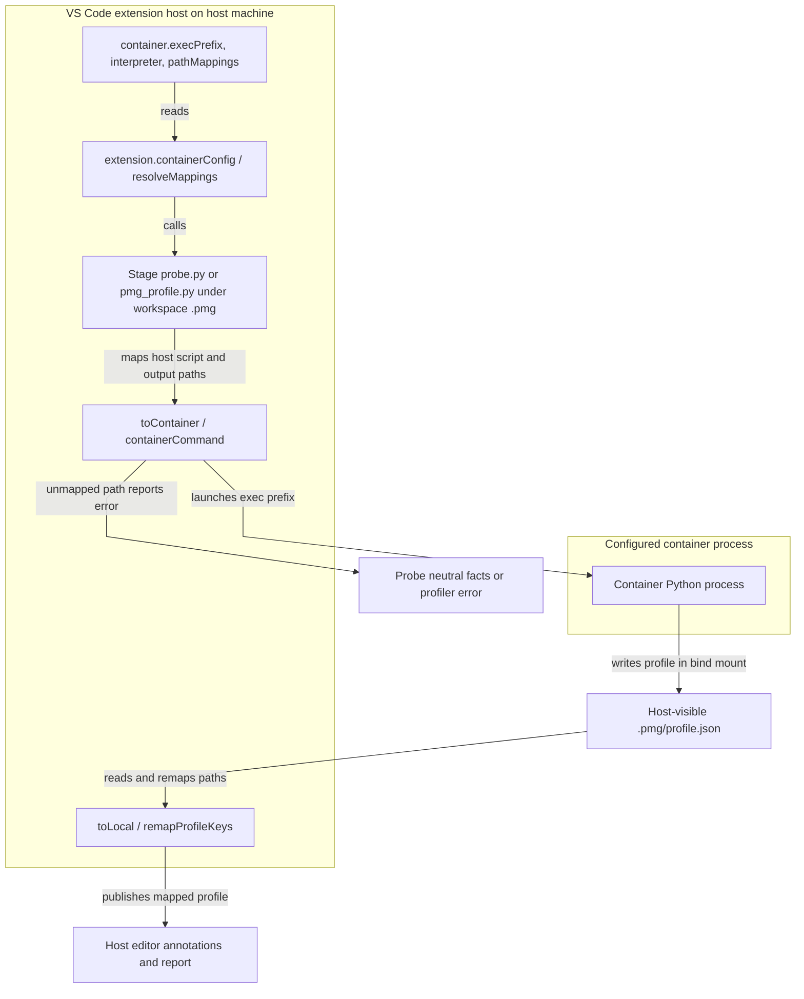

An empty `execPrefix` leaves local or remote-extension-host execution in place. Plain Docker/Compose mode requires a bind-mounted workspace and path mappings. `toContainer` fails on an unmapped host path; `toLocal` leaves an unmapped container path unchanged, so that file will not match the host editor. `test-fixtures/test_container.js` exercises this with a path alias rather than a Docker daemon.

## 3. Shared dependency graphs: implementation level

The diagrams below reuse the same boundary names: **CONFIG** (`package.json` settings and commands), **FACTS** (`initializationOptions.profile`), **LSP** (the selected stdio language-server process), **DIAGNOSTICS** (`textDocument/publishDiagnostics`), **PROFILE** (`.pmg/profile.json`), **SOURCE** (profile file hashes versus current text), **PATHS** (host/container mapping), and **WEBVIEW** (`postMessage` in both directions). Repeated boundary nodes refer to the same contract across diagrams, not additional services. Solid edges are runtime calls or data transfers; dotted edges are build-time dependencies. Each edge says what crosses it.

### 3.1 Extension startup, interpreter facts and backend lifecycle

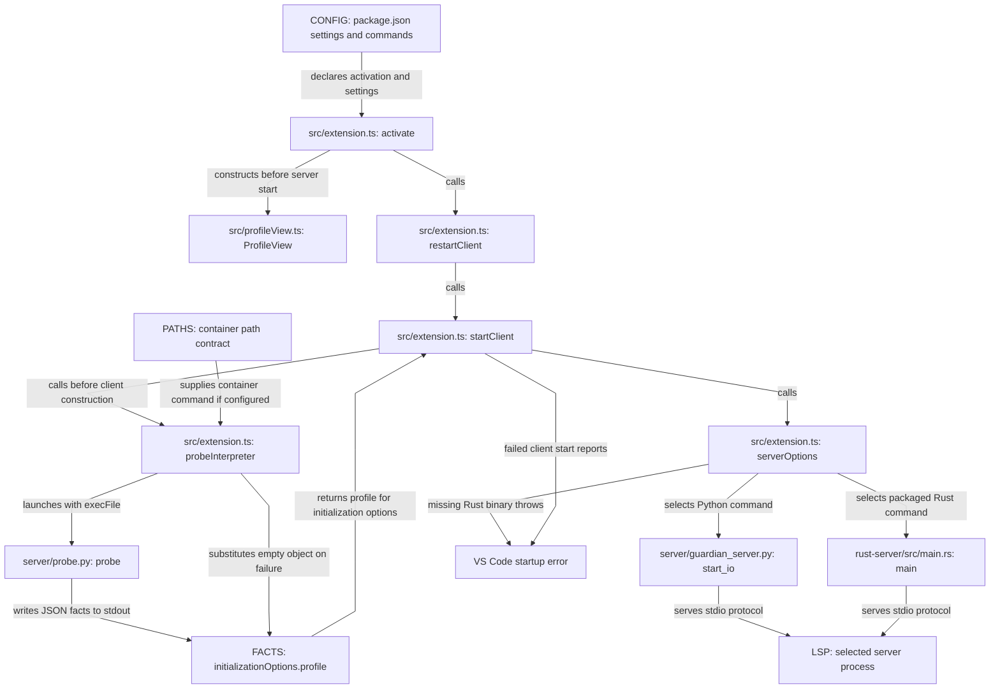

Evidence for the edges: [manifest activation/settings and commands](../package.json#L26), [`activate` constructs `ProfileView` then restarts](../src/extension.ts#L187), [`restartClient` serializes stops and starts](../src/extension.ts#L177), [`probeInterpreter` launches the target and handles empty-fact fallback](../src/extension.ts#L77), [`probe` emits JSON](../server/probe.py#L51), [`startClient` passes `profile` and creates the `LanguageClient`](../src/extension.ts#L146), [`serverOptions` selects commands and checks `bin`](../src/extension.ts#L112), [Python stdio entry](../server/guardian_server.py#L82), and [Rust stdio entry](../rust-server/src/main.rs#L1234). The failure arrows matter: a failed probe changes diagnostic wording, while a failed server start removes static diagnostics; `ProfileView` was already constructed, so its task/report commands remain registered.

### 3.2 Static analyzers, shared messages and duplicated implementations

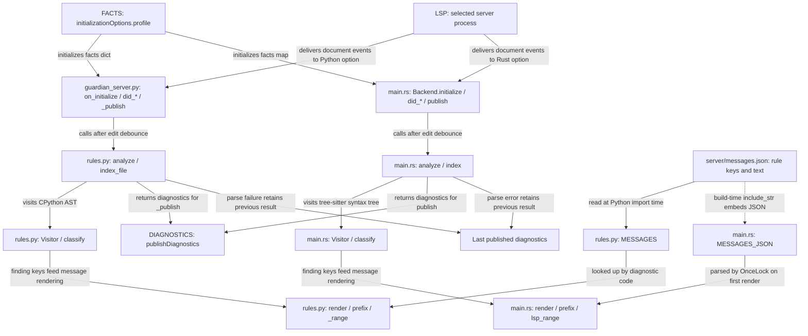

Evidence: [Python initialization, handlers, debounce and publish](../server/guardian_server.py#L29), [Python AST/index/visitor and finding construction](../server/rules.py#L238), [Python message loading and `render`](../server/rules.py#L32), [Python UTF-16 range and suppression](../server/rules.py#L661), [Rust rule tables and `include_str!`](../rust-server/src/main.rs#L24), [Rust parser/visitor and diagnostics](../rust-server/src/main.rs#L1111), and [Rust initialization, debounce and publish](../rust-server/src/main.rs#L1163). The two parsers, scope indexes, visitors, message renderers, UTF-16 range conversions and suppression paths are **duplicated implementations** of one intended rule contract. `test-fixtures/parity_test.py` compares their emitted diagnostics; it does not make the implementations identical by construction. Python reads message JSON when the module loads; Rust includes its bytes at build time, so message edits require a Rust rebuild before that backend sees them.

### 3.3 Profiler task, CLI and profile production

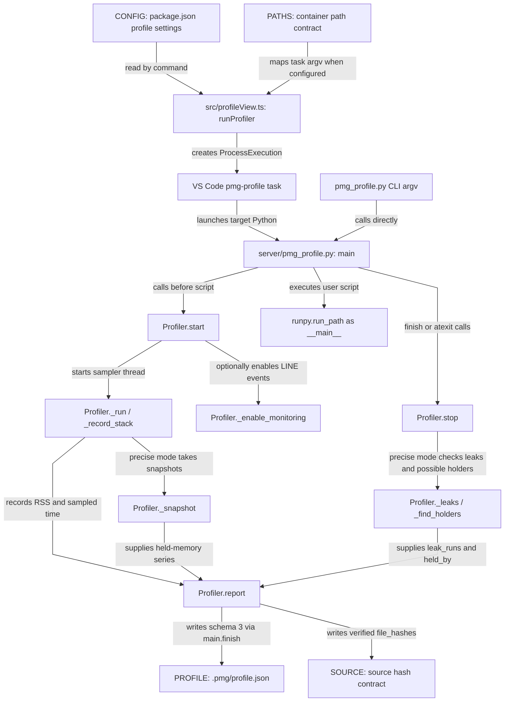

Evidence: [task setup, modes and argv](../src/profileView.ts#L77), [CLI parsing and `runpy`/`finish` lifecycle](../server/pmg_profile.py#L891), [sampler timing, RSS and snapshots](../server/pmg_profile.py#L377), [optional monitoring](../server/pmg_profile.py#L217), [precise stop/holder scan](../server/pmg_profile.py#L571), [leak trend criterion](../server/pmg_profile.py#L665), [schema/stack/hash fields in `report`](../server/pmg_profile.py#L743), and [atomic JSON replace](../server/pmg_profile.py#L921). Direct CLI use and the editor task converge on the same `main`. A script exception is caught and the finalizer still attempts a report; failure before `start` completes or during report writing can leave no new **PROFILE** file. `memoryMode` in the setting supplies Quick Pick placeholder text; the selected Quick Pick item supplies the actual CLI mode.

### 3.4 Profile validation, path normalization and freshness contract

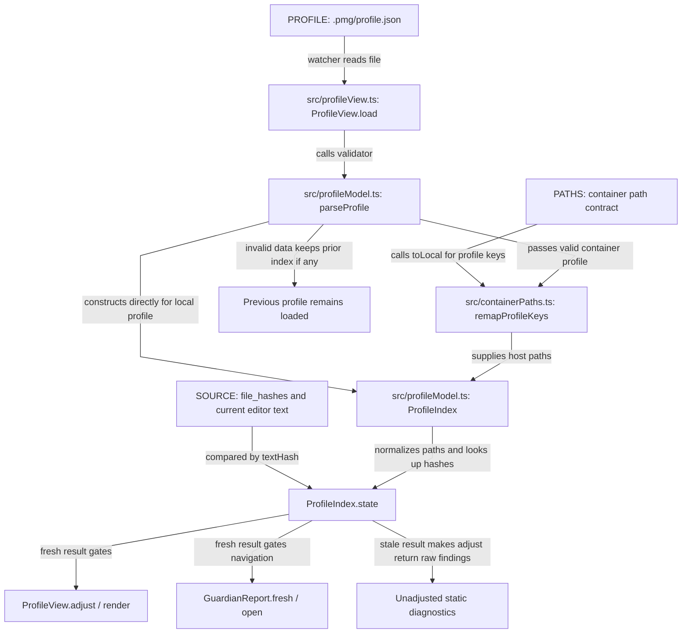

Evidence: [file watcher, `load`, remap, prior-index behavior and refresh](../src/profileView.ts#L44), [schema validator](../src/profileModel.ts#L63), [path normalization and freshness](../src/profileModel.ts#L130), [container key rewrite](../src/containerPaths.ts#L72), [profiler source identity check and decoded-text hash](../server/pmg_profile.py#L266), [editor hash implementation](../src/profileModel.ts#L59), and [report navigation freshness check](../src/reportView.ts#L61). The Python producer hashes unchanged decoded source text after CRLF normalization; the TypeScript consumer hashes current editor text the same way. This duplicated cross-process algorithm is necessary for the freshness gate. If the hash is absent or mismatched, editor evidence is withheld. `load` warns on malformed JSON and returns before replacing its previous `index`; the old report remains loaded, a concrete failure propagation rather than a claim that the schema is generally harmful.

### 3.5 Editor annotations, runtime warnings and static priority

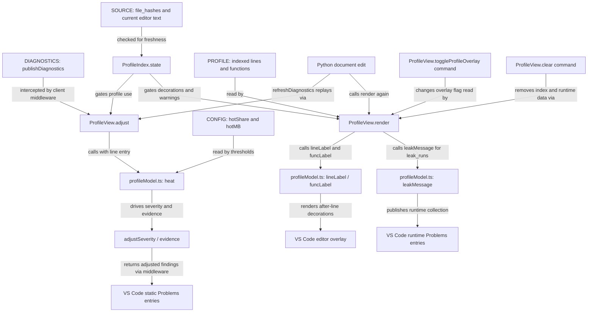

Evidence: [LSP middleware uses `ProfileView.adjust`](../src/extension.ts#L153), [overlay/clear command registration](../src/profileView.ts#L59), [`adjust` stores raw findings and applies freshness/heat/severity](../src/profileView.ts#L163), [`refreshDiagnostics` replays raw findings](../src/profileView.ts#L183), [`render` sets decorations, runtime leak warnings and status](../src/profileView.ts#L192), [heat/severity/evidence](../src/profileModel.ts#L175), [label functions](../src/profileModel.ts#L210), and [leak text](../src/profileModel.ts#L278). The same **PROFILE** and **SOURCE** contract serves inline labels, runtime warnings and static prioritization. `toggleProfileOverlay` only skips decorations; runtime warnings still publish. Staleness returns the raw static finding from `adjust` and clears current runtime evidence on the edited document.

### 3.6 Report model, webview messages and navigation

```mermaid
%%{init: {"fontFamily":"Inter, ui-sans-serif, system-ui, sans-serif","flowchart":{"curve":"linear","nodeSpacing":50,"rankSpacing":60},"layout":"dagre"}}%%
flowchart TD
    PROFILE["PROFILE: indexed profile"] -->|passed on load| Update["GuardianReport.update / refresh"]
    SOURCE["SOURCE: file_hashes and current text"] -->|checked by| Fresh["GuardianReport.fresh"]
    Update -->|calls for precise profile| Diagnose["reportModel.ts: diagnose / recommendations"]
    Update -->|calls for stack samples| Tree["reportModel.ts: callTree"]
    Diagnose -->|returns cards to refresh| Update
    Tree -->|returns weighted tree to refresh| Update
    WEBVIEW["WEBVIEW: postMessage report/filter/open"]
    Html["reportWebview.ts: reportHtml"] -->|renders HTML in| Panel["GuardianReport.show panel"]
    Command["ProfileView.showReport / status command"] -->|calls show| Panel
    Auto["ProfileView.load: showNextReport"] -->|calls show after valid load| Panel
    Update -->|posts report payload| WEBVIEW
    WEBVIEW -->|filter message selects metric/thread| Update
    WEBVIEW -->|open message requests source| Open["GuardianReport.show message handler"]
    Open -->|validates report-listed location| Fresh
    Fresh -->|fresh source allows| Nav["vscode.openTextDocument / showTextDocument"]
    Fresh -->|stale or absent source warns| Reject["Navigation warning"]
```

Evidence: [report/status command registration](../src/profileView.ts#L59), [auto-open after valid profile load](../src/profileView.ts#L145), [`GuardianReport.update`, `show`, message validation and navigation](../src/reportView.ts#L14), [`fresh` and `refresh` payload](../src/reportView.ts#L61), [precise retention diagnosis and recommendations](../src/reportModel.ts#L10), [sampled call-tree aggregation](../src/reportModel.ts#L62), and [webview filter/open messages and rendering](../src/reportWebview.ts#L26). The report uses the same profile and freshness contract as editor feedback, but it can show stale historical measurements with a warning; navigation still requires verified source. The webview messages form a separate two-way contract: its `filter`/`open` payloads and the extension's validation must change together.

### 3.7 Container execution and path translation

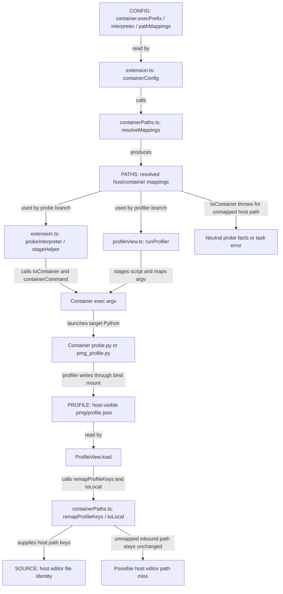

Evidence: [container setting fields](../package.json#L100), [`containerConfig`, helper staging and probe failure](../src/extension.ts#L50), [container task argv and error handling](../src/profileView.ts#L99), [profile load remapping](../src/profileView.ts#L131), and [`resolveMappings`, `toContainer`, `toLocal`, `containerCommand`, `remapProfileKeys`](../src/containerPaths.ts#L24). This is deliberate sharing: probe and profiler use the same configured mapping and prefix, while the language server remains in the extension host. An unmapped outbound path throws, causing neutral probe facts or a visible profiler error. An unmapped inbound profile path remains unchanged and can miss the host editor when those paths differ; the mapping must cover profile file keys, function keys, hashes and stack frames, all rewritten by `remapProfileKeys`.

### 3.8 Build artifacts and resource loading

Extension and Python packaging:

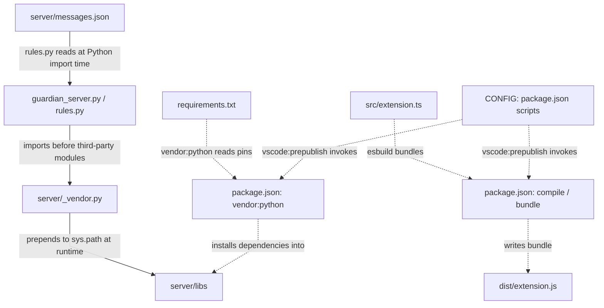

Rust compilation and runtime binary lookup:

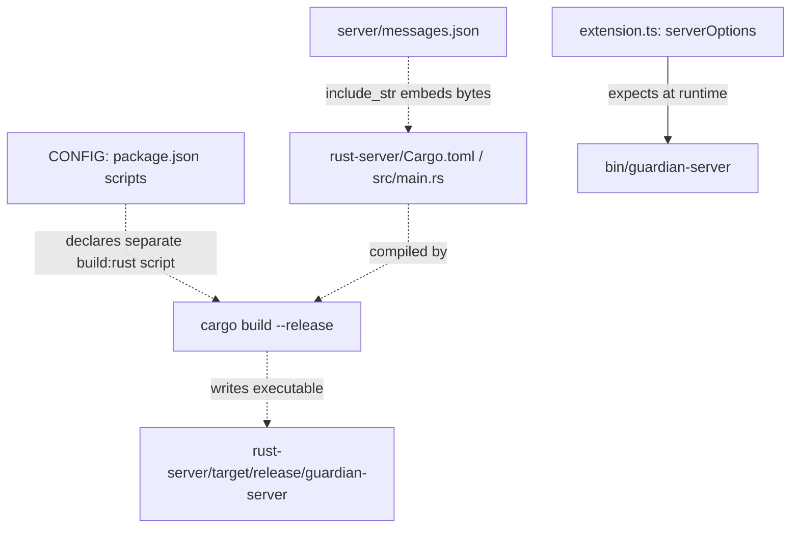

Evidence: [npm build, vendor and prepublish scripts](../package.json#L174), [Python package pins](../requirements.txt), [Python server's early `_vendor` import](../server/guardian_server.py#L15), [`_vendor` prepends `server/libs`](../server/_vendor.py#L14), [extension entry/bundle path](../package.json#L29), [Rust `include_str!`](../rust-server/src/main.rs#L24), [Rust crate inputs](../rust-server/Cargo.toml), and [runtime `bin` lookup](../src/extension.ts#L117). Dotted arrows here are build-time dependencies. There is deliberately **no arrow** from the Cargo output to `bin/guardian-server`: the repository scripts build into `rust-server/target/release`, while `serverOptions` loads `bin/guardian-server`, and no copy step appears in `package.json`. That gap explains the missing-binary startup failure in this un-packaged checkout; it does not imply the Rust source is unused.

### Import cycles, propagation and coordinated changes

The local TypeScript source imports point from `extension.ts` to `profileView.ts` and `containerPaths.ts`; from `profileView.ts` to `profileModel.ts`, `containerPaths.ts` and `reportView.ts`; from `reportView.ts` to `profileModel.ts`, `reportModel.ts` and `reportWebview.ts`; and from `reportModel.ts` to `profileModel.ts`. Some TypeScript imports are type-only uses and can be elided at build time. Python `guardian_server.py` imports `_vendor.py`, `probe.py` and `rules.py`; `rules.py` imports `_vendor.py`; `pmg_profile.py` has no local server-module import. These local import graphs are acyclic in this checkout. The report/filter and diagnostic refresh arrows above are runtime message/call loops, not import cycles. Evidence: [extension imports](../src/extension.ts#L28), [profile view imports](../src/profileView.ts#L12), [report view imports](../src/reportView.ts#L4), [report model import](../src/reportModel.ts#L2), [Python server imports](../server/guardian_server.py#L15), and [rules imports](../server/rules.py#L29).

| Change or failure | Components affected and evidence | Assessment |
|---|---|---|
| Add or alter a static rule | [Python `Visitor`/`analyze`](../server/rules.py#L351), [Rust `Visitor`/`analyze`](../rust-server/src/main.rs#L717), [message keys/text](../server/messages.json), [parity fixtures](../test-fixtures/parity_test.py) | Coordinated edits are required because the two implementations intentionally target equivalent diagnostics; drift is possible and parity tests are the check. |
| Edit diagnostic text only | [Python loads JSON at import](../server/rules.py#L35); [Rust embeds it with `include_str!`](../rust-server/src/main.rs#L24); [Rust build script](../package.json#L176) | Intentional shared wording with different load times; rebuild Rust before comparing or packaging. |
| Change interpreter fact names or meaning | [probe producer](../server/probe.py#L51), [initialization bridge](../src/extension.ts#L146), [Python initialization/rendering](../server/guardian_server.py#L29), [Rust initialization/rendering](../rust-server/src/main.rs#L1176), [message placeholders](../server/messages.json) | Cross-process contract. Missing facts select neutral wording; GIL-state facts also affect CPU-thread findings. |
| Change profile fields, mode names or schema | [Python `Profiler.report`](../server/pmg_profile.py#L743), [TypeScript `Profile`/`parseProfile`](../src/profileModel.ts#L32), [editor consumer](../src/profileView.ts#L131), [report consumers](../src/reportModel.ts#L10) | Cross-process persisted contract. Validator rejection prevents the new profile from loading; backward compatibility with schema 2 is explicit. |
| Change runtime leak criteria or advice | [profiler `_leaks`](../server/pmg_profile.py#L665) and [`_find_holders`](../server/pmg_profile.py#L597), [runtime `leakMessage`](../src/profileModel.ts#L278), [report `diagnose`/`recommendations`](../src/reportModel.ts#L10) | Coordinated semantics across produced `leak_runs`, editor warning text and report cards. These are separate consumers, not one shared message formatter. |
| Change file identity or hash normalization | [profiler `_remember_sources`/`_text_hash`](../server/pmg_profile.py#L270), [extension `textHash`/`ProfileIndex.state`](../src/profileModel.ts#L59), [report `fresh`](../src/reportView.ts#L61) | Duplicated algorithm is intentional verification. A mismatch suppresses editor evidence and report navigation. |
| Change container paths or profile path fields | [mapping and remap functions](../src/containerPaths.ts#L24), [probe branch](../src/extension.ts#L77), [task/load branches](../src/profileView.ts#L99), [profiler report keys](../server/pmg_profile.py#L855) | Intentional shared path contract. A missing outbound mapping errors; a missing inbound mapping prevents freshness matches. |
| Change webview payloads | [report postMessage and handlers](../src/reportView.ts#L29), [webview messages and rendering](../src/reportWebview.ts#L26) | Coordinated two-way message contract; source navigation is validated again after the message crosses the boundary. |
| Change command IDs, settings or packaging | [manifest](../package.json#L26), [extension registrations and server options](../src/extension.ts#L112), [profile registrations/task](../src/profileView.ts#L59), [vendored import path](../server/_vendor.py#L14) | Manifest and consumers must agree. `serverOptions` expects `bin/guardian-server`; `build:rust` creates `rust-server/target/release/guardian-server`, so packaging must place the binary at the expected path. |
| Invalid profile or failed server start | [`ProfileView.load` returns before replacing `index`](../src/profileView.ts#L131); [`startClient` catches and reports startup error](../src/extension.ts#L163) | These failures propagate differently: invalid profile retains prior report state, while failed server start removes static analysis. Neither alone proves harmful coupling between otherwise shared modules. |
| Profiler task fails before a valid profile loads | [`runProfiler` sets `showNextReport` before task execution](../src/profileView.ts#L123); [invalid `load` returns before clearing it](../src/profileView.ts#L138); [next valid `load` clears it and opens the report](../src/profileView.ts#L145) | A later valid watcher event can auto-open the report after the original task failed. This is a specific UI lifecycle coupling, evidenced by the flag's set/clear paths, rather than a general claim about shared modules. |

The shared message catalog, interpreter facts, path helpers and profile model are intentional reuse supported by direct calls and imports. The replicated Python/Rust rules and Python/TypeScript hash code are **coordination risks** because source changes can diverge across processes; the parity and freshness tests exercise those contracts. The `showNextReport` flag is the concrete potentially harmful lifecycle coupling identified here. Ordinary sharing is not labeled a defect.

## Feature-to-code map

Paths are relative to the repository root. Tests listed are relevant checks, not proof of all UI behavior.

| Feature | Trigger | Main files and symbols | Output | Shared dependencies | Relevant tests |
|---|---|---|---|---|---|
| Activation, server selection and restart | Python language activation; `pythonMemoryGuardian.restart`; any Guardian setting change | `package.json`; `src/extension.ts` `activate`, `restartClient`, `serverOptions`, `deactivate` | Running LSP client or startup error/output log | `pythonMemoryGuardian.backend`, interpreter setting, `vscode-languageclient`, probe facts | `test-fixtures/test_extension_lifecycle.js`, `test-fixtures/server_lifecycle_test.py` |
| Target interpreter selection, probing and measured messages | Server start/restart | `src/extension.ts` `interpreter`, `probeInterpreter`; `server/probe.py` `probe`; `server/rules.py` `render`; `rust-server/src/main.rs` `render` | Target facts, sized or neutral diagnostic wording | `server/messages.json`, `initializationOptions.profile`, Python process or container prefix | `test-fixtures/parity_test.py`, `test-fixtures/server_lifecycle_test.py` |
| Static diagnostics, rules and suppression | Open/edit/save/close Python `file` or `untitled` document | `server/guardian_server.py` `did_open`, `did_change`, `did_save`, `did_close`, `_publish`; `server/rules.py` `analyze`, `Visitor`, `index_file`, `classify`; `rust-server/src/main.rs` `Backend::did_*`, `analyze`, `Visitor::visit`, `index_with_imports`, `classify` | LSP diagnostics with advice; empty list on close | `server/messages.json`, probe facts, parser libraries, `memory-guardian: ignore` | `test-fixtures/parity_test.py`, `test-fixtures/server_lifecycle_test.py` and rule fixtures |
| Runtime profiler task and standalone CLI | `pythonMemoryGuardian.profileFile`; direct `pmg_profile.py` invocation | `src/profileView.ts` `ProfileView.runProfiler`; `server/pmg_profile.py` `main`, `Profiler.start`, `Profiler._run`, `Profiler.stop`, `Profiler.report` | VS Code task output and schema-3 `.pmg/profile.json` | Saved script, target interpreter, profile settings, standard-library clocks/RSS readers | `test-fixtures/profiler_test.py`, `test-fixtures/profiler_regression_test.py` |
| Precise retention and holder evidence | Profile with `--memory precise` | `server/pmg_profile.py` `Profiler._snapshot`, `Profiler._leaks`, `Profiler._find_holders`, `Profiler.report`; `src/reportModel.ts` `diagnose` | Retention trend, suspected leak data, memory cards and recommendations | `tracemalloc`, profile JSON, source metadata | `test-fixtures/profiler_test.py`, `test-fixtures/profiler_regression_test.py`, `test-fixtures/test_report.js` |
| Optional line execution coverage | `pythonMemoryGuardian.profile.monitoring=lines` or CLI `--monitoring lines` | `server/pmg_profile.py` `Profiler._enable_monitoring`, `Profiler._on_line_event`, `Profiler.report` | Line-event counts and activation/failure status in profile | Python 3.12+ `sys.monitoring`, profile schema | `test-fixtures/profiler_regression_test.py`, `test-fixtures/test_model.js` |
| Profile discovery, validation and freshness | `.pmg/profile.json` create/change/delete, extension startup, source edit | `src/profileView.ts` `ProfileView.load`, `clear`; `src/profileModel.ts` `parseProfile`, `ProfileIndex.state`, `textHash` | Loaded/cleared profile, stale status, warning on invalid JSON | Profile schema 2/3, `file_hashes`, normalized paths | `test-fixtures/test_model.js`, `test-fixtures/test_report.js`, `test-fixtures/profiler_regression_test.py` |
| Inline annotations, runtime warnings and diagnostic prioritization | Fresh profile; editor visibility/change; `pythonMemoryGuardian.toggleProfileOverlay` | `src/profileView.ts` `ProfileView.render`, `adjust`, `refreshDiagnostics`; `src/profileModel.ts` `lineLabel`, `funcLabel`, `heat`, `adjustSeverity`, `leakMessage` | End-of-line labels, function totals, status bar, runtime leak warnings, adjusted static diagnostics | ProfileIndex, source hashes, hot thresholds, LSP diagnostic collection | `test-fixtures/test_model.js`, `test-fixtures/test_report.js` |
| Interactive report and source navigation | `pythonMemoryGuardian.showReport`; status-bar click; auto-open after task profile loads | `src/reportView.ts` `GuardianReport.show`, `refresh`, `fresh`; `src/reportModel.ts` `diagnose`, `callTree`; `src/reportWebview.ts` `reportHtml` | Memory diagnosis cards and time-weighted Stack Explorer with metric/thread filters | ProfileIndex, stack samples, freshness validation, webview messages | `test-fixtures/test_report.js` |
| Container execution and path translation | Nonempty `pythonMemoryGuardian.container.execPrefix` | `src/extension.ts` `containerConfig`, `stageHelper`, `probeInterpreter`; `src/profileView.ts` `runProfiler`, `load`; `src/containerPaths.ts` `resolveMappings`, `toContainer`, `toLocal`, `containerCommand`, `remapProfileKeys` | Probe/profile run in container; host-side editor mappings or error | Bind mount, configured prefix/interpreter/path mappings, staged helpers | `test-fixtures/test_container.js` |

## Planned, incomplete or unused capabilities

| Item | Source-grounded status |
|---|---|
| Automatic quick fixes or code actions | Diagnostic text recommends changes, but no code-action provider, `WorkspaceEdit`, or fix command is registered in `src`, `server`, or `rust-server/src/main.rs`. |
| Automatic environment/interpreter discovery | `src/extension.ts` `interpreter` uses the explicit setting or `python3`/`python` fallback. It does not query the VS Code Python extension or scan virtual environments. `server/probe.py` measures whichever executable was selected. |
| Allocation-stack graph and native stack/heap attribution | `server/pmg_profile.py` records line-level traced memory and Python call-stack **time** samples; `src/reportModel.ts` `callTree` weights time metrics only. The [planned completion criteria](#planned-completion-criteria) list memory-weighted allocation stacks and native visibility as planned. |
| Cross-run comparison and agent telemetry contract | A single loaded `ProfileIndex` and one `.pmg/profile.json` path are used by `ProfileView`; no comparison view or telemetry export command exists. These are roadmap items. |
| Process RSS timeline visualization | `Profiler.report` writes `timeline` to JSON; `GuardianReport.refresh` does not send it to the webview. Per-line retention sparklines are implemented. |
| General task provider | `package.json` declares the `pmg-profile` task type and `runProfiler` creates a task, but no `registerTaskProvider` implementation exists. |

### Planned completion criteria

These criteria describe proposed work, not current app behavior. The current Stack Explorer weights sampled Python call stacks by time. Precise memory evidence is attributed to lines, and native timing is estimated at a Python call site; the app does not unwind C/C++ stacks or attribute native heap allocations.

| Planned capability | Completion criterion |
|---|---|
| Memory-weighted stack graph | Precise-mode allocation tracebacks produce peak-held and end-held MB views. A diagnosis opens the relevant stack; displayed totals reconcile with captured snapshots, and missing or truncated attribution is visible. |
| Native C-extension visibility | Show supported native call stacks and native allocation evidence with their platform and collection limits. Keep estimated Python-site timing distinct from measured native frames and memory. |
| Cross-run diffing | Save and select a baseline, align source and stack identities, and show changes in held memory, growth, allocation sites, and time alongside workload and environment metadata. |
| Agent-ready telemetry | Export a versioned, machine-readable report with evidence, source identity, measurement method, confidence and limits, and suggested verification steps, without requiring agents to scrape webview text. |
| End-to-end verification | Move from a finding to a candidate fix and a repeat run in VS Code, with a comparison showing whether retention improved under the same workload. |

The intended priority is memory-stack attribution and leak diagnosis, then interactive exploration, native visibility, cross-run diffing, and telemetry. New measurements should expose their source and limits so sampled or inferred data is not presented as proof of ownership or causality.

## Verification and limits

The code paths above were checked against `package.json`, `src`, `server`, `rust-server/src/main.rs`, the shared messages and tests. The Rust choice requires `bin/guardian-server[.exe]`; this checkout has a release binary under `rust-server/target/release` but no `bin` directory, so selecting Rust in this un-packaged tree reports a missing binary. Runtime tests can exercise that release binary through `test-fixtures/parity_test.py`.

Mermaid flowcharts use top-down direction and separate feature sections. All 15 styling directives were checked as JSON, the diagram blocks and edge labels were checked structurally, and the local TypeScript/Python import graphs were checked for cycles. No Mermaid renderer is bundled in `node_modules` or available on `PATH` in this checkout, so a rendered visual preview could not be confirmed here; a viewer may also ignore or override diagram-level styling. Container tests simulate an exec prefix and mapped paths; they do not start Docker. UI flows are supported by source inspection and model tests, not an automated VS Code-host integration run.
