# Python Memory Guardian: implemented feature map

Use this map to trace a feature from its trigger to its result, implementation and tests. Static analysis examines source text; runtime profiling executes the saved script. Source code is the authority for implemented behavior. See the [README](../README.md) for product context and the [user guides](00-guides.md) for usage instructions.

## Start here

| What do you want to understand? | Start with |
|---|---|
| How the main pieces fit together | [System overview](#system-overview) |
| Where a static warning comes from, or where to add a rule | [Static diagnostics](#static-diagnostics) |
| What happens when you profile a script | [Runtime profiling](#runtime-profiling) |
| Why a profile fails to load or becomes stale | [Profile loading and freshness](#profile-loading-and-freshness) |
| How line labels, runtime warnings and severity changes work | [Editor annotations and warnings](#editor-annotations-and-warnings) |
| How report charts and source navigation work | [Reports and source navigation](#reports-and-source-navigation) |
| Which Python or language server runs | [Interpreter and backend setup](#interpreter-and-backend-setup) |
| How host and container paths connect | [Container execution](#container-execution) |
| How resources reach the installed extension | [Build and packaging](#build-and-packaging) |
| Which components must change together | [Shared contracts and coordinated changes](#shared-contracts-and-coordinated-changes) |

**Contents:** [Overview](#system-overview) · [Implemented features](#implemented-features) · [Developer reference](#developer-reference) · [Planned capabilities](#planned-incomplete-or-unused-capabilities) · [Verification and limits](#verification-and-limits)

Each feature below follows the same order: **behavior → trigger/result → flow → code → branches → tests**. Filenames link to source; named functions identify the relevant entry points. Tables are the feature-to-code map, placed beside the behavior they explain.

## System overview

**Where static and runtime analysis meet**

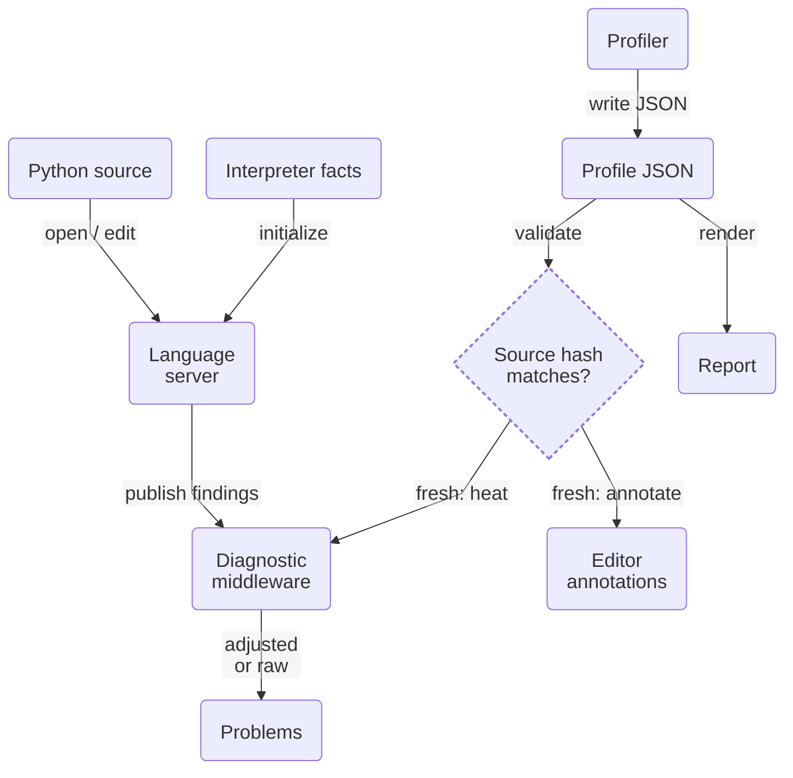
```mermaid
%%{init: {"fontFamily":"Arial, sans-serif","themeVariables":{"fontSize":"18px","fontFamily":"Arial, sans-serif"},"flowchart":{"curve":"linear","nodeSpacing":32,"rankSpacing":40,"diagramPadding":8,"padding":18,"subGraphTitleMargin":{"top":10,"bottom":24},"htmlLabels":false},"layout":"dagre","htmlLabels":false,"themeCSS":".node rect, .cluster rect { rx: 10px; ry: 10px; } .label, .nodeLabel, .edgeLabel, .cluster-label { letter-spacing: normal; word-spacing: normal; } .edgeLabel rect { stroke: currentColor !important; stroke-width: 1px !important; stroke-dasharray: none; opacity: 1 !important; fill-opacity: 1; rx: 4px; ry: 4px; }"}}%%
flowchart TD
    Src("Python source") -->|open / edit| LSP("Language<br/>server")
    Facts("Interpreter facts") -->|initialize| LSP
    LSP -->|publish findings| MW("Diagnostic<br/>middleware")
    Prof("Profiler") -->|write JSON| JSON("Profile JSON")
    JSON -->|validate| Gate{"Source hash<br/>matches?"}
    Gate -->|fresh: heat| MW
    Gate -->|fresh: annotate| Ed("Editor<br/>annotations")
    MW -->|adjusted<br/>or raw| Probs("Problems")
    JSON -->|render| Rep("Report")
    classDef decision stroke-width:2px,stroke-dasharray:4 3;
    class Gate decision;
```

Static findings come from the selected language server; runtime evidence comes from a validated profile. They meet in the diagnostic middleware, and only when the current source text matches the profiled hash. A stale or absent profile leaves static findings unchanged, while the report can still show historical measurements.

**Diagram key:** rounded rectangles show actions, components or data; dashed diamonds show decisions. Bordered arrow labels describe calls and transfers. Solid arrows show runtime calls or data flow; dotted arrows show build-time dependencies. Diagrams that cross a process boundary group nodes in borderless-titled boxes and name the owning process inside the first node of each box, keeping process names clear of arrow labels. When a flow returns to a process it left, that process appears as a second box below, so arrows run top-down instead of crossing back. Single-process diagrams name the owner in the caption; overview and build diagrams are unboxed. Each diagram shows one complete mechanism, including its main failure branches; repeated nodes refer to the same component. Labels use SVG text with a consistent Arial/sans-serif font at 18 px, explicit line breaks and room around words and process titles. Nodes and process boxes have rounded corners; arrows remain straight and colors follow the viewer.

## Implemented features

### Static diagnostics

The selected Python or Rust language server recognizes source patterns and publishes findings with advice. These are suggestions in diagnostic text; no code actions or automatic edits are registered.

**Trigger:** open, edit, save or close a Python `file` or `untitled` document. **Result:** editor squiggles and Problems entries, optionally adjusted using a fresh runtime profile.

**Analyze and publish — both servers**

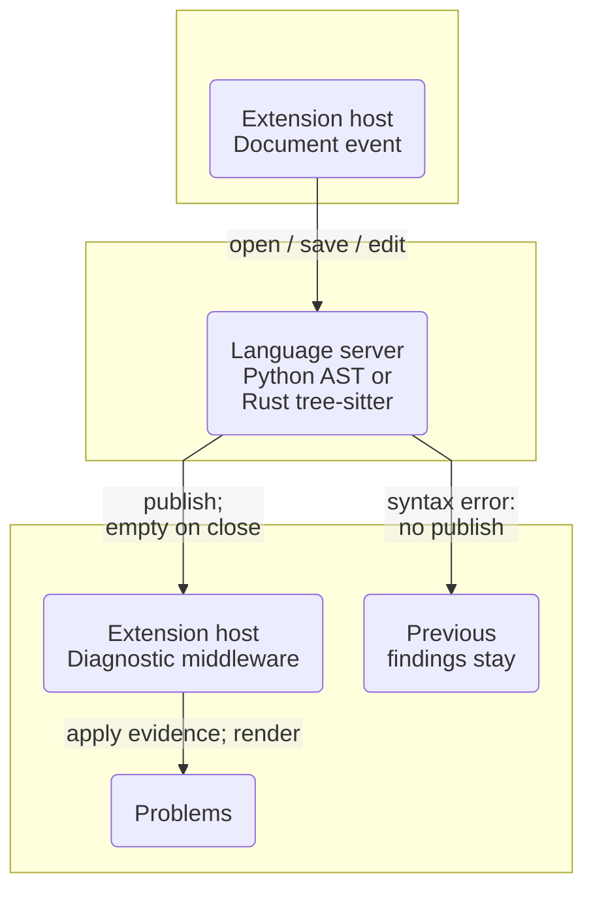
```mermaid
%%{init: {"fontFamily":"Arial, sans-serif","themeVariables":{"fontSize":"18px","fontFamily":"Arial, sans-serif"},"flowchart":{"curve":"linear","nodeSpacing":32,"rankSpacing":40,"diagramPadding":8,"padding":18,"subGraphTitleMargin":{"top":10,"bottom":24},"htmlLabels":false},"layout":"dagre","htmlLabels":false,"themeCSS":".node rect, .cluster rect { rx: 10px; ry: 10px; } .label, .nodeLabel, .edgeLabel, .cluster-label { letter-spacing: normal; word-spacing: normal; } .edgeLabel rect { stroke: currentColor !important; stroke-width: 1px !important; stroke-dasharray: none; opacity: 1 !important; fill-opacity: 1; rx: 4px; ry: 4px; }"}}%%
flowchart TD
    subgraph IN[" "]
      Event("Extension host<br/>Document event")
    end
    subgraph LSP[" "]
      Server("Language server<br/>Python AST or<br/>Rust tree-sitter")
    end
    subgraph OUT[" "]
      MW("Extension host<br/>Diagnostic middleware")
      Keep("Previous<br/>findings stay")
      UI("Problems")
    end
    Event -->|open / save / edit| Server
    Server -->|publish;<br/>empty on close| MW
    Server -->|syntax error:<br/>no publish| Keep
    MW -->|apply evidence; render| UI
```

**Implementation**

| Responsibility | Files and symbols |
|---|---|
| Receive events, debounce edits and publish findings | [guardian_server.py](../server/guardian_server.py#L60): `did_open`, `did_change`, `did_save`, `did_close`, `_publish`; [main.rs](../rust-server/src/main.rs#L1206): `Backend::did_*`, `publish` |
| Parse source, build scope indexes and visit patterns | [rules.py](../server/rules.py#L705): `analyze`, `index_file`, `classify`, `Visitor`; [main.rs](../rust-server/src/main.rs#L1111): `analyze`, `index_with_imports`, `classify`, `Visitor::visit` |
| Render advice and sized or neutral messages | [messages.json](../server/messages.json); `render` and `prefix` in both analyzers |
| Convert ranges and suppress marked findings | [rules.py](../server/rules.py#L661): `_utf16`, `_range`, `SUPPRESS`; [main.rs](../rust-server/src/main.rs#L1096): `to_utf16`, `lsp_range`, `SUPPRESS` |
| Apply runtime evidence before display | [extension.ts](../src/extension.ts#L146): `startClient` middleware; [profileView.ts](../src/profileView.ts#L185): `adjust` |

**Important branches and limits**

- Open/save analyze immediately; edits debounce for 350 ms. Invalid syntax retains the last good diagnostics; closing publishes an empty list.
- Python uses CPython `ast`, `pygls` and `lsprotocol`. Rust uses `tree-sitter-python` and `tower-lsp`. Parsers, scope indexes, visitors, message rendering, range conversion and suppression are separate implementations.
- Both use the same [diagnostic message contract](#shared-contracts-and-coordinated-changes). Python reads the JSON at module import; Rust embeds it with `include_str!` at build time and parses it through `OnceLock` on first render. Message changes require a Rust rebuild.
- Rule context includes import aliases, lexical bindings, loops and known thread targets. No project-wide dataflow analysis is implemented.
- For runtime severity changes, see [Editor annotations and warnings](#editor-annotations-and-warnings).

**Tests:** [parity_test.py](../test-fixtures/parity_test.py) and its rule fixtures compare backend diagnostics; [server_lifecycle_test.py](../test-fixtures/server_lifecycle_test.py) checks server events and lifecycle. Parity is tested, not guaranteed by shared implementation.

#### Static rule families

Both servers emit the following codes through their visitor/analyzer, with text and advice from `server/messages.json`. These are source-pattern suggestions in diagnostic messages; the extension registers no code actions or automatic edits.

| Family | Implemented diagnostic codes | Examples of recognized patterns |
|---|---|---|
| Heap inflation | `heap-inflation` | `fetchall`, looped `fetchone`, cursor iteration |
| Pointer chasing | `pointer-chasing` | pandas import and recognized loader calls |
| Cycles and GC | `cyclic-reference`, `gc-cycle-risk` | looped construction of back-linked classes; back links with finalizers |
| RAM fragmentation | `ram-fragmentation.append`, `ram-fragmentation.no-slots` | per-row containers; looped instances without slots |
| Text inflation | `text-inflation.concat`, `text-inflation.whole-file` | string `+=` in loops; whole-file line/token reads |
| Memory swell | `memory-swell.list-arg`, `memory-swell.list-copy`, `memory-swell.method-cache`, `memory-swell.unbounded-cache`, `memory-swell.deepcopy-loop`, `memory-swell.recompile-loop`, `memory-swell.setdefault-loop`, `memory-swell.list-extend-loop` | eager lists, unbounded caches, repeated copies/compilation/default creation |
| Resource and task retention | `resource-leak.file-handle`, `task-retention.asyncio-task` | open handles without visible cleanup; discarded task handles |
| Single-thread stalls | `single-thread-stall.async-blocking`, `single-thread-stall.list-membership`, `single-thread-stall.cpu-thread` | blocking async calls, repeated list search, known pure-Python thread targets |

There are **21 codes in 8 grouped rows** above. The source has ten naming prefixes if `cyclic-reference` and `gc-cycle-risk`, and `resource-leak` and `task-retention`, are counted separately. Diagnostics carry severity, code, source, UTF-16 range and sometimes related locations. A `memory-guardian: ignore` marker on the finding's starting line suppresses that static finding. It does not suppress runtime leak diagnostics.

[Back to navigation](#start-here)

### Runtime profiling

The editor command and standalone CLI run the same profiler. It executes the target script, samples thread timing and records memory evidence according to the chosen mode.

**Trigger:** `pythonMemoryGuardian.profileFile` (Profile Current File), or direct `pmg_profile.py` invocation. **Result:** task/terminal output and schema-3 `.pmg/profile.json`.

**Launch the profiler**

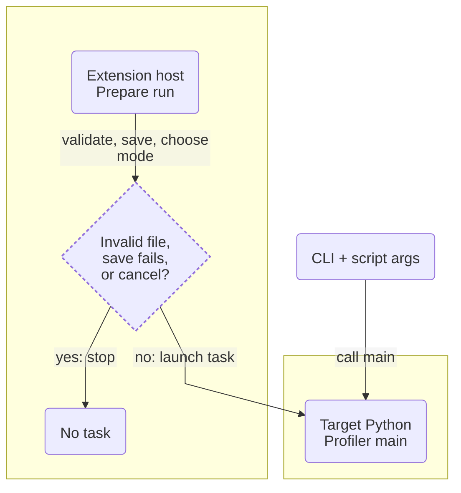
```mermaid
%%{init: {"fontFamily":"Arial, sans-serif","themeVariables":{"fontSize":"18px","fontFamily":"Arial, sans-serif"},"flowchart":{"curve":"linear","nodeSpacing":32,"rankSpacing":40,"diagramPadding":8,"padding":18,"subGraphTitleMargin":{"top":10,"bottom":24},"htmlLabels":false},"layout":"dagre","htmlLabels":false,"themeCSS":".node rect, .cluster rect { rx: 10px; ry: 10px; } .label, .nodeLabel, .edgeLabel, .cluster-label { letter-spacing: normal; word-spacing: normal; } .edgeLabel rect { stroke: currentColor !important; stroke-width: 1px !important; stroke-dasharray: none; opacity: 1 !important; fill-opacity: 1; rx: 4px; ry: 4px; }"}}%%
flowchart TD
    subgraph EXT[" "]
      Editor("Extension host<br/>Prepare run")
      Stop{"Invalid file,<br/>save fails,<br/>or cancel?"}
      Cancel("No task")
    end
    subgraph PROC[" "]
      Main("Target Python<br/>Profiler main")
    end
    Editor -->|validate, save, choose mode| Stop
    Stop -->|yes: stop| Cancel
    Stop -->|no: launch task| Main
    CLI("CLI + script args") -->|call main| Main
    classDef decision stroke-width:2px,stroke-dasharray:4 3;
    class Stop decision;
```

**Capture and write**

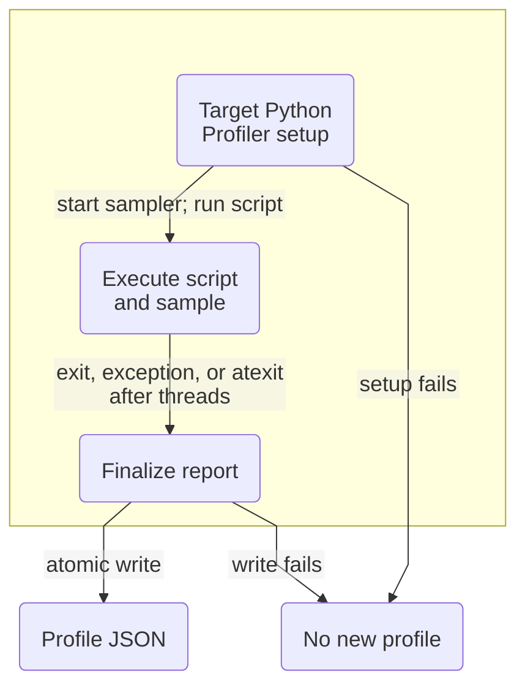
```mermaid
%%{init: {"fontFamily":"Arial, sans-serif","themeVariables":{"fontSize":"18px","fontFamily":"Arial, sans-serif"},"flowchart":{"curve":"linear","nodeSpacing":32,"rankSpacing":40,"diagramPadding":8,"padding":18,"subGraphTitleMargin":{"top":10,"bottom":24},"htmlLabels":false},"layout":"dagre","htmlLabels":false,"themeCSS":".node rect, .cluster rect { rx: 10px; ry: 10px; } .label, .nodeLabel, .edgeLabel, .cluster-label { letter-spacing: normal; word-spacing: normal; } .edgeLabel rect { stroke: currentColor !important; stroke-width: 1px !important; stroke-dasharray: none; opacity: 1 !important; fill-opacity: 1; rx: 4px; ry: 4px; }"}}%%
flowchart TD
subgraph PROC[" "]
      Start("Target Python<br/>Profiler setup")
      Run("Execute script<br/>and sample")
      Finish("Finalize report")
    end
    Start -->|start sampler; run script| Run
    Run -->|exit, exception, or atexit after threads| Finish
    Finish -->|atomic write| JSON("Profile JSON")
    Start -->|setup fails| Missing("No new profile")
    Finish -->|write fails| Missing
```

**Implementation**

| Responsibility | Files and symbols |
|---|---|
| Validate/save editor, choose mode, build argv and launch task | [profileView.ts](../src/profileView.ts#L79): `runProfiler`; [package.json](../package.json): profile settings |
| Parse CLI arguments and execute target | [pmg_profile.py](../server/pmg_profile.py#L900): `main`, `runpy.run_path`, `finish` |
| Sample stacks, time and RSS | [pmg_profile.py](../server/pmg_profile.py#L560): `Profiler.start`, `_run`, `_record_stack` |
| Collect precise retention and possible holders | [pmg_profile.py](../server/pmg_profile.py#L511): `_snapshot`, `_leaks`, `_find_holders` |
| Count optional line execution events | [pmg_profile.py](../server/pmg_profile.py#L217): `_enable_monitoring`, `_on_line_event` |
| Finalize, bound timeline, verify source hashes and write JSON | [pmg_profile.py](../server/pmg_profile.py#L571): `stop`, `report`, `_remember_sources`, `_unchanged_source`, `_text_hash`; `main.finish` uses `os.replace` |

**Important branches and limits**

| Mode | Collected memory evidence |
|---|---|
| `fast` | Sampled process RSS growth attributed to Python lines |
| `precise` | `tracemalloc` allocation, held memory, retention trends and bounded holder search |
| `off` / time only | Memory omitted from line labels and heat; process RSS fields still recorded |

- The editor requires a saved Python file and saves dirty text before prompting. Invalid editors warn; save failure or Quick Pick cancellation launches no task. The `memoryMode` setting supplies placeholder text; the actual selected item supplies the CLI mode.
- Timing is sampled per thread and classified as Python, native, waiting or unsplit where clocks/GIL signals permit. Native timing is estimated at Python call sites; native stacks are not captured.
- `profile.frames` / `--frames` controls precise traceback depth (1–64). `profile.monitoring=lines` / `--monitoring lines` uses Python 3.12+ `sys.monitoring` for line-event counts and records why activation failed when unavailable. Timing remains sampled.
- The CLI also accepts `--root`, `--out`, `--interval` and target-script arguments.
- Precise leak detection requires at least four snapshots in the run (including the exit snapshot), at least three trailing snapshot increases without an intervening decrease, and at least 1 MiB retained at exit (`_leaks`). A run too short for four snapshots reports no suspected leaks; its retention cards can still appear in the report. Holder search is bounded; it provides possible references, not a complete ownership graph.
- `stop` adds a post-script RSS/traced-memory sample; `report` retains the endpoint while bounding the timeline to 300 points. It also emits line/function data, stack samples, source metadata and verified hashes.
- Normal exit, `SystemExit`, `KeyboardInterrupt` and script exceptions all attempt finalization. Non-daemon threads can defer it through `atexit`. Failure during setup or report writing can prevent output.
- Container task staging and path arguments are described under [Container execution](#container-execution).

**Tests:** [profiler_test.py](../test-fixtures/profiler_test.py) and [profiler_regression_test.py](../test-fixtures/profiler_regression_test.py) cover measurements, retention, monitoring and output; [test_model.js](../test-fixtures/test_model.js) checks consumed line-event data; [test_report.js](../test-fixtures/test_report.js) checks diagnosis from precise evidence.

[Back to navigation](#start-here)

### Profile loading and freshness

A profile must pass schema validation before it replaces the loaded profile. Its measurements can inform current source only when the mapped path and source hash match.

**Trigger:** startup discovery; `.pmg/profile.json` create/change; saved-report selection; JSON editor graph action; Python source edit. **Result:** an indexed profile, a warning on invalid data, or a freshness decision for each source file.

**Load, validate and check freshness — extension host**

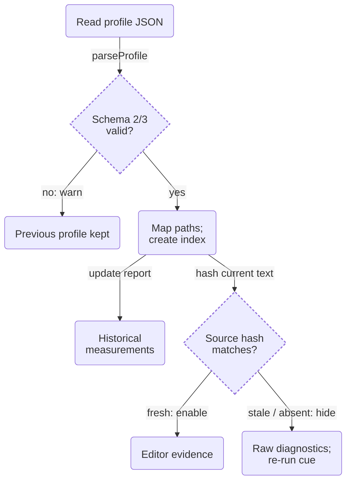
```mermaid
%%{init: {"fontFamily":"Arial, sans-serif","themeVariables":{"fontSize":"18px","fontFamily":"Arial, sans-serif"},"flowchart":{"curve":"linear","nodeSpacing":32,"rankSpacing":40,"diagramPadding":8,"padding":18,"subGraphTitleMargin":{"top":10,"bottom":24},"htmlLabels":false},"layout":"dagre","htmlLabels":false,"themeCSS":".node rect, .cluster rect { rx: 10px; ry: 10px; } .label, .nodeLabel, .edgeLabel, .cluster-label { letter-spacing: normal; word-spacing: normal; } .edgeLabel rect { stroke: currentColor !important; stroke-width: 1px !important; stroke-dasharray: none; opacity: 1 !important; fill-opacity: 1; rx: 4px; ry: 4px; }"}}%%
flowchart TD
    Load("Read profile JSON") -->|parseProfile| Valid{"Schema 2/3<br/>valid?"}
    Valid -->|no: warn| Old("Previous profile kept")
    Valid -->|yes| Index("Map paths;<br/>create index")
    Index -->|update report| Report("Historical<br/>measurements")
    Index -->|hash current text| Check{"Source hash<br/>matches?"}
    Check -->|fresh: enable| Editor("Editor evidence")
    Check -->|stale / absent: hide| Stale("Raw diagnostics;<br/>re-run cue")
    classDef decision stroke-width:2px,stroke-dasharray:4 3;
    class Valid,Check decision;
```

**Implementation**

| Responsibility | Files and symbols |
|---|---|
| Discover/watch profiles and refresh on Python edits | [profileView.ts](../src/profileView.ts#L37): constructor, `PROFILE_GLOB` |
| Select a saved JSON file or receive an editor URI | [profileView.ts](../src/profileView.ts#L133): `openSavedReport`, `visualizeReport`; [package.json](../package.json): `visualizeReport` command and editor/title menu |
| Read, validate, replace index and update consumers | [profileView.ts](../src/profileView.ts#L149): `load`; [profileModel.ts](../src/profileModel.ts#L67): `parseProfile`, `ProfileIndex` |
| Normalize paths and compare current text with recorded hashes | [profileModel.ts](../src/profileModel.ts#L57): `normPath`, `textHash`, `ProfileIndex.state` |
| Rewrite container paths before indexing | [containerPaths.ts](../src/containerPaths.ts#L53): `remapProfileKeys`, `toLocal` |
| Clear loaded evidence and report state | [profileView.ts](../src/profileView.ts#L175): `clear` |

**Important branches and limits**

- Startup loads the first discovered profile. The watcher reads disk; saved-report selection and the JSON graph action use `load` with reveal, which reads an open document's current text, including unsaved edits.
- The graph action is contributed for any local JSON file. It passes its URI to `visualizeReport`; validation decides whether it is a supported profile.
- Unreadable selected files or malformed/unsupported profiles warn and retain the previous index/report. No partially validated profile is installed.
- `ProfileIndex.state` returns `fresh`, `stale` or `absent`. Freshness requires a matching normalized file path and SHA-1 of decoded source text with CRLF normalized to LF. The producer records hashes only for verified unchanged source; the consumer hashes current editor text. See the [source identity contract](#shared-contracts-and-coordinated-changes).
- Editing a file refreshes diagnostics, report freshness and decorations. Stale files lose current editor evidence and regain unadjusted static diagnostics; historical measurements can still appear in the report.
- `pythonMemoryGuardian.clearProfile` or watched profile deletion clears the index, runtime diagnostics and report, restores raw static findings and removes decorations/status.

**Tests:** [test_model.js](../test-fixtures/test_model.js), [test_report.js](../test-fixtures/test_report.js), [test_report_entry.js](../test-fixtures/test_report_entry.js) and [profiler_regression_test.py](../test-fixtures/profiler_regression_test.py) cover validation, report entry, hashing and freshness.

[Back to navigation](#start-here)

### Editor annotations and warnings

A fresh profile supplies line/function labels, suspected runtime leak warnings and prioritization of static findings. The extension stores raw static diagnostics so it can restore them when the profile becomes stale or is cleared.

**Trigger:** valid profile load, editor visibility/source change, static diagnostic publication or overlay toggle. **Result:** end-of-line annotations, runtime Problems entries, adjusted static severity and profile status.

**Runtime evidence in the editor — extension host**

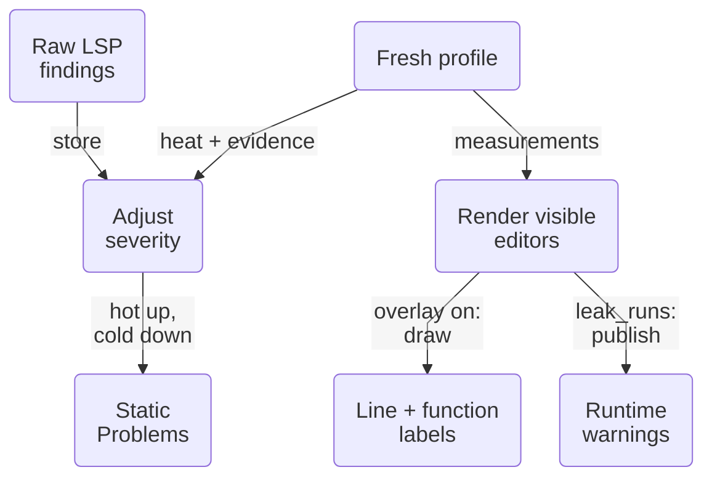
```mermaid
%%{init: {"fontFamily":"Arial, sans-serif","themeVariables":{"fontSize":"18px","fontFamily":"Arial, sans-serif"},"flowchart":{"curve":"linear","nodeSpacing":32,"rankSpacing":40,"diagramPadding":8,"padding":18,"subGraphTitleMargin":{"top":10,"bottom":24},"htmlLabels":false},"layout":"dagre","htmlLabels":false,"themeCSS":".node rect, .cluster rect { rx: 10px; ry: 10px; } .label, .nodeLabel, .edgeLabel, .cluster-label { letter-spacing: normal; word-spacing: normal; } .edgeLabel rect { stroke: currentColor !important; stroke-width: 1px !important; stroke-dasharray: none; opacity: 1 !important; fill-opacity: 1; rx: 4px; ry: 4px; }"}}%%
flowchart TD
    Raw("Raw LSP<br/>findings") -->|store| Adjust("Adjust<br/>severity")
    Fresh("Fresh profile") -->|heat + evidence| Adjust
    Fresh -->|measurements| Render("Render visible<br/>editors")
    Adjust -->|hot up,<br/>cold down| UI("Static<br/>Problems")
    Render -->|overlay on:<br/>draw| Labels("Line + function<br/>labels")
    Render -->|leak_runs:<br/>publish| Warnings("Runtime<br/>warnings")
```

**Implementation**

| Responsibility | Files and symbols |
|---|---|
| Store raw findings, check freshness and adjust severity | [profileView.ts](../src/profileView.ts#L185): `adjust`, `refreshDiagnostics` |
| Classify heat and format diagnostic evidence | [profileModel.ts](../src/profileModel.ts#L194): `heat`, `memoryMb`, `adjustSeverity`, `evidence`, `ProfileIndex.insideSampledFunction` |
| Render decorations, runtime diagnostics and status | [profileView.ts](../src/profileView.ts#L214): `render`, `thresholds` |
| Format line/function totals and leak advice | [profileModel.ts](../src/profileModel.ts#L221): `lineLabel`, `funcLabel`, `leakMessage`, `unattributedNote` |
| Register overlay and clear controls | [profileView.ts](../src/profileView.ts#L37): constructor; `pythonMemoryGuardian.toggleProfileOverlay` and `pythonMemoryGuardian.clearProfile` |

**Important branches and limits**

| Evidence state | Editor behavior |
|---|---|
| Fresh, hot line | Static severity rises one level; measured evidence is prefixed |
| Fresh, cold line | Non-error findings become hints |
| Sampled-function gap or line-event-only evidence | Heat stays unknown; severity stays unchanged |
| Stale/absent profile evidence | Raw static diagnostics; no current runtime annotations/warnings |

- `profile.hotShare` and `profile.hotMB` set hot thresholds; `leak_runs` also makes a line hot. This is **inferred runtime prioritization**, not a new language-server finding.
- Labels show time split and mode-specific memory; precise mode distinguishes allocated, held and transient-peak quantities. Function annotations aggregate measurements.
- Overlay toggling skips decorations only. Runtime leak warnings still publish, and the static adjustment path is unchanged.
- `render` publishes runtime leak warnings per **visible** editor whose source is fresh. A profiled file that is not open in a visible editor has no runtime warnings in Problems until it becomes visible; static severity adjustment does not depend on visibility.
- `memory-guardian: ignore` suppresses a static finding, not runtime leak warnings.
- Status shows run duration, memory mode/peak or a stale re-run cue. Its click opens the report; the tooltip explains substantial unattributed precise memory and traceback-depth tuning.

**Tests:** [test_model.js](../test-fixtures/test_model.js) and [test_report.js](../test-fixtures/test_report.js) cover model and consumed evidence behavior. These checks do not constitute an automated VS Code editor integration run.

[Back to navigation](#start-here)

### Reports and source navigation

The webview presents an Overview, precise-memory diagnosis and a time-weighted Stack Explorer. It can display historical measurements when source is stale, but source navigation requires verified current text.

**Trigger:** `pythonMemoryGuardian.showReport`, `pythonMemoryGuardian.openSavedReport`, `pythonMemoryGuardian.visualizeReport`, status click, or automatic opening after a profiling task's next valid load. **Result:** interactive charts, evidence cards, stack filters and verified source navigation.

**Render and filter**

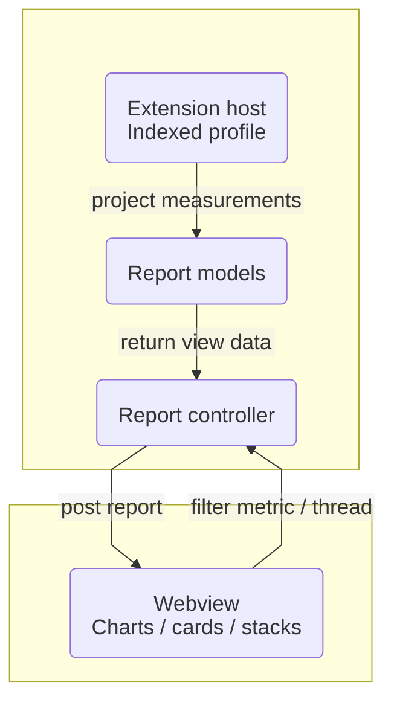
```mermaid
%%{init: {"fontFamily":"Arial, sans-serif","themeVariables":{"fontSize":"18px","fontFamily":"Arial, sans-serif"},"flowchart":{"curve":"linear","nodeSpacing":32,"rankSpacing":40,"diagramPadding":8,"padding":18,"subGraphTitleMargin":{"top":10,"bottom":24},"htmlLabels":false},"layout":"dagre","htmlLabels":false,"themeCSS":".node rect, .cluster rect { rx: 10px; ry: 10px; } .label, .nodeLabel, .edgeLabel, .cluster-label { letter-spacing: normal; word-spacing: normal; } .edgeLabel rect { stroke: currentColor !important; stroke-width: 1px !important; stroke-dasharray: none; opacity: 1 !important; fill-opacity: 1; rx: 4px; ry: 4px; }"}}%%
flowchart TD
subgraph EXT[" "]
      Profile("Extension host<br/>Indexed profile")
      Models("Report models")
      Bridge("Report controller")
    end
    subgraph WEB[" "]
      Panel("Webview<br/>Charts / cards / stacks")
    end
    Profile -->|project measurements| Models
    Models -->|return view data| Bridge
    Bridge -->|post report| Panel
    Panel -->|filter metric / thread| Bridge
```

**Navigate to source**

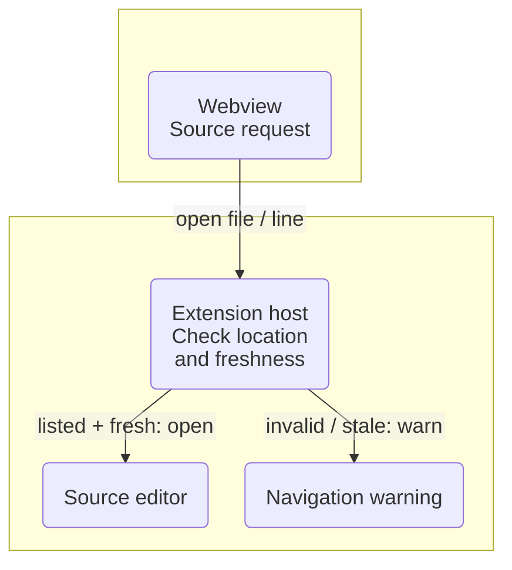
```mermaid
%%{init: {"fontFamily":"Arial, sans-serif","themeVariables":{"fontSize":"18px","fontFamily":"Arial, sans-serif"},"flowchart":{"curve":"linear","nodeSpacing":32,"rankSpacing":40,"diagramPadding":8,"padding":18,"subGraphTitleMargin":{"top":10,"bottom":24},"htmlLabels":false},"layout":"dagre","htmlLabels":false,"themeCSS":".node rect, .cluster rect { rx: 10px; ry: 10px; } .label, .nodeLabel, .edgeLabel, .cluster-label { letter-spacing: normal; word-spacing: normal; } .edgeLabel rect { stroke: currentColor !important; stroke-width: 1px !important; stroke-dasharray: none; opacity: 1 !important; fill-opacity: 1; rx: 4px; ry: 4px; }"}}%%
flowchart TD
subgraph WEB[" "]
      Request("Webview<br/>Source request")
    end
    subgraph EXT[" "]
      Check("Extension host<br/>Check location<br/>and freshness")
      Source("Source editor")
      Warning("Navigation warning")
    end
    Request -->|open file / line| Check
    Check -->|listed + fresh: open| Source
    Check -->|invalid / stale: warn| Warning
```

**Pending report flag — extension host**

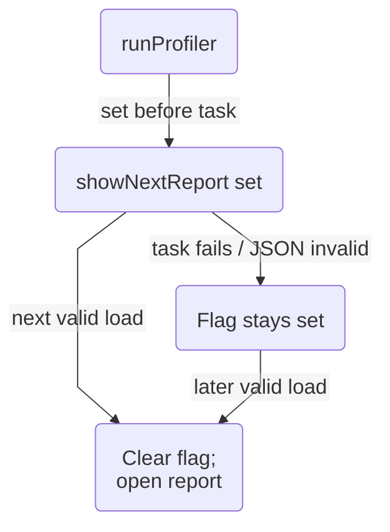
```mermaid
%%{init: {"fontFamily":"Arial, sans-serif","themeVariables":{"fontSize":"18px","fontFamily":"Arial, sans-serif"},"flowchart":{"curve":"linear","nodeSpacing":32,"rankSpacing":40,"diagramPadding":8,"padding":18,"subGraphTitleMargin":{"top":10,"bottom":24},"htmlLabels":false},"layout":"dagre","htmlLabels":false,"themeCSS":".node rect, .cluster rect { rx: 10px; ry: 10px; } .label, .nodeLabel, .edgeLabel, .cluster-label { letter-spacing: normal; word-spacing: normal; } .edgeLabel rect { stroke: currentColor !important; stroke-width: 1px !important; stroke-dasharray: none; opacity: 1 !important; fill-opacity: 1; rx: 4px; ry: 4px; }"}}%%
flowchart TD
    Run("runProfiler") -->|set before task| Flag("showNextReport set")
    Flag -->|next valid load| Open("Clear flag;<br/>open report")
    Flag -->|task fails / JSON invalid| Wait("Flag stays set")
    Wait -->|later valid load| Open
```

**Implementation**

| Responsibility | Files and symbols |
|---|---|
| Register report commands and update after valid loads | [profileView.ts](../src/profileView.ts#L37): constructor, `openSavedReport`, `visualizeReport`, `load`, `showNextReport` |
| Create/reveal panel and exchange messages | [reportView.ts](../src/reportView.ts#L20): `GuardianReport.show`, `update`, `refresh` |
| Project bounded timeline and top sampled lines | [reportModel.ts](../src/reportModel.ts#L17): `overview` |
| Classify retention and suggest checks | [reportModel.ts](../src/reportModel.ts#L51): `diagnose`, `recommendations` |
| Aggregate sampled stacks by time metric and thread | [reportModel.ts](../src/reportModel.ts#L103): `callTree` |
| Render charts, cards, filters and source controls | [reportWebview.ts](../src/reportWebview.ts#L2): `reportHtml`, `memoryChart`, `overview` |
| Validate requested location and current source before opening | [reportView.ts](../src/reportView.ts#L20): `GuardianReport.show` message handler, `fresh` |

**Important branches and limits**

- Overview shows run metrics, bounded RSS/traced-memory timeline and top sampled-line bars. Time-only mode hides the memory chart. `timeline` and `rss_kind` come from the profiler through schema validation.
- Only precise profiles produce memory cards (`growing`, `retained`, `released`) and recommendations. Editor leak text and report recommendations are separate consumers of the same evidence.
- Stack Explorer aggregates Python call stacks, including library frames, by elapsed/Python/native/system/unsplit time and thread. Missing stacks leave it empty. Sampled time across threads may exceed run duration; widths are aggregated time, not chronological order or allocation weights.
- `ready` requests a refresh; `filter` selects metric/thread; `open` requests navigation. The controller validates message shape, metric and report-listed locations. Producer/consumer payload changes must stay coordinated.
- Navigation accepts a profiled line or user stack-frame location only if its source hash is fresh; freshness is checked again after opening the document. Stale, unavailable or unverified source warns. Historical measurements remain visible with freshness warnings.
- Opening a report with no loaded profile shows an information message.
- `runProfiler` sets `showNextReport` before task execution; a valid `load` clears it and opens the report. If the task fails or its JSON is invalid, a later valid watcher load can still auto-open the report. This is a specific lifecycle coupling.

**Tests:** [test_report.js](../test-fixtures/test_report.js) covers report projection, diagnosis, call trees, path remapping and webview script syntax; [test_report_entry.js](../test-fixtures/test_report_entry.js) checks the JSON editor URI and validation path; [profiler_test.py](../test-fixtures/profiler_test.py) checks produced report data. Navigation guards are supported by source inspection.

[Back to navigation](#start-here)

### Interpreter and backend setup

Activation probes the target interpreter, then starts the selected language server over stdio. Probe facts let either backend render messages for the target Python.

**Trigger:** Python document activation, `pythonMemoryGuardian.restart` or any Guardian setting change. **Result:** a running language client, logs/trace, or a startup error.

**Probe interpreter facts**

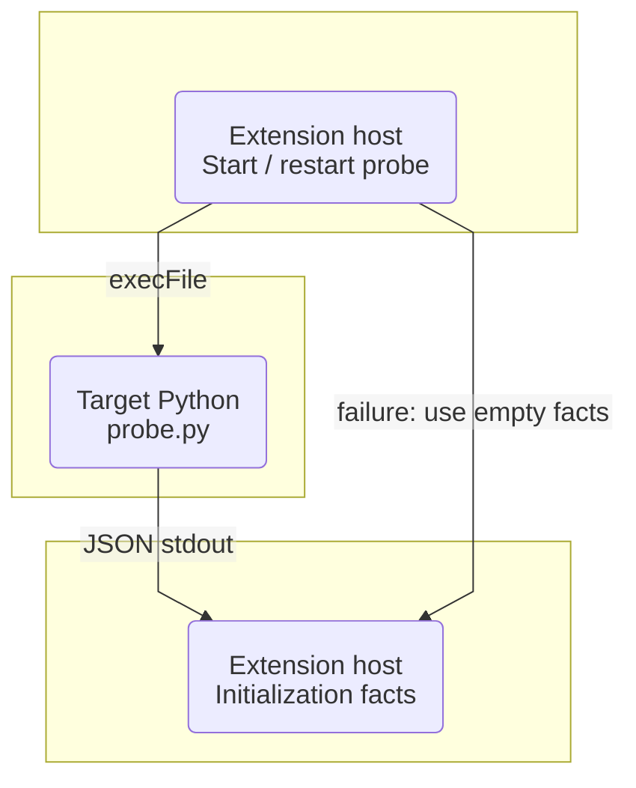
```mermaid
%%{init: {"fontFamily":"Arial, sans-serif","themeVariables":{"fontSize":"18px","fontFamily":"Arial, sans-serif"},"flowchart":{"curve":"linear","nodeSpacing":32,"rankSpacing":40,"diagramPadding":8,"padding":18,"subGraphTitleMargin":{"top":10,"bottom":24},"htmlLabels":false},"layout":"dagre","htmlLabels":false,"themeCSS":".node rect, .cluster rect { rx: 10px; ry: 10px; } .label, .nodeLabel, .edgeLabel, .cluster-label { letter-spacing: normal; word-spacing: normal; } .edgeLabel rect { stroke: currentColor !important; stroke-width: 1px !important; stroke-dasharray: none; opacity: 1 !important; fill-opacity: 1; rx: 4px; ry: 4px; }"}}%%
flowchart TD
    subgraph IN[" "]
      Probe("Extension host<br/>Start / restart probe")
    end
    subgraph TARGET[" "]
      Facts("Target Python<br/>probe.py")
    end
    subgraph OUT[" "]
      Init("Extension host<br/>Initialization facts")
    end
    Probe -->|execFile| Facts
    Facts -->|JSON stdout| Init
    Probe -->|failure: use empty facts| Init
```

**Python and Rust backends**

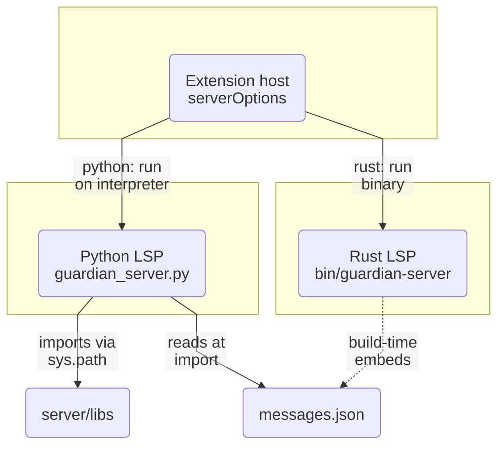
```mermaid
%%{init: {"fontFamily":"Arial, sans-serif","themeVariables":{"fontSize":"18px","fontFamily":"Arial, sans-serif"},"flowchart":{"curve":"linear","nodeSpacing":32,"rankSpacing":40,"diagramPadding":8,"padding":18,"subGraphTitleMargin":{"top":10,"bottom":24},"htmlLabels":false},"layout":"dagre","htmlLabels":false,"themeCSS":".node rect, .cluster rect { rx: 10px; ry: 10px; } .label, .nodeLabel, .edgeLabel, .cluster-label { letter-spacing: normal; word-spacing: normal; } .edgeLabel rect { stroke: currentColor !important; stroke-width: 1px !important; stroke-dasharray: none; opacity: 1 !important; fill-opacity: 1; rx: 4px; ry: 4px; }"}}%%
flowchart TD
    subgraph EXT[" "]
      Client("Extension host<br/>serverOptions")
    end
    subgraph PY[" "]
      Python("Python LSP<br/>guardian_server.py")
    end
    subgraph RS[" "]
      Rust("Rust LSP<br/>bin/guardian-server")
    end
    Client -->|python: run<br/>on interpreter| Python
    Client -->|rust: run<br/>binary| Rust
    Python -->|imports via<br/>sys.path| Libs("server/libs")
    Python -->|reads at<br/>import| Msg("messages.json")
    Rust -. build-time<br/>embeds .-> Msg
```

**Implementation**

| Responsibility | Files and symbols |
|---|---|
| Declare activation, commands and settings | [package.json](../package.json): `activationEvents`, `contributes` |
| Construct profile view before starting server | [extension.ts](../src/extension.ts#L187): `activate` |
| Select interpreter and launch probe with fallback | [extension.ts](../src/extension.ts#L37): `interpreter`, `probeInterpreter`; [probe.py](../server/probe.py#L51): `probe` |
| Select server command and initialize stdio client | [extension.ts](../src/extension.ts#L112): `serverOptions`, `startClient`, `LanguageClient` |
| Serialize stop/start and stop on deactivation | [extension.ts](../src/extension.ts#L177): `restartClient`, `deactivate` |
| Consume initialization facts and serve LSP | [guardian_server.py](../server/guardian_server.py#L30): `on_initialize`, `start_io`; [main.rs](../rust-server/src/main.rs#L1176): `Backend::initialize`, `main` |

**Important branches and limits**

- `pythonMemoryGuardian.backend` selects Python or Rust. `pythonMemoryGuardian.interpreter` chooses Python; an empty setting falls back to `python3` (`python` on Windows). No automatic environment discovery is implemented.
- The Python server runs on that interpreter. Rust runs the packaged `bin/guardian-server[.exe]`; missing binaries report a startup error. The server command is launched from the extension host in both cases.
- **Container mode changes the probe and profiler, not the language-server launch.** Both backends receive target-interpreter facts via `initializationOptions.profile`.
- Probe failure supplies `{}` and neutral wording where sized facts are unavailable. Python probes itself only if initialization supplies no facts object; an explicit empty object does not trigger a host probe.
- Failed server start leaves static analysis unavailable. Profile tasks/report commands remain registered because `ProfileView` was constructed first.
- Any `pythonMemoryGuardian` setting change restarts the client; deactivation waits for the serialized lifecycle and stops it. `trace.server` controls LSP traffic in the output channel.

**Tests:** [test_extension_lifecycle.js](../test-fixtures/test_extension_lifecycle.js), [server_lifecycle_test.py](../test-fixtures/server_lifecycle_test.py) and [parity_test.py](../test-fixtures/parity_test.py) cover lifecycle, facts and backend behavior.

[Back to navigation](#start-here)

### Container execution

With the editor on the host, a configured exec prefix launches the probe/profiler in a container. Path translation connects staged helpers and generated profile data to host-side source.

**Trigger:** nonempty `pythonMemoryGuardian.container.execPrefix`. **Result:** target measurements from container Python, remapped editor/report paths, or a mapping/execution error.

**Map outbound paths and execute**

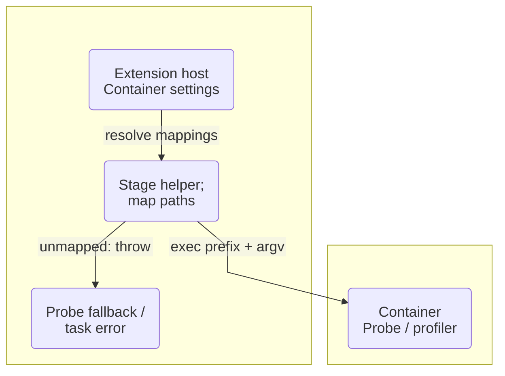
```mermaid
%%{init: {"fontFamily":"Arial, sans-serif","themeVariables":{"fontSize":"18px","fontFamily":"Arial, sans-serif"},"flowchart":{"curve":"linear","nodeSpacing":32,"rankSpacing":40,"diagramPadding":8,"padding":18,"subGraphTitleMargin":{"top":10,"bottom":24},"htmlLabels":false},"layout":"dagre","htmlLabels":false,"themeCSS":".node rect, .cluster rect { rx: 10px; ry: 10px; } .label, .nodeLabel, .edgeLabel, .cluster-label { letter-spacing: normal; word-spacing: normal; } .edgeLabel rect { stroke: currentColor !important; stroke-width: 1px !important; stroke-dasharray: none; opacity: 1 !important; fill-opacity: 1; rx: 4px; ry: 4px; }"}}%%
flowchart TD
subgraph HOST[" "]
      Config("Extension host<br/>Container settings")
      Stage("Stage helper;<br/>map paths")
      Error("Probe fallback /<br/>task error")
    end
    subgraph CONT[" "]
      Target("Container<br/>Probe / profiler")
    end
    Config -->|resolve mappings| Stage
    Stage -->|exec prefix + argv| Target
    Stage -->|unmapped: throw| Error
```

**Remap incoming profile paths**

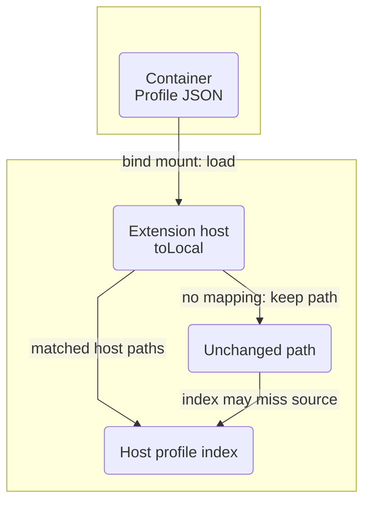
```mermaid
%%{init: {"fontFamily":"Arial, sans-serif","themeVariables":{"fontSize":"18px","fontFamily":"Arial, sans-serif"},"flowchart":{"curve":"linear","nodeSpacing":32,"rankSpacing":40,"diagramPadding":8,"padding":18,"subGraphTitleMargin":{"top":10,"bottom":24},"htmlLabels":false},"layout":"dagre","htmlLabels":false,"themeCSS":".node rect, .cluster rect { rx: 10px; ry: 10px; } .label, .nodeLabel, .edgeLabel, .cluster-label { letter-spacing: normal; word-spacing: normal; } .edgeLabel rect { stroke: currentColor !important; stroke-width: 1px !important; stroke-dasharray: none; opacity: 1 !important; fill-opacity: 1; rx: 4px; ry: 4px; }"}}%%
flowchart TD
subgraph CONT[" "]
      JSON("Container<br/>Profile JSON")
    end
    subgraph HOST[" "]
      Remap("Extension host<br/>toLocal")
      Index("Host profile index")
      Unmapped("Unchanged path")
    end
    JSON -->|bind mount: load| Remap
    Remap -->|matched host paths| Index
    Remap -->|no mapping: keep path| Unmapped
    Unmapped -->|index may miss source| Index
```

**Implementation**

| Responsibility | Files and symbols |
|---|---|
| Read container configuration and stage probe | [extension.ts](../src/extension.ts#L50): `containerConfig`, `stageHelper`, `probeInterpreter` |
| Resolve mapping settings and compose container argv | [containerPaths.ts](../src/containerPaths.ts#L24): `resolveMappings`, `toContainer`, `containerCommand` |
| Copy profiler under workspace `.pmg` and map task paths | [profileView.ts](../src/profileView.ts#L79): `runProfiler` |
| Rewrite profile paths on load | [profileView.ts](../src/profileView.ts#L149): `load`; [containerPaths.ts](../src/containerPaths.ts#L53): `toLocal`, `remapProfileKeys` |

**Important branches and limits**

- Empty `execPrefix` keeps local or remote-extension-host execution. Dev Containers, Codespaces, WSL and Remote-SSH normally run the extension beside Python and do not need this branch.
- Plain Docker/Compose requires a bind-mounted workspace and configured path mappings. Helpers are staged under workspace `.pmg` so container Python can read them.
- Probe and profiler intentionally share mapping/prefix helpers. The language server remains launched from the extension host.
- `toContainer` throws on an unmapped outbound path: the probe falls back to neutral facts, while profiler setup reports an error.
- `toLocal` leaves unmapped inbound paths unchanged. If they differ from host paths, source lookup/freshness can miss.
- `remapProfileKeys` rewrites script, file/function keys, source hashes and stack-frame paths. Changes to profile path fields must update this contract.

**Tests:** [test_container.js](../test-fixtures/test_container.js) simulates an exec prefix with a path alias and mapped paths; it does not launch Docker.

[Back to navigation](#start-here)

### Build and packaging

Packaging creates the JavaScript bundle and vendors Python dependencies. Rust compilation is separate; its output must be placed at the path the extension expects.

**Trigger:** npm build/package scripts, `build:rust`, or `node scripts/install-local.js`. **Result:** bundled resources, an optional Rust executable, a VSIX and optionally local VS Code installation.

#### Extension and Python resources

**Prepublish build**

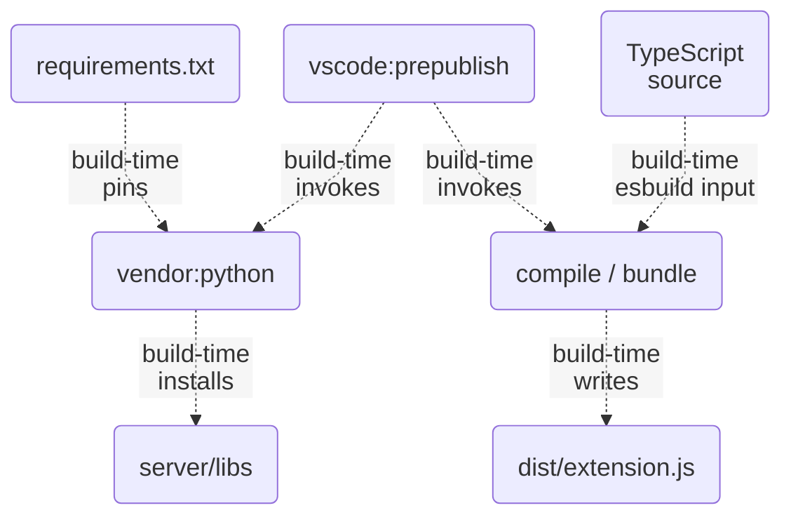
```mermaid
%%{init: {"fontFamily":"Arial, sans-serif","themeVariables":{"fontSize":"18px","fontFamily":"Arial, sans-serif"},"flowchart":{"curve":"linear","nodeSpacing":32,"rankSpacing":40,"diagramPadding":8,"padding":18,"subGraphTitleMargin":{"top":10,"bottom":24},"htmlLabels":false},"layout":"dagre","htmlLabels":false,"themeCSS":".node rect, .cluster rect { rx: 10px; ry: 10px; } .label, .nodeLabel, .edgeLabel, .cluster-label { letter-spacing: normal; word-spacing: normal; } .edgeLabel rect { stroke: currentColor !important; stroke-width: 1px !important; stroke-dasharray: none; opacity: 1 !important; fill-opacity: 1; rx: 4px; ry: 4px; }"}}%%
flowchart TD
    Pins("requirements.txt") -. build-time<br/>pins .-> Vendor("vendor:python")
    Prepub("vscode:prepublish") -. build-time<br/>invokes .-> Vendor
    Prepub -. build-time<br/>invokes .-> Compile("compile / bundle")
    Sources("TypeScript<br/>source") -. build-time<br/>esbuild input .-> Compile
    Vendor -. build-time<br/>installs .-> Libs("server/libs")
    Compile -. build-time<br/>writes .-> Bundle("dist/extension.js")
```

#### Rust executable

**Compile and place the Rust binary**

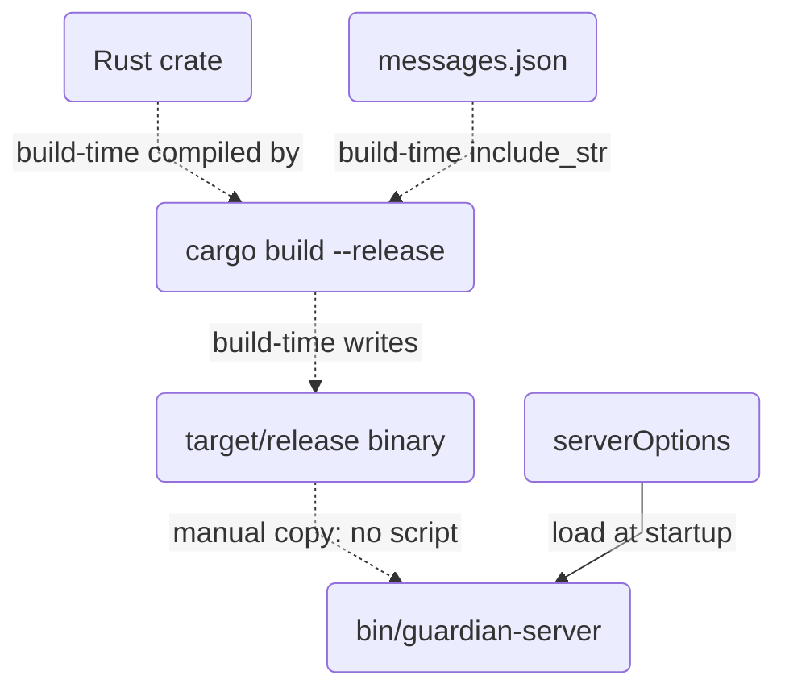
```mermaid
%%{init: {"fontFamily":"Arial, sans-serif","themeVariables":{"fontSize":"18px","fontFamily":"Arial, sans-serif"},"flowchart":{"curve":"linear","nodeSpacing":32,"rankSpacing":40,"diagramPadding":8,"padding":18,"subGraphTitleMargin":{"top":10,"bottom":24},"htmlLabels":false},"layout":"dagre","htmlLabels":false,"themeCSS":".node rect, .cluster rect { rx: 10px; ry: 10px; } .label, .nodeLabel, .edgeLabel, .cluster-label { letter-spacing: normal; word-spacing: normal; } .edgeLabel rect { stroke: currentColor !important; stroke-width: 1px !important; stroke-dasharray: none; opacity: 1 !important; fill-opacity: 1; rx: 4px; ry: 4px; }"}}%%
flowchart TD
    Source("Rust crate") -. build-time compiled by .-> Cargo("cargo build --release")
    Messages("messages.json") -. build-time include_str .-> Cargo
    Cargo -. build-time writes .-> Target("target/release binary")
    Target -. manual copy: no script .-> Bin("bin/guardian-server")
    Client("serverOptions") -->|load at startup| Bin
```

The manual-copy edge has no repository script. See [optional Rust packaging](05-local-deploy.md#optional-rust-backed-package) for placing the binary; a missing binary produces a startup error.

#### Local installer

**Install locally**

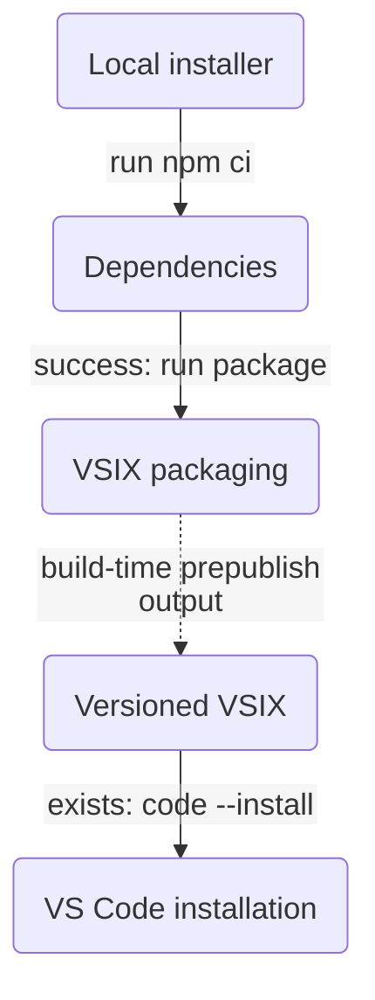
```mermaid
%%{init: {"fontFamily":"Arial, sans-serif","themeVariables":{"fontSize":"18px","fontFamily":"Arial, sans-serif"},"flowchart":{"curve":"linear","nodeSpacing":32,"rankSpacing":40,"diagramPadding":8,"padding":18,"subGraphTitleMargin":{"top":10,"bottom":24},"htmlLabels":false},"layout":"dagre","htmlLabels":false,"themeCSS":".node rect, .cluster rect { rx: 10px; ry: 10px; } .label, .nodeLabel, .edgeLabel, .cluster-label { letter-spacing: normal; word-spacing: normal; } .edgeLabel rect { stroke: currentColor !important; stroke-width: 1px !important; stroke-dasharray: none; opacity: 1 !important; fill-opacity: 1; rx: 4px; ry: 4px; }"}}%%
flowchart TD
Installer("Local installer") -->|run npm ci| Ci("Dependencies")
    Ci -->|success: run package| Pack("VSIX packaging")
    Pack -. build-time prepublish output .-> VSIX("Versioned VSIX")
    VSIX -->|exists: code --install| Code("VS Code installation")
```

**Implementation**

| Responsibility | Files and symbols |
|---|---|
| Define compile, bundle, vendor, package and Rust build commands | [package.json](../package.json): `scripts`, `main` |
| Pin Python packages and load vendored dependencies | [requirements.txt](../requirements.txt); [_vendor.py](../server/_vendor.py): `sys.path` setup; [guardian_server.py](../server/guardian_server.py) and [rules.py](../server/rules.py): early `_vendor` imports |
| Compile Rust and embed diagnostic messages | [Cargo.toml](../rust-server/Cargo.toml); [main.rs](../rust-server/src/main.rs#L24): `MESSAGES_JSON` |
| Check/load installed Rust binary | [extension.ts](../src/extension.ts#L112): `serverOptions` |
| Derive VSIX filename, run ordered commands and stop on failure | [install-local.js](../scripts/install-local.js#L8): `manifest`, `vsix`, `run` |

**Important branches and limits**

- `vscode:prepublish` runs Python vendoring through `uv` and TypeScript compilation/bundling through `tsc`/`esbuild`. `_vendor` prepends `server/libs` before third-party imports; `package.json` points the extension entry to `dist/extension.js`.
- `build:rust` writes into `rust-server/target/release`; `serverOptions` expects `bin/guardian-server[.exe]`. Repository scripts do not copy the binary. Missing it breaks Rust startup; that gap does not mean the Rust implementation is unused.
- The local installer supports macOS/Linux, runs `npm ci` then packaging then `code --install-extension --force`, and stops when a command fails or the VSIX is missing.
- `PMG_CODE_CLI` overrides the VS Code executable; `--dry-run` prints commands without running them. The filename comes from manifest name/version.
- The installer does not build/copy Rust or reload an open VS Code window. See [local deployment](05-local-deploy.md) and [developer setup](04-developer-setup.md) for those steps.

**Checks:** `node scripts/install-local.js --dry-run` previews installer commands; [package_test.py](../test-fixtures/package_test.py) checks the VSIX.

[Back to navigation](#start-here)

## Developer reference

### Shared contracts and coordinated changes

Feature sections own their detailed code/test mappings. This table identifies the data and configuration shared across features; repeated references describe the same contract, not additional services.

| Contract | Producer / definition | Consumers |
|---|---|---|
| Commands and settings | [package.json](../package.json) | [extension.ts](../src/extension.ts), [profileView.ts](../src/profileView.ts), build/install scripts |
| Interpreter facts: `initializationOptions.profile` | [probe.py](../server/probe.py) via `probeInterpreter` | Python/Rust initialization and message renderers |
| Diagnostic codes and text | [messages.json](../server/messages.json), Python/Rust analyzers | LSP handlers, `ProfileView.adjust` and editor diagnostics |
| Profile schema 2/3, modes, timeline and measurements | [pmg_profile.py](../server/pmg_profile.py#L749): `Profiler.report` | [profileModel.ts](../src/profileModel.ts#L32): `Profile`/`parseProfile`; editor and report models |
| Source identity: `file_hashes` and normalized text | [pmg_profile.py](../server/pmg_profile.py#L307): `_text_hash`, verified source | [profileModel.ts](../src/profileModel.ts#L63): `textHash`/`ProfileIndex.state`; report navigation |
| Host/container paths | [containerPaths.ts](../src/containerPaths.ts), container settings | Probe/task argv, profile loader, source identity |
| Runtime retention: `leak_runs`, `held_by`, trends | [pmg_profile.py](../server/pmg_profile.py#L671): `_leaks`/`_find_holders`/`report` | `leakMessage` in [profileModel.ts](../src/profileModel.ts); `diagnose`/`recommendations` in [reportModel.ts](../src/reportModel.ts) |
| Webview `report`/`clear` and `ready`/`filter`/`open` messages | [reportView.ts](../src/reportView.ts) ↔ [reportWebview.ts](../src/reportWebview.ts) | Report rendering, filters and validated navigation |

**When changing a contract**

- **Static rule or diagnostic wording:** coordinate Python/Rust rules, message keys/placeholders and parity fixtures. Python loads messages at import; Rust needs a rebuild.
- **Interpreter facts:** coordinate the probe, initialization bridge, both server renderers and message placeholders. Missing sized facts select neutral wording; GIL facts also affect CPU-thread findings.
- **Profile fields or mode/schema names:** coordinate Python production, TypeScript types/validation, editor and report consumers. Schema 2 compatibility is explicit; validator rejection preserves the old profile. Timeline changes involve sampler/exit production, report bounds, validation and Overview rendering.
- **Retention criteria/advice:** coordinate produced evidence with both editor leak messages and report diagnosis/recommendations. These consumers have separate formatters.
- **Source identity:** coordinate Python and TypeScript hash algorithms. A normalization mismatch suppresses editor evidence and report navigation.
- **Paths:** update outbound mapping and every inbound profile path field. Missing outbound mappings error; unmatched inbound paths can prevent freshness matches.
- **Webview payloads:** update both message producers/consumers and extension validation together.
- **Commands/settings or packaging:** keep manifest IDs, registrations, argv and resource lookup paths consistent. The local installer derives version/output path from the manifest. The language servers report their own version at initialization: Rust uses `CARGO_PKG_VERSION` from [Cargo.toml](../rust-server/Cargo.toml) and Python uses the `LanguageServer` constructor in [guardian_server.py](../server/guardian_server.py); neither reads `package.json`, so a release bumps all three.
- **Task/report lifecycle:** review `showNextReport` set/clear paths; failed tasks or invalid loads can leave automatic opening pending for a later valid profile.

Shared messages, facts, path helpers and the profile model are intentional reuse. Separate Python/Rust analyzers and Python/TypeScript hash algorithms create coordination risks; parity and freshness checks exercise them. The pending-report flag is the specific lifecycle coupling identified in [Reports](#reports-and-source-navigation).

### Imports and process boundaries

Local imports are acyclic in this checkout. Runtime refresh/message loops are distinct from import cycles; some TypeScript imports are type-only and can be elided during compilation.

| Module | Local imports |
|---|---|
| [extension.ts](../src/extension.ts) | `profileView`, `containerPaths` |
| [profileView.ts](../src/profileView.ts) | `profileModel`, `containerPaths`, `reportView` |
| [reportView.ts](../src/reportView.ts) | `profileModel`, `reportModel`, `reportWebview` |
| [reportModel.ts](../src/reportModel.ts) | `profileModel` |
| [guardian_server.py](../server/guardian_server.py) | `_vendor`, `probe`, `rules` |
| [rules.py](../server/rules.py) | `_vendor` |
| [pmg_profile.py](../server/pmg_profile.py) | No local server-module imports |

The extension uses `vscode-languageclient` to communicate with the selected language server over stdio LSP (`textDocument/publishDiagnostics` carries findings), launches the probe/profiler as separate processes, reads persisted profile JSON and exchanges `postMessage` messages with the report webview. A configured container changes the probe/profiler process location. Runtime and build-time relationships are separated in the feature diagrams.

[Back to navigation](#start-here)

## Planned, incomplete or unused capabilities

| Item | Source-grounded status |
|---|---|
| Automatic quick fixes or code actions | Diagnostic text recommends changes, but no code-action provider, `WorkspaceEdit`, or fix command is registered in `src`, `server`, or `rust-server/src/main.rs`. |
| Automatic environment/interpreter discovery | `src/extension.ts` `interpreter` uses the explicit setting or `python3`/`python` fallback. It does not query the VS Code Python extension or scan virtual environments. `server/probe.py` measures whichever executable was selected. |
| Allocation-stack graph and native stack/heap attribution | `server/pmg_profile.py` records line-level traced memory and Python call-stack **time** samples; `src/reportModel.ts` `callTree` weights time metrics only. The [planned completion criteria](#planned-completion-criteria) list memory-weighted allocation stacks and native visibility as planned. |
| Cross-run comparison and agent telemetry contract | A single loaded `ProfileIndex` and one `.pmg/profile.json` path are used by `ProfileView`; no comparison view or telemetry export command exists. These are roadmap items. |
| General task provider | `package.json` declares the `pmg-profile` task type and `runProfiler` creates a task, but no `registerTaskProvider` implementation exists. |

### Planned completion criteria

These criteria describe proposed work, not current app behavior. The current Stack Explorer weights sampled Python call stacks by time. Precise memory evidence is attributed to lines, and native timing is estimated at a Python call site; the app does not unwind C/C++ stacks or attribute native heap allocations.

| Planned capability | Completion criterion |
|---|---|
| Memory-weighted stack graph | Precise-mode allocation tracebacks produce peak-held and end-held MB views. A diagnosis opens the relevant stack; displayed totals reconcile with captured snapshots, and missing or truncated attribution is visible. |
| Native C-extension visibility | Show supported native call stacks and native allocation evidence with their platform and collection limits. Keep estimated Python-site timing distinct from measured native frames and memory. |
| Cross-run diffing | Save and select a baseline, align source and stack identities, and show changes in held memory, growth, allocation sites, and time alongside workload and environment metadata. |
| Agent-ready telemetry | Export a versioned, machine-readable report with evidence, source identity, measurement method, confidence and limits, and suggested verification steps, without requiring agents to scrape webview text. |
| End-to-end verification | Move from a finding to a candidate fix and a repeat run in VS Code, with a comparison showing whether retention improved under the same workload. |

The intended priority is memory-stack attribution and leak diagnosis, then interactive exploration, native visibility, cross-run diffing, and telemetry. New measurements should expose their source and limits so sampled or inferred data is not presented as proof of ownership or causality.

## Verification and limits

This map describes the current `package.json`, `src`, `server`, `rust-server/src/main.rs`, shared messages and test entry points. Feature tables identify relevant checks; their presence does not establish full UI coverage.

- Rust startup requires `bin/guardian-server[.exe]`. The build output is under `rust-server/target/release` and requires placement at the installed lookup path. Parity tests can exercise the release binary directly.
- Container tests simulate an exec prefix and mapped paths; they do not start Docker.
- UI flows are supported by source inspection and model/entry/lifecycle tests, rather than an automated VS Code-host integration run.
- Local file/heading links, Mermaid block structure, edge labels and styling JSON were checked. All 16 diagrams were rendered with Mermaid 11.17.2 and headless Chrome at 720 px and 480 px column widths. All fit a 720 px column at 18 px type except the system overview (727 px wide, about 17.8 px). In the 480 px check the smallest scaled type was about 12 px in the overview and at least 13.7 px elsewhere. Edge-label bounds were checked against each other and against nodes, with no overlaps detected; rounded corners, bordered arrow labels and the decision diamonds were inspected in rendered screenshots. The unspecified Markdown viewer may use a different Mermaid version or override styling.

[Back to navigation](#start-here)
