# Python Memory Guardian: end-to-end feature map

This map describes the implementation in this checkout: a VS Code extension that detects Python memory and concurrency risks while editing, profiles runnable Python scripts, and uses the measured results to prioritize static findings. The extension manifest declares version **1.3.0**, VS Code **1.82+**, and Python **3.9+** for the Python backend and runtime tools.

The diagrams describe implemented flows. Tables enumerate the individual features, settings, and outputs. Source links point to the code responsible for each behavior; [README.md](README.md) covers usage and [guide-deploy.md](guide-deploy.md) covers deployment.

## 1. Overall feature map

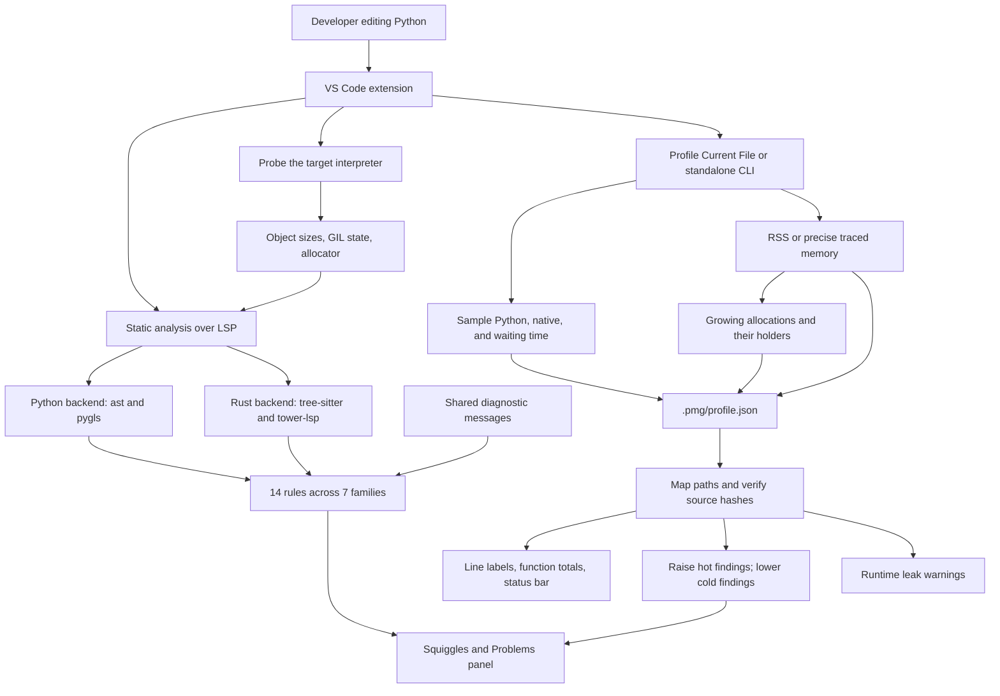

The extension supports local execution, remote extension hosts, and a host editor connected to Python in a Docker/Compose container. Static analysis does not execute the user's script. Profiling executes the saved script as `__main__`.

| Component | Responsibility |
|---|---|
| [package.json](package.json) | Activation, commands, settings, task type, dependencies, build scripts |
| [src/extension.ts](src/extension.ts) | Interpreter probing, server selection, LSP client, restart lifecycle |
| [server/guardian_server.py](server/guardian_server.py), [server/rules.py](server/rules.py) | Python language server and AST rules |
| [rust-server/src/main.rs](rust-server/src/main.rs) | Rust language server and matching tree-sitter rules |
| [server/messages.json](server/messages.json), [server/probe.py](server/probe.py) | Shared wording and measured interpreter facts |
| [server/pmg_profile.py](server/pmg_profile.py) | Script execution, sampling, memory analysis, report generation |
| [src/profileModel.ts](src/profileModel.ts) | Profile parsing, freshness, heat, severity, label and message formatting |
| [src/profileView.ts](src/profileView.ts) | Profile tasks, report watcher, editor decorations, runtime diagnostics |
| [src/reportModel.ts](src/reportModel.ts), [src/reportView.ts](src/reportView.ts), [src/reportWebview.ts](src/reportWebview.ts) | Retention diagnosis, recommendations, and native interactive report |
| [src/containerPaths.ts](src/containerPaths.ts) | Container command construction and bidirectional path mapping |

## 2. Activation, interpreter awareness, and server lifecycle

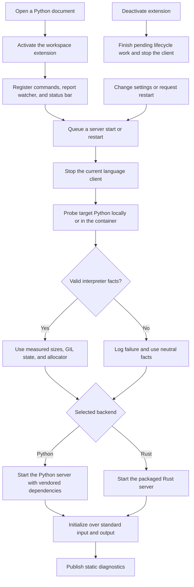

The client accepts both saved (`file`) and unsaved (`untitled`) Python documents for static analysis. The extension is declared as a workspace extension, so remote workspaces run it beside the remote source and interpreter.

| Feature | Behavior |
|---|---|
| Interpreter selection | Uses `pythonMemoryGuardian.interpreter`; an empty value selects `python3` on non-Windows hosts and `python` on Windows. |
| Interpreter probe | Measures implementation/version, pointer and integer sizes, empty/ASCII/wide string sizes, three-field dictionaries/tuples/ordinary/slotted instances, runtime GIL state, and allocator facts where available. |
| Version-aware diagnostics | A sized message is used only when all of its placeholders are available; otherwise the shared neutral variant is used. Non-CPython probes omit CPython-specific sizes and allocator facts. |
| Probe failure | The client logs failures and uses empty facts after a 20-second timeout or other failure. An explicitly empty facts object remains neutral in both servers. The Python server probes itself only when no profile object was supplied; failed container probes never substitute host measurements. |
| Python backend | Starts `server/guardian_server.py` with bundled dependencies from `server/libs`. [server/_vendor.py](server/_vendor.py) also locates these dependencies when the server is launched directly. |
| Rust backend | Starts `bin/guardian-server` or `bin/guardian-server.exe`; reports a startup error if missing. On non-Windows hosts it attempts to restore the executable bit if needed. |
| Restart and shutdown | Any setting change under `pythonMemoryGuardian` restarts the server and probe. The restart command does the same. Starts and restarts are serialized; deactivation waits for in-flight lifecycle work and stops the resulting client. |
| Observability | The Python Memory Guardian output channel shows probe/startup information; `trace.server` controls LSP traffic logging. `PMG_DEBUGPY=<port>` lets the Python server wait for a localhost debugger when `debugpy` is installed. |

## 3. Static analysis: edit to diagnostic

Both backends implement the same rule catalog and share message text. Python reads the JSON at runtime; Rust embeds it at build time, so message changes require rebuilding Rust.

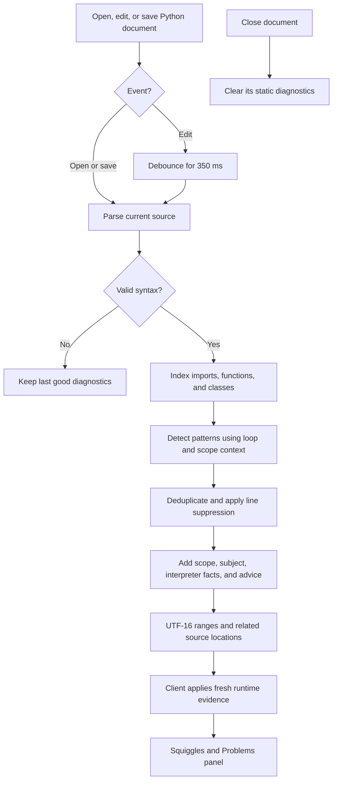

### 3.1 Complete rule catalog

Severity below is the base severity before runtime adjustment. These are source-pattern heuristics, not proof that a particular input will exhaust memory or stall.

| Family / diagnostic code | Base severity | Detected pattern | Advice supplied by the diagnostic |
|---|---|---|---|
| Heap inflation: `heap-inflation` | Warning | `.fetchall()`; `.fetchone()` inside loops; iteration over `.execute(...)` or a name such as `cursor`, `cur`, or `rows_cursor` | Stream columnar batches or use columnar database readers to reduce per-cell Python objects. |
| Pointer chasing: `pointer-chasing` | Warning | `pandas` imports and recognized pandas loaders, resolving import aliases | Consider Polars/Arrow storage and lazy streaming for large object-heavy data. |
| Cycles: `cyclic-reference` | Information | A locally defined class with a back-pointer pattern is instantiated inside a loop | Use weak references or flat/index-based structures; related locations connect construction and the potential cycle edge. |
| RAM fragmentation: `ram-fragmentation.append` | Warning | Loop appends a fresh dict, tuple, list literal, or `dict(...)` | Accumulate columns or batches instead of allocating a container for every row. |
| RAM fragmentation: `ram-fragmentation.no-slots` | Information | A locally defined class without recognized slot support is instantiated inside a loop | Add `__slots__`, use a slotted dataclass, or use column storage. |
| Text inflation: `text-inflation.concat` | Warning | `+=` inside a loop where the target is tracked as a string or the added expression is string-like | Collect and join pieces or use `io.StringIO`. |
| Text inflation: `text-inflation.whole-file` | Warning | `.readlines()` without positional arguments, or `.read()` without positional arguments followed by `.split()`, `.splitlines()`, or `.rsplit()` | Iterate lazily, process bytes, or use columnar readers. |
| Memory swell: `memory-swell.list-arg` | Warning | A single list-comprehension argument to `sum`, `any`, `all`, `min`, or `max` | Pass a generator expression to avoid eagerly constructing the list. |
| Memory swell: `memory-swell.list-copy` | Warning | A `for`/`async for` iterates `list(...)` or a list comprehension | Iterate directly unless a snapshot is intentional. |
| Memory swell: `memory-swell.method-cache` | Warning | `@functools.cache` or unbounded `lru_cache` on a method whose first parameter is `self` | Use per-instance results or a bounded cache to avoid retaining instances in keys. |
| Memory swell: `memory-swell.unbounded-cache` | Information | The same unbounded decorators on other functions | Bound caches whose input domain can grow. |
| Single-thread stall: `single-thread-stall.async-blocking` | Warning | Recognized blocking calls inside an `async def` body | Use async APIs or offload the blocking operation. |
| Single-thread stall: `single-thread-stall.list-membership` | Warning | `in` or `not in` against a tracked list variable inside a loop | Build a set/frozenset for repeated membership checks. |
| Single-thread stall: `single-thread-stall.cpu-thread` | Information | A recognized thread/pool receives a same-file function that loops over its inputs, with no recognized I/O or native work, while the GIL is not known to be disabled | Use processes, native vectorized work, or an appropriate free-threaded runtime for CPU-bound Python work. |

Recognized pandas loaders are `read_csv`, `read_json`, `read_table`, `read_sql`, `read_sql_query`, `read_sql_table`, `read_excel`, and `read_fwf`. The async blocking table includes `time.sleep`, several `requests` methods, `urllib.request.urlopen`, `subprocess.run/call/check_call/check_output`, and `socket.create_connection`.

### 3.2 Context, exemptions, and suppression

Diagnostics include an enclosing class/function and subject when available, for example `Service.handle() › self.history`. Cycle and thread findings can carry related source locations. Findings are deduplicated and sorted, and their ranges use LSP's UTF-16 character coordinates.

| Feature | Scope and behavior |
|---|---|
| Alias resolution | Recognizes imported module and callable aliases for loaders, cache decorators, threads, and known blocking/native calls. Function, class, and lambda scopes isolate tracked names and respect parameter/local shadowing; enclosing function bindings remain available. |
| Loop awareness | Includes ordinary/async loops and comprehensions; distinguishes loop bodies from iterable evaluation for loop-specific findings. |
| Slot exemptions | Recognizes `__slots__`, `@dataclass(slots=True)`, selected NamedTuple/Enum/TypedDict/Protocol/exception bases, and exception-like base names. |
| Weak-reference exemption | Recognized weakref wrappers are excluded from cycle-edge detection. |
| Cache exemption | Bounded `lru_cache` decorators do not trigger unbounded-cache rules. |
| Thread classification | Recognizes `threading.Thread`, `ThreadPoolExecutor`, `multiprocessing.pool.ThreadPool`, and `multiprocessing.dummy.Pool`, including supported submission/map methods. It follows same-file helper calls for I/O/native classification. |
| Conservative thread exclusions | Skips unknown targets and lambdas, functions without input-dependent loops, recognized I/O/native work, and runtimes reporting a disabled GIL. |
| Line suppression | Put `# memory-guardian: ignore` on the diagnostic's starting line to suppress static findings on that line. This does not suppress runtime leak warnings. |

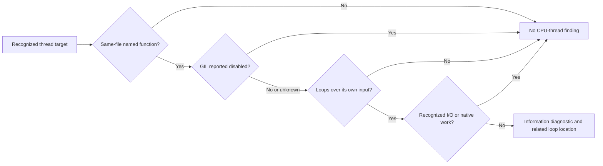

## 4. Runtime profiling: script to report

The extension and standalone CLI both use [server/pmg_profile.py](server/pmg_profile.py). It uses only the Python standard library.

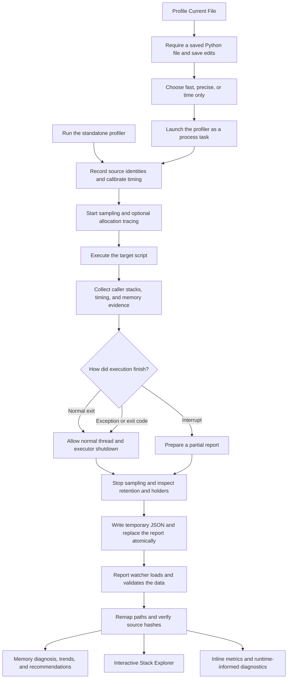

The command runs a saved file as a script, not a selected function or notebook cell. Locally, its working directory is the script's directory; its analysis root is the containing workspace folder, or the script directory when no folder applies. The process task passes arguments without shell interpolation. The CLI also accepts script arguments:

```bash
python3 server/pmg_profile.py --memory precise --frames 2 --interval 0.01 --root . --out .pmg/profile.json test-fixtures/profiler/holders_workload.py
```

| CLI input | Default | Purpose |
|---|---|---|
| `script` and trailing arguments | Script required | Execute the script and populate its `sys.argv`. |
| `--out` | `.pmg/profile.json` | Report destination; creates parent directories. |
| `--root` | Script directory | Limit attribution to user files under this directory. |
| `--interval` | `0.01` seconds | Sampling interval. |
| `--memory` | `fast` | Select `fast`, `precise`, or `off`. |
| `--frames` | `2` | Tracemalloc traceback depth in precise mode. The editor clamps this to 1–64. |
| `--monitoring` | `off` | Optional `lines` mode records Python 3.12+ user-line events; sampled timing remains active. |

Normal completion returns 0; integer `SystemExit` codes are preserved, Ctrl+C returns 130, and uncaught exceptions print a traceback and return 1. The finalization path attempts to save a report in all these cases. If non-daemon workers remain, normal Python thread/executor shutdown completes before finalization; Ctrl+C attempts an immediate partial report. Abrupt process termination cannot guarantee a report.

### 4.1 Time sampling

A daemon thread samples other Python thread frames and attributes each sample to the innermost eligible user frame. Files outside the root, the profiler itself, standard-library/package paths, and synthetic filenames are excluded.

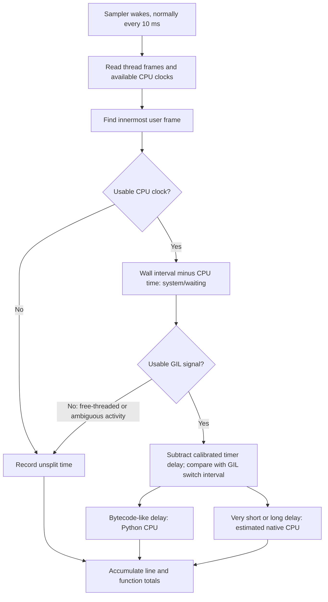

The Python/native split is an estimate based on GIL timing. Before user execution, nine short sleeps measure median idle timer oversleep. Sampling subtracts that baseline and excludes the previous sample/snapshot work from the GIL-delay estimate; changing scheduler load can still affect classification. The baseline is recorded as `sleep_overhead_s`. Calibration adds roughly 0.1 seconds before the measured run at the default interval. `system_s` means off-CPU wall time such as sleep, I/O, or lock waiting; it is not a kernel CPU-time counter. Where per-thread CPU clocks are unavailable, the main thread uses process CPU time and other threads can be unsplit. The line `share` is normalized against total attributed line time across threads, so it is not necessarily a fraction of single-thread wall time.

### 4.2 Memory modes and attribution

| Mode | User-visible measurement | Implementation and limits |
|---|---|---|
| `fast` | RSS growth per line and function, plus timing | Attributes process RSS changes to the busiest eligible thread's current line. Includes Python/native memory, but cannot reliably identify allocation origins or leaks. |
| `precise` | Timing, allocated/held/spike memory, leak trends, holder names | Adds `tracemalloc`, periodic/growth-triggered snapshots, and peak resets. Tracing changes runtime, so time labels carry `~`. |
| `off` / time only | Timing without memory labels or memory-based heat | Does not enable `tracemalloc`. The current sampler still collects RSS/timeline data internally, and the status bar can show RSS peak. |

RSS readers use `/proc/self/statm` on Linux, process memory APIs on Windows, and Mach task information on macOS. If those are unavailable, the profiler tries peak RSS from `resource`; the report records `rss_kind` so current and peak-only readings can be distinguished.

In precise mode, `alloc_mb` accumulates observed positive traced-memory changes attributed during sampling; it is not a complete allocation-event log. `peak_mb` is held memory at the snapshot with the largest total attributed user memory, `end_mb` is held at exit, and `transient_peak_mb` captures sufficiently large short-lived peaks between samples. They describe different quantities and are labeled separately at line level.

Snapshots map allocation tracebacks to the nearest eligible user source line. The fast path aggregates raw traces with cached traceback resolution; a public-API fallback is available if the private trace layout is absent. Periodic snapshot scheduling predicts cost against a budget of `max(10% of elapsed time, 0.5 seconds)`; the final exit snapshot is additional work. Allocations with no reachable user frame are reported as `unattributed_peak_mb`, and the tooltip suggests increasing traceback depth when that value is at least 1 MB.

## 5. Leak detection and holder discovery

Leak detection is available in precise mode. It identifies a sustained growth pattern; intentional retention can satisfy the same pattern.

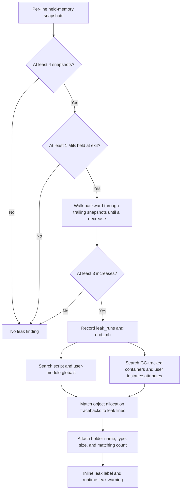

Equal snapshots are permitted between increases. The size threshold is `1 << 20` bytes; displayed MB values use decimal millions of bytes.

Holder discovery checks module globals as well as GC-tracked objects because some dictionaries containing plain values are not GC-tracked. It also inspects `__dict__` attributes of user-defined instances. Example labels are `global AUDIT`, `Service.history`, and a qualified module global; unnamed containers can be reported when no useful name is found.

The search inspects at most 5,000 elements per container and uses a time-budget check during its GC-object walk. The report retains up to three holders per line, ranked by matching objects. If a holder is not found, the warning still reports the measured retained memory. Main-script globals are most reliably available after normal completion because they come from `runpy.run_path`'s return value.

## 6. Profile data, persistence, and freshness

The profiler writes schema **3** JSON. The client validates schemas 2 and 3, including required timing fields, retention evidence, and stack references. Older reports remain readable without the new stack/trend views.

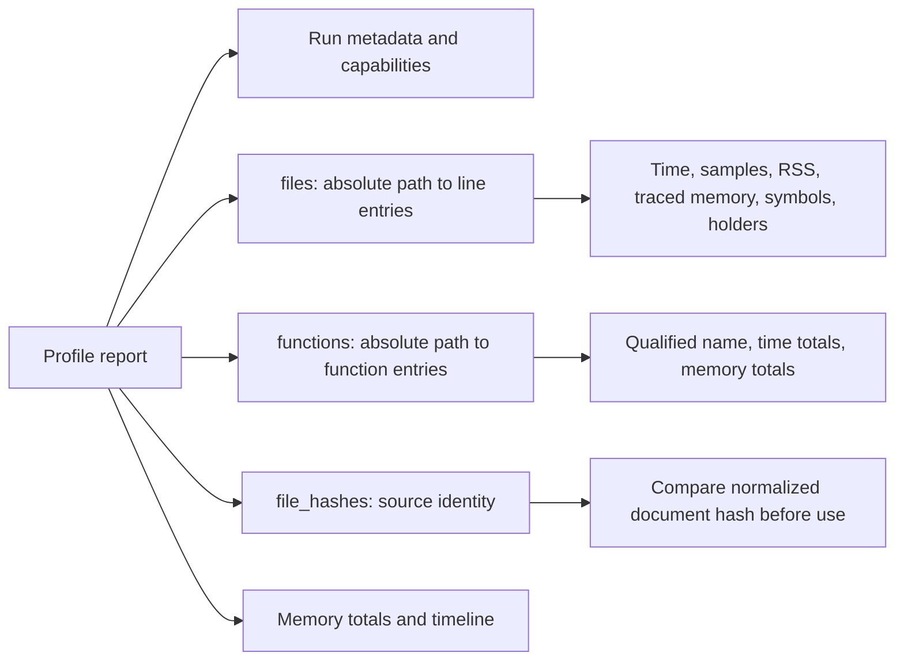

| Data | Contents and consumer |
|---|---|
| Run metadata | Script path, Python version, wall/process CPU time, interval, sample count, memory mode, GIL split availability, per-thread clock availability, RSS reader type. |
| `files` | Absolute file paths → one-based line-number strings → timing, RSS growth/release, precise memory fields, leak evidence, function-start association, scope, assigned names, called names, and holders. |
| `functions` | File paths → first-line strings → qualified function names and aggregated metrics. Source AST information recovers qualified names on older Python versions. These are line aggregates, not a call graph. |
| `file_hashes` | SHA-1 of unchanged source decoded using its Python encoding (BOM removed), encoded as UTF-8 after CRLF-to-LF normalization; compared with the current editor text. Files changed or created during the run receive no freshness hash. |
| Memory totals | Traced peak, RSS start/end/peak, snapshot count/cost, frame depth, unattributed held memory, and a coarse process-level `native_untraced_mb` estimate when current RSS is available. |
| `timeline` | Downsampled elapsed/traced/RSS samples for external inspection; the extension does not render a timeline chart. |

The extension watches `**/.pmg/profile.json`, loads one existing matching report at startup, and reloads on creation/change. It holds one active profile index; another loaded report replaces it. Paths are normalized for separators and Windows case differences. Container paths are translated before indexing.

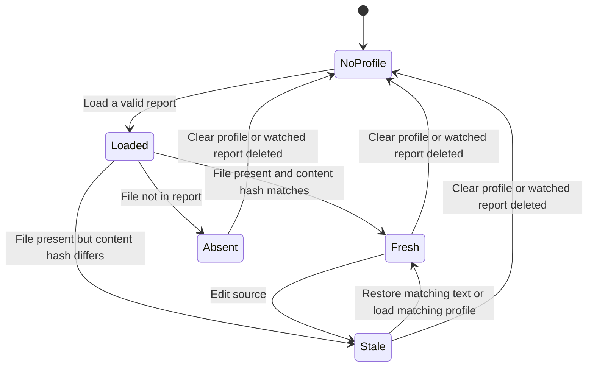

Freshness is checked per document. Stale/absent files get no runtime decorations or leak diagnostics, and freshly processed static diagnostics retain their base behavior. A text edit immediately rerenders the overlay and restores static severities when the report becomes stale. The report marks historical measurements and disables unverified source navigation. Before execution, the profiler inventories eligible Python source-file hashes and filesystem identities (device, inode, size, modification time, and change/creation time). It checks those identities around source reading and compares the content hash at report time. This startup inventory runs before timing and tracing begin, retains hashes rather than source buffers, and adds startup work proportional to source size. Changed, replaced, deleted, newly created, or uninventoried files receive no hash or source-derived labels and are treated as stale. This conservatively invalidates even a file edited back to its original contents. Hidden subdirectories and `node_modules` are skipped during the inventory.

## 7. Editor feedback and profile-informed priorities

### 7.1 Commands and visible results

| Command / surface | Feature |
|---|---|
| `pythonMemoryGuardian.restart` | **Restart Server** stops the backend, probes again, and restarts it. |
| `pythonMemoryGuardian.profileFile` | **Profile Current File**, also exposed as the pulse icon on Python editor titles. A completed run opens the native report. |
| `pythonMemoryGuardian.showReport` | **Open Profile Report**, also available through the status bar. Memory diagnosis is the initial view; Stack Explorer is a second tab. |
| `pythonMemoryGuardian.toggleProfileOverlay` | **Toggle Profile Overlay** hides/shows inline labels; runtime leak diagnostics and static severity adjustment remain active. |
| `pythonMemoryGuardian.clearProfile` | **Clear Profile** clears the active in-memory report, runtime warnings, and decorations, and restores raw static diagnostics. It does not delete the JSON file, which can load again later. |
| Inline timing | Seconds, attributed-time share, and substantial Python/native/system components. Precise mode adds `~` to indicate timing distortion. |
| Inline memory | Fast mode shows `RSS +`; precise mode distinguishes `alloc`, `held`, and `spike`. Assigned-variable names are included when available. |
| Inline leaks | Retained memory and available holder names. |
| Function labels | `Σ` totals at the recorded function-start line, including qualified names and time/memory summaries; module totals are not decorated. |
| Problems panel | Static diagnostics plus a separate runtime collection using code `runtime-leak` and Warning severity. Runtime suspected-leak entries are populated for visible fresh Python editors and persist when switching tabs; stale edits remove them. |
| Status bar | Run duration, mode, memory peak when available, or a stale-profile notice; tooltip includes script, Python version, and unattributed-memory explanation. |

To reduce clutter, line labels generally require at least 1% of attributed time, a displayed memory amount, or a leak. Memory labels normally start at 1 MB. Hot labels use the editor warning color; ordinary labels use the CodeLens foreground color.

### 7.2 Static severity adjustment

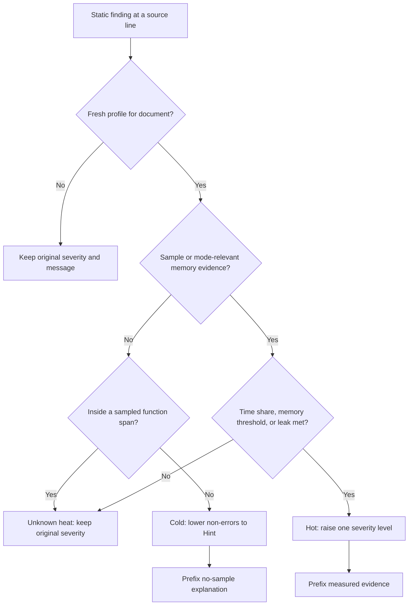

Defaults are `hotShare = 0.05` and `hotMB = 50`. Precise memory heat uses the maximum of allocated, transient, and held-at-peak memory; fast mode uses RSS growth; time-only mode uses no memory heat. Hot findings move Hint → Information → Warning → Error, with Error as the ceiling. Cold non-errors become Hint.

A line missing from samples inside a sampled function's recorded span is treated as unknown rather than cold. New reports include the complete syntactic function range; older schema-2 reports fall back to the last sampled line. A low-cost sampled line also remains unknown. Absence from samples is not proof that a line did not execute.

## 8. Local, remote, and container execution

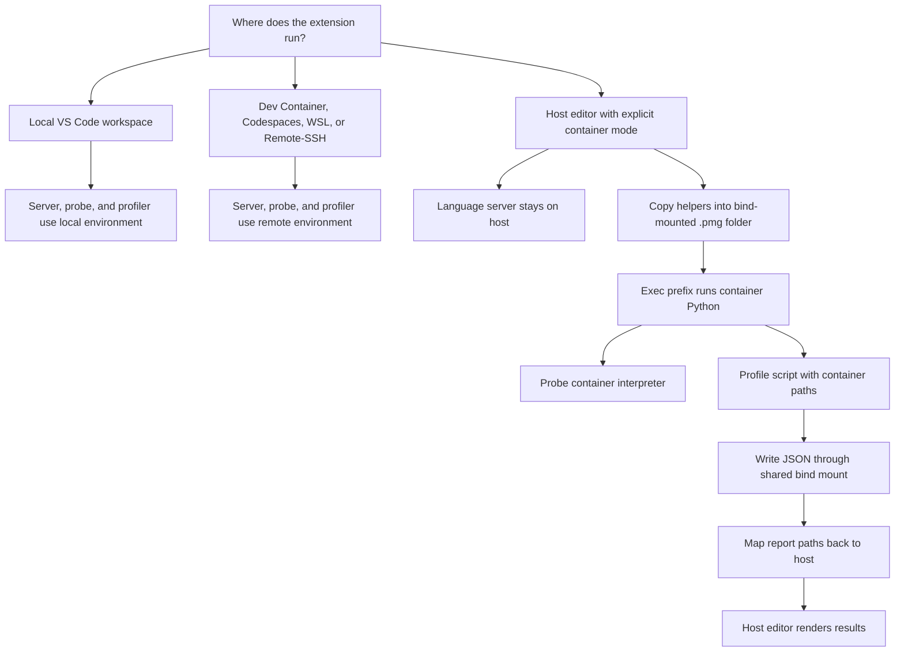

Dev Containers, Codespaces, WSL, and Remote-SSH do not need `container.execPrefix` when the extension itself runs remotely. Any Rust binary must match the OS/CPU of that extension host.

For plain Docker/Compose with the editor on the host, a nonempty prefix enables container mode. The existing container and bind mount are prerequisites; the extension does not build or start containers. For example:

```json
{
  "pythonMemoryGuardian.container.execPrefix": ["docker", "compose", "exec", "-T", "app"],
  "pythonMemoryGuardian.container.interpreter": "python3",
  "pythonMemoryGuardian.container.pathMappings": [
    { "local": "${workspaceFolder}", "container": "/app" }
  ]
}
```

The extension stages `probe.py` and `pmg_profile.py` under `.pmg`, then translates helper, script, root, and output paths. Commands are built as an executable plus argument array. The static Python backend still needs a host Python interpreter; a host Rust backend avoids that requirement for static analysis.

Mapping uses the longest matching directory prefix with path-boundary checks. `${workspaceFolder}` expands from the first workspace folder. Windows host matches ignore case; container matches remain case-sensitive. An unmapped outbound host path produces an error; an unmapped inbound container path is left unchanged. Report remapping covers `script`, `files`, `functions`, and `file_hashes`.

[examples/containerized-app](examples/containerized-app) includes a Python 3.12 Dockerfile, Compose bind mount at `/app`, a Dev Container configuration, example host settings, and a service workload with retained global/instance data. The sample extension ID is a publisher placeholder. Existing test coverage simulates container execution; the documentation does not establish a real Docker deployment test for this checkout.

## 9. Complete settings reference

All setting names below have the `pythonMemoryGuardian.` prefix. See [package.json](package.json) for their declarations.

| Setting | Default | Effect |
|---|---|---|
| `backend` | `python` | Choose `python` or `rust` language server. |
| `interpreter` | Empty string | Local/remote-host interpreter for probing, local profiling, and the Python server. Use an executable name or concrete path; the client does not expand workspace variables here. |
| `profile.memoryMode` | `fast` | Advertised default memory mode. Currently only interpolated into the Quick Pick prompt; choices remain in fixed fast/precise/time-only order and the user selects the actual mode. |
| `profile.hotShare` | `0.05` | Hot attributed-time share threshold, from 0 to 1. |
| `profile.hotMB` | `50` | Hot memory threshold in MB, minimum 0. |
| `profile.frames` | `2` | Precise traceback depth, 1–64; deeper traces can improve attribution and increase overhead. |
| `profile.monitoring` | `off` | Optional `lines` event coverage on Python 3.12+; gracefully falls back when unavailable. |
| `container.execPrefix` | `[]` | Enable host/container mode and supply the command prefix. |
| `container.interpreter` | `python3` | Interpreter inside the container. |
| `container.pathMappings` | `[]` | Host/container path pairs covering the bind-mounted project. |
| `trace.server` | `off` | LSP tracing: `off`, `messages`, or `verbose`. |

## 10. Build, packaging, and verification features

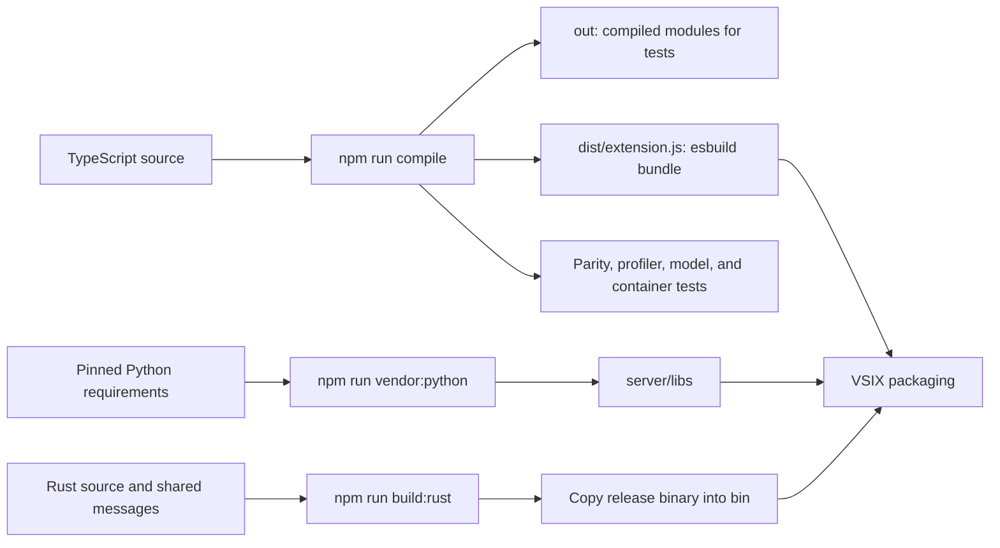

| Capability | Repository support |
|---|---|
| Client compile/bundle | `npm run compile` runs TypeScript compilation and esbuild. `npm run bundle` bundles the extension separately; `npm run watch` watches TypeScript compilation but does not continuously rebuild the bundle. |
| Python dependency vendoring | `npm run vendor:python` installs explicitly version-pinned runtime requirements into `server/libs`, using Python 3.9 as the resolver target. End-user environments do not need these packages installed separately. The requirements are version-pinned, not hash-pinned. |
| Rust build | `npm run build:rust` creates a release build. Copy its executable to `bin` for the extension to find it. |
| Packaging | `npm run package` runs `vsce package`; `vscode:prepublish` vendors Python dependencies and compiles/bundles the client. It does not build Rust automatically. |
| Cross-platform test launcher | [scripts/py.js](scripts/py.js) tries Python 3.9+ through `python3`, `python`, then `py -3`; `PMG_PYTHON` overrides this selection. |
| Full test entry point | `npm test` compiles, runs parity tests, then runtime tests. |
| Backend parity | [test-fixtures/parity_test.py](test-fixtures/parity_test.py) exercises real stdio LSP with static fixtures and multiple interpreter profiles. Rust comparison is skipped if its binary is unavailable unless `PMG_REQUIRE_RUST=1` requires it. |
| Source and peak regressions | [test-fixtures/profiler_regression_test.py](test-fixtures/profiler_regression_test.py) checks edits during execution, imported/new/deleted sources, normalized hashes, and transient peaks. |
| Profiler verification | [test-fixtures/profiler_test.py](test-fixtures/profiler_test.py) checks known Python/native/waiting workloads, RSS growth, leak trends, holder names, source symbols, and snapshot budget. |
| Editor model verification | [test-fixtures/test_model.js](test-fixtures/test_model.js) checks hashes, staleness, heat/severity, labels, holders, and unattributed-memory notes using generated reports. Run after profiler tests. |
| Container verification | [test-fixtures/test_container.js](test-fixtures/test_container.js) checks mappings and a simulated exec-prefix probe/profile round trip. |
| Examples and fixtures | Static positive/negative patterns plus dedicated timing, leak, and holder workloads under [test-fixtures](test-fixtures). |
| Packaged runtime verification | `python test-fixtures/package_test.py path/to/extension.vsix` checks runtime files, development-file exclusions, and real LSP diagnostics from the extracted server. Run on the oldest and newest supported Python. |
| Deployment documentation | [guide-deploy.md](guide-deploy.md) describes local VSIX installation and publishing workflows. These instructions are separate from runtime features. |

This checkout does **not** contain the root `.devcontainer`, root `.vscode` launch/tasks files, or `.github/workflows/release.yml` referred to by existing documentation. Only the example application's Dev Container/settings files are present. Automated release CI and the referenced root debug configurations therefore are not included features of this tree. Publisher/repository URLs in the manifest also remain placeholders.

## 11. Boundaries to keep in mind

The implementation is a static heuristic analyzer plus a sampling profiler. Static rules use same-file syntax and lightweight name tracking, without whole-program type inference or automated fixes. Runtime results describe the executed workload and eligible files; they do not guarantee coverage of every line or allocation.

Long native calls holding the GIL can delay the sampler and attribute a spike to the following line; function aggregates help when the shifted attribution stays within the same function. Deep library allocations can lack a user frame at the configured traceback depth. RSS changes include allocator behavior and are not equivalent to live Python object sizes. `native_untraced_mb` is a coarse process-level estimate, not a per-line native allocation measurement.

There is no child-process/multiprocessing aggregation, GPU profiling, copy-volume measurement, historical profile comparison UI, or a process-wide timeline chart. Native C/C++ stack unwinding is not supported; the call graph contains Python frames and estimated timing categories. The editor manages one active report at a time. These boundaries explain how to read the diagrams and outputs without treating sampled evidence as exhaustive execution tracing.


## 12. Native diagnosis report and Stack Explorer

[reportModel.ts](src/reportModel.ts) derives evidence and recommendations from retained allocations. Findings are ordered by suspected growth, then unconfirmed retention, then released allocations. Snapshot counts, increases/decreases, net growth, per-line observed peak, downsampled retention points, and up to three observed holders explain each finding. Recommendations depend on holder type and scope; they recommend bounded histories, cache eviction, or shorter ownership lifetimes when those match the intended workload. No automatic deletion or source modification is performed.

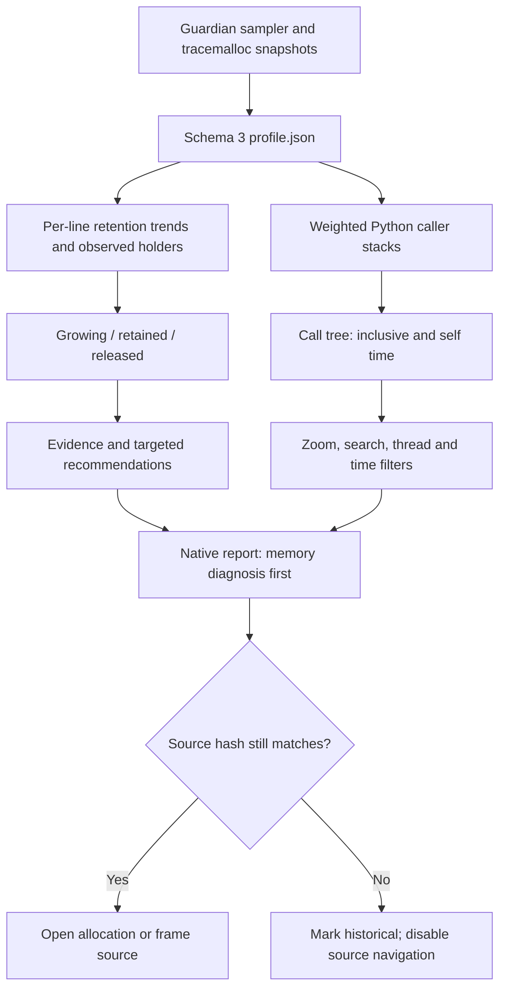

The collector keeps Python frames from the outermost application frame through active library frames. No frame objects are retained. Immutable frame IDs and weighted stacks preserve caller relationships, including recursion. Time weights are accumulated from observed intervals instead of assuming a fixed sampling frequency. Multiple threads may accumulate more elapsed time than the wall-clock duration. Collection caps (128-frame depth, 50,000 stacks) and the 25,000-node display cap are reported as limitations when reached.

Python 3.12+ offers `sys.monitoring` for execution-event callbacks. Guardian can optionally count `LINE` events from user code, keeping only file/line/count values and capping distinct lines at 50,000. An event-observed line missed by interval sampling is treated as unknown rather than cold when adjusting static severity. The profiler uses the monitoring profiler tool ID only when free, unregisters callbacks and releases the ID on completion, and records whether coverage was active or unavailable. `sys.monitoring` does not provide a snapshot of every thread, and a thread blocked inside a long native call may produce no Python event until the call returns. Guardian therefore retains `sys._current_frames()` for sampled stacks and timing across all supported Python versions. Event counts are not durations, native frames, or allocation records; the mode is off by default because its workload-dependent cost has not yet been benchmarked.

The report uses a CSP-restricted webview, plain-text rendering of source metadata, and validates source-navigation messages against the loaded report. It includes a per-line retention sparkline; the process RSS timeline remains available in JSON only. New diagnostics call growth a suspected leak because a growing cache or a deliberately retained dataset can have the same trend.

Normal Python thread/executor shutdown completes before reports for outstanding non-daemon workers are finalized. Interrupted runs attempt an immediate partial report. `npm run benchmark:native` checks growing and bounded histories and records measured cost by profiler mode. This benchmark does not establish superiority over py-spy or Memray.

## 13. Target state (planned)

**Goal:** Make Guardian the fastest path from a Python memory symptom to an evidence-backed diagnosis and a verified fix, entirely inside VS Code for supported workloads. A developer should not need a separate profiler CLI to find a growing allocation, understand its allocation stack and observed owner, compare the result with an earlier run, and give an agent structured evidence for a proposed change. Workflow velocity is the outcome; trustworthy memory-leak diagnosis and actionable recommendations come first.

The diagram below is a roadmap, not a description of implemented features. Stack Explorer currently visualizes sampled **time** on Python call stacks; precise memory evidence is currently attributed to lines, not full allocation stacks. Native timing is an estimate at a Python call site, not C/C++ stack unwinding or native heap attribution. There is no cross-run comparison UI or stable agent telemetry contract yet.

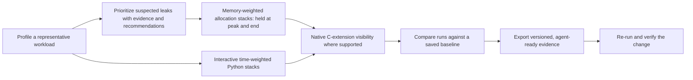

| Planned capability | Completion criterion |
|---|---|
| Memory-weighted stack graph | Precise-mode allocation tracebacks produce peak-held and end-held MB views. A diagnosis opens the relevant stack; displayed totals reconcile with captured snapshots, and missing/truncated attribution is visible. |
| Native C-extension visibility | Show supported native call stacks and native allocation evidence with their platform and collection limits. Keep estimated Python-site timing distinct from measured native frames and memory. |
| Cross-run diffing | Save/select a baseline, align source and stack identities, and show changes in held memory, growth, allocation sites, and time alongside workload and environment metadata. |
| Agent-ready telemetry | Export a versioned, machine-readable report containing evidence, source identity, measurement method, confidence/limits, and suggested verification steps; agents can consume it without scraping webview text. |
| End-to-end verification | A developer can move from a finding to a candidate fix and a repeat run in VS Code, with a comparison that shows whether retention improved under the same workload. |

Priority order is memory-stack attribution and leak diagnosis, then reliable interactive exploration, then native visibility, cross-run diffing, and telemetry. Every new measurement needs an explicit source and limitation so the report never presents sampled or inferred data as proof of ownership or causality.
